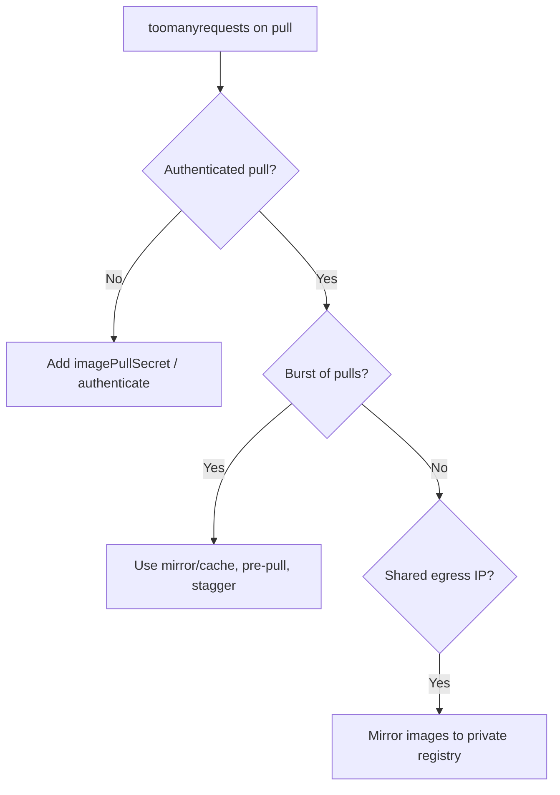

# Image Pull Rate Limited

> **Severity:** High · **Typical recovery time:** 5–60 min · **Affected versions:** 1.20+

## Error Message

```text
Failed to pull image "nginx:latest":
rpc error: code = Unknown desc = toomanyrequests:
You have reached your pull rate limit. You may increase the limit by
authenticating and upgrading: https://www.docker.com/increase-rate-limit
Reason: ImagePullBackOff
```

## Description

`toomanyrequests` is the registry (most commonly Docker Hub) telling the node it has
exceeded its allowed image pulls in the rolling time window. Anonymous pulls from a
shared cluster egress IP exhaust the free quota quickly, especially during scale-ups,
node replacements, or CI bursts where many pods pull the same upstream image. The
pull fails and the pod cycles through `ErrImagePull` → `ImagePullBackOff`. This is an
availability incident even though images and credentials may be otherwise valid.

## Affected Kubernetes Versions

Version-independent (1.20+). This is a registry-side limit, not a Kubernetes feature.
After dockershim removal (1.24+), all runtimes surface the upstream `toomanyrequests`
text the same way. Docker Hub's published anonymous/authenticated limits change over
time, so confirm current quotas with the registry.

## Likely Root Causes

- Anonymous (unauthenticated) pulls sharing one NAT/egress IP across many nodes
- Large scale-up or node-pool replacement pulling the same image many times at once
- No imagePullSecret configured, so pulls fall back to the low anonymous tier
- `imagePullPolicy: Always` re-pulling on every pod start
- Pulling directly from Docker Hub instead of a cache/mirror or private registry

## Diagnostic Flow



## Verification Steps

Confirm the pull error text contains `toomanyrequests` and points at the registry's
rate-limit page (distinguishes it from auth `401`/`denied` or `ErrImagePull` DNS
failures). Note which registry and image triggered it.

## kubectl Commands

```bash
kubectl describe pod <pod> -n <namespace>
kubectl get events -n <namespace> --sort-by=.lastTimestamp
kubectl get pod <pod> -n <namespace> -o jsonpath='{.spec.containers[*].image}'
kubectl get pod <pod> -n <namespace> -o jsonpath='{.spec.imagePullSecrets[*].name}'
kubectl get pods -A -o wide | grep -i ImagePullBackOff
```

## Expected Output

```text
Events:
  Warning  Failed  30s  kubelet  Failed to pull image "nginx:latest":
           toomanyrequests: You have reached your pull rate limit.

$ kubectl get pod web-1 -o jsonpath='{.spec.imagePullSecrets[*].name}'
            # (empty: anonymous pull)
```

## Common Fixes

1. Authenticate pulls with an `imagePullSecret` (paid/authenticated tier has higher limits)
2. Mirror required images into a private registry or pull-through cache and reference that
3. Set `imagePullPolicy: IfNotPresent` and pre-pull images to nodes to cut pull volume
4. Stagger scale-ups / node replacements so pulls do not burst past the quota

## Recovery Procedures

1. Confirm whether pulls are anonymous; if so, create and attach a registry `Secret`.
2. Point workloads at a mirror or private copy of the image (spec change).
3. **Disruptive — roll out the updated pull config** (`rollout restart` with the
   imagePullSecret / mirrored image): blast radius = all replicas, but affected pods
   are already failing. Stagger restarts across workloads to avoid a fresh pull burst.
4. If the limit window simply needs to reset, waiting and letting `ImagePullBackOff`
   retry succeeds with no changes (zero blast radius) — but fix the root cause too.

## Validation

```bash
kubectl get pod <pod> -n <namespace> -o wide
kubectl get events -n <namespace> --sort-by=.lastTimestamp
```

Pods progress to `Running`; events show `Pulled` instead of `toomanyrequests`; no
recurrence during the next scale-up.

## Prevention

- Always authenticate registry pulls; never rely on the anonymous tier in production
- Run a pull-through cache / private registry and mirror third-party images
- Prefer `imagePullPolicy: IfNotPresent` with pinned tags or digests
- Pre-pull base images to nodes (DaemonSet or node bootstrap) and spread scale events

## Related Errors

- [ImagePullBackOff](../pods/imagepullbackoff.md)
- [ImageInspectError](../pods/imageinspecterror.md)
- [InvalidImageName](../pods/invalidimagename.md)

## References

- [Pull an Image from a Private Registry](https://kubernetes.io/docs/tasks/configure-pod-container/pull-image-private-registry/)
- [Images — Image Pull Policy](https://kubernetes.io/docs/concepts/containers/images/#image-pull-policy)

## Further Reading

- [DevOps AI ToolKit — Kubernetes guides](https://devopsaitoolkit.com/blog/)
