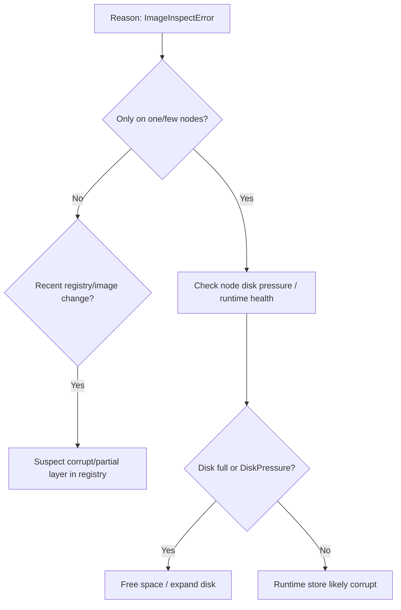

# ImageInspectError

> **Severity:** High · **Typical recovery time:** 10–45 min · **Affected versions:** 1.20+

## Description

`ImageInspectError` means the image was (or appears to be) present locally, but the
container runtime failed when it tried to *inspect* the image metadata before
creating the container. Unlike `ErrImagePull` (network/auth) or `InvalidImageName`
(bad string), this is a node/runtime-level fault: a corrupted image layer, a damaged
containerd/CRI-O content store, disk pressure, or a runtime bug. It is comparatively
rare and frequently node-local — the same image may run fine on other nodes — which
makes node correlation the fastest diagnostic.

## Error Message

```text
State:          Waiting
  Reason:       ImageInspectError
  Message:      Failed to inspect image "myrepo/app:v1":
                rpc error: code = Unknown desc = failed to get image:
                content digest sha256:...: not found
Pod status: ImageInspectError
```

## Affected Kubernetes Versions

Version-independent (1.20+). The reason string is surfaced by the kubelet image
manager regardless of runtime. Frequency rose on containerd/CRI-O clusters after the
dockershim removal (1.24+) simply because those runtimes are now universal; the
underlying causes (store corruption, disk pressure) are the same.

## Likely Root Causes

- Corrupted image content / layer in the node's containerd or CRI-O store
- Disk pressure or a full filesystem on the node interrupting image operations
- Partial or aborted pull leaving inconsistent image metadata
- Runtime daemon bug or restart mid-operation
- Underlying storage/overlayfs problems on the node

## Diagnostic Flow



## Verification Steps

Confirm `Reason: ImageInspectError` (not `ErrImagePull`/`InvalidImageName`). Identify
which node(s) the affected pods are on and check those nodes' conditions for
`DiskPressure` and runtime status.

## kubectl Commands

```bash
kubectl describe pod <pod> -n <namespace>
kubectl get pods -n <namespace> -o wide
kubectl get nodes -o wide
kubectl describe node <node>
kubectl get events -n <namespace> --sort-by=.lastTimestamp
kubectl top nodes
```

## Expected Output

```text
State:  Waiting
  Reason:  ImageInspectError
  Message: Failed to inspect image "myrepo/app:v1": content digest ...: not found

$ kubectl describe node ip-10-0-3-12
Conditions:
  Type           Status
  DiskPressure   True
```

## Common Fixes

1. Relieve node disk pressure (free space, expand the disk, prune dead images)
2. Force a clean re-pull (use a digest or new tag so the corrupt local copy is bypassed)
3. Drain and recycle the affected node so it pulls fresh image content
4. Repair/restart the container runtime if its content store is inconsistent

## Recovery Procedures

1. Map affected pods to nodes and inspect `DiskPressure`/runtime health.
2. If a single node is at fault, **cordon and drain it** (disruptive: its pods
   reschedule to other nodes — blast radius = everything on that node) and then
   recycle/replace the node so the runtime store is rebuilt.
3. For a fleet-wide bad layer, push a corrected image (new digest) and **roll out**
   the workload (disruptive: all replicas re-pull; rolling update preserves
   availability).
4. **Deleting a stuck pod** so it reschedules onto a healthy node is the lowest blast
   radius option (one replica).

## Validation

```bash
kubectl get pod <pod> -n <namespace> -o wide
kubectl describe node <node>
```

Pod moves past `ImageInspectError` to `ContainerCreating` → `Running`; node no longer
reports `DiskPressure`; no repeat inspect failures on that node.

## Prevention

- Monitor and alert on node disk usage and `DiskPressure` before it bites
- Configure kubelet image garbage collection thresholds appropriately
- Use immutable digests so re-pulls fetch verified content
- Keep the container runtime patched and monitor its health on every node

## Related Errors

- [InvalidImageName](../pods/invalidimagename.md)
- [ImagePullBackOff](../pods/imagepullbackoff.md)
- [Image Pull Rate Limited](../pods/image-pull-toomanyrequests.md)

## References

- [Images](https://kubernetes.io/docs/concepts/containers/images/)
- [Container Runtimes](https://kubernetes.io/docs/setup/production-environment/container-runtimes/)

## Further Reading

- [DevOps AI ToolKit — Kubernetes guides](https://devopsaitoolkit.com/blog/)
