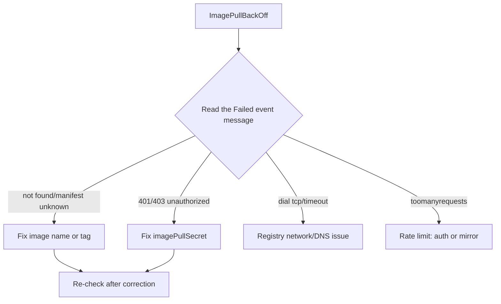

# ImagePullBackOff

> **Severity:** High · **Typical recovery time:** 5–30 min · **Affected versions:** 1.20+

## Error Message

```text
Warning  Failed     90s (x4 over 3m)  kubelet  Failed to pull image "myregistry.io/app:1.2.3": ...
Warning  BackOff    12s (x6 over 3m)  kubelet  Back-off pulling image "myregistry.io/app:1.2.3"
```

## Description

`ImagePullBackOff` is the state the kubelet enters after one or more failed image
pulls (`ErrImagePull`). Like CrashLoopBackOff, it applies an exponential back-off
(capped at 300s) between retry attempts so it does not hammer the registry. The
container `State` is `Waiting` with reason `ImagePullBackOff`.

The pod is scheduled to a node, but the kubelet cannot obtain the container image,
so the container never starts. This is almost always a name/tag mistake,
authentication failure, or registry/network problem — all fixable without
touching application code.

## Affected Kubernetes Versions

All supported versions (1.20+). Behaviour is stable across versions. Note that
`imagePullPolicy` defaults to `Always` for the `:latest` tag and `IfNotPresent`
otherwise; this default has been consistent and affects whether a cached image
could have masked the problem.

## Likely Root Causes

- Wrong image name, tag, or registry host (typo, non-existent tag)
- Missing or invalid `imagePullSecrets` for a private registry (401/403)
- Registry unreachable from the node (network, DNS, firewall, proxy)
- Rate limiting (e.g. Docker Hub anonymous pull limits)
- Image deleted from the registry or wrong architecture/platform

## Diagnostic Flow



## Verification Steps

Read the `Failed` event in `describe` — the underlying reason (manifest unknown,
unauthorized, timeout) tells you exactly which root cause applies. Confirm the
reason is `ImagePullBackOff` and not `ErrImageNeverPull` (a different policy bug).

## kubectl Commands

```bash
kubectl describe pod <pod> -n <namespace>
kubectl get events -n <namespace> --sort-by=.lastTimestamp
kubectl get pod <pod> -n <namespace> -o jsonpath='{.spec.containers[*].image}'
kubectl get secret -n <namespace>
kubectl get pod <pod> -n <namespace> -o jsonpath='{.spec.imagePullSecrets[*].name}'
```

## Expected Output

```text
    State:          Waiting
      Reason:       ImagePullBackOff
Events:
  Warning  Failed   2m   kubelet  Failed to pull image "myregistry.io/app:1.2.3":
           rpc error: code = NotFound desc = manifest unknown
  Warning  BackOff  15s  kubelet  Back-off pulling image "myregistry.io/app:1.2.3"
```

## Common Fixes

1. Correct the image name/tag; verify the tag exists in the registry.
2. Create and attach a valid `imagePullSecret` (docker-registry type) and
   reference it via `spec.imagePullSecrets` or the pod's ServiceAccount.
3. Fix node networking/DNS or configure a registry mirror / pull-through cache.
4. Authenticate to avoid Docker Hub rate limits, or pull from a private mirror.

## Recovery Procedures

1. Identify the precise failure from the event message before changing anything.
2. Apply the corrected image reference or pull secret. The controller performs a
   rolling update — **blast radius: only this workload's pods; multi-replica
   Deployments stay available.**
3. To force an immediate retry you can delete the stuck pod, but **deleting
   affects only that replica**; the safer alternative is to fix the spec and let
   the back-off naturally retry, or trigger a rollout restart of the controller.

## Validation

`kubectl get pods` shows `Running`/`READY`; the `Pulled` event appears in
`describe`, and restart/back-off counts stop climbing.

## Prevention

- Pin immutable, digest-based image references in production.
- Store pull secrets at the ServiceAccount level so all pods inherit them.
- Use a pull-through cache/mirror and authenticated registry access in CI/CD.
- Validate image existence in your pipeline before deploying.

## Related Errors

- [ErrImagePull](./errimagepull.md)
- [ErrImageNeverPull](./errimageneverpull.md)
- [CrashLoopBackOff](./crashloopbackoff.md)
- [Pending Pod](./pending.md)

## References

- [Images](https://kubernetes.io/docs/concepts/containers/images/)
- [Pull an Image from a Private Registry](https://kubernetes.io/docs/tasks/configure-pod-container/pull-image-private-registry/)
- [Debug Pods](https://kubernetes.io/docs/tasks/debug/debug-application/debug-pods/)

## Further Reading

- [DevOps AI ToolKit — Kubernetes guides](https://devopsaitoolkit.com/blog/)
