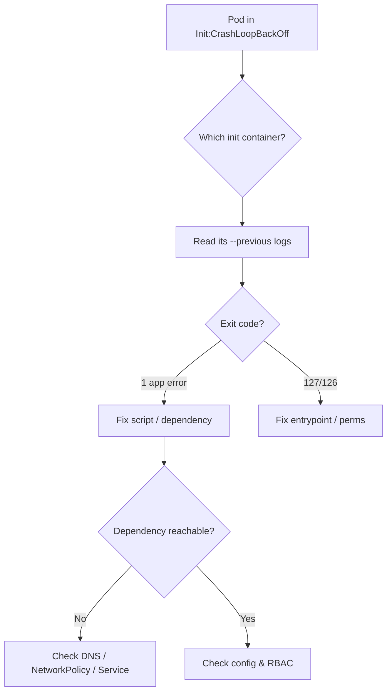

# Init Container CrashLoopBackOff

> **Severity:** High · **Typical recovery time:** 10–40 min · **Affected versions:** 1.20+

## Error Message

```text
Init Containers:
  wait-for-db:
    State:   Waiting
      Reason:  CrashLoopBackOff
    Last State:  Terminated
      Reason:    Error
      Exit Code: 1
Pod status: Init:CrashLoopBackOff
```

## Description

An init container runs to completion *before* any app container starts. When one
exits non-zero, the kubelet restarts it with exponential backoff (10s, 20s, 40s …
capped at 5 min), and the pod is held in `Init:CrashLoopBackOff`. No application
container ever starts, so the workload is fully down even though scheduling
succeeded. During an incident this commonly blocks an entire rollout because every
new pod stalls at the same init step.

## Affected Kubernetes Versions

Init containers are stable since 1.6 and behave identically through current
releases. Sidecar/native init containers (`restartPolicy: Always` on an init
container) are GA in 1.29+; a crashing native sidecar shows the same backoff but
does not block subsequent containers the same way ordinary init containers do.

## Likely Root Causes

- The init command itself fails (bad migration script, failed `wait-for` probe, exit 1)
- A dependency the init container waits on is unreachable (DB, service, secret)
- Missing/incorrect config: env var, mounted Secret/ConfigMap, or file path
- Insufficient RBAC or network policy blocking the init container's calls
- Image or binary problems (wrong entrypoint, exit 127/126)

## Diagnostic Flow



## Verification Steps

Confirm the failing container is an *init* container (not an app container in
plain `CrashLoopBackOff`) by checking the `Init Containers:` section of
`describe`, and note the exact init container name and exit code.

## kubectl Commands

```bash
kubectl describe pod <pod> -n <namespace>
kubectl logs <pod> -c <init-container> -n <namespace> --previous
kubectl get events -n <namespace> --sort-by=.lastTimestamp
kubectl get pod <pod> -n <namespace> -o jsonpath='{.status.initContainerStatuses[*].state}'
kubectl auth can-i list endpoints -n <namespace> --as=system:serviceaccount:<namespace>:<sa>
```

## Expected Output

```text
$ kubectl logs web-7d9 -c wait-for-db --previous
waiting for postgres.db.svc:5432 ...
timeout reached after 30s: connection refused

State:        Waiting
  Reason:     CrashLoopBackOff
Last State:   Terminated
  Reason:     Error   Exit Code: 1
```

## Common Fixes

1. Fix the dependency the init container waits for (start the DB, create the Service, repair DNS)
2. Correct the init script logic, env vars, or mounted Secret/ConfigMap
3. Add a sane timeout/retry to the init command so transient delays do not hard-fail
4. Resolve image/entrypoint issues if the exit code is 127 or 126

## Recovery Procedures

1. Read `--previous` logs to capture the real failure (logs are lost after restart).
2. Apply the corrected ConfigMap/Secret/script. Updating a Secret/ConfigMap does
   not restart running pods automatically.
3. **Disruptive — rollout restart** (`kubectl rollout restart`): recreates all
   pods in the workload. Blast radius = every replica of that Deployment; do during
   a maintenance window if it is the only healthy path. Prefer letting backoff
   retry pick up a fixed external dependency first.
4. **Disruptive — delete a single stuck pod**: blast radius = one replica;
   the controller recreates it with the new config.

## Validation

```bash
kubectl get pod <pod> -n <namespace> -o wide
```

Pod transitions `Init:0/1 → PodInitializing → Running` and `Ready 1/1`. Confirm app
container logs show normal startup and probes pass.

## Prevention

- Make init scripts idempotent with bounded retries and clear log output
- Validate referenced Secrets/ConfigMaps exist in CI before deploy
- Use readiness gates / proper Services for dependencies instead of brittle `wait-for` loops
- Set `activeDeadlineSeconds` or sensible timeouts to fail fast and visibly

## Related Errors

- [CrashLoopBackOff](../pods/crashloopbackoff.md)
- [Init:0/1 (PodInitializing)](../pods/podinitializing-stuck.md)
- [Container Exit Code 1](../pods/exit-code-1.md)

## References

- [Init Containers](https://kubernetes.io/docs/concepts/workloads/pods/init-containers/)
- [Debug Running Pods](https://kubernetes.io/docs/tasks/debug/debug-application/debug-running-pod/)

## Further Reading

- [DevOps AI ToolKit — Kubernetes guides](https://devopsaitoolkit.com/blog/)
