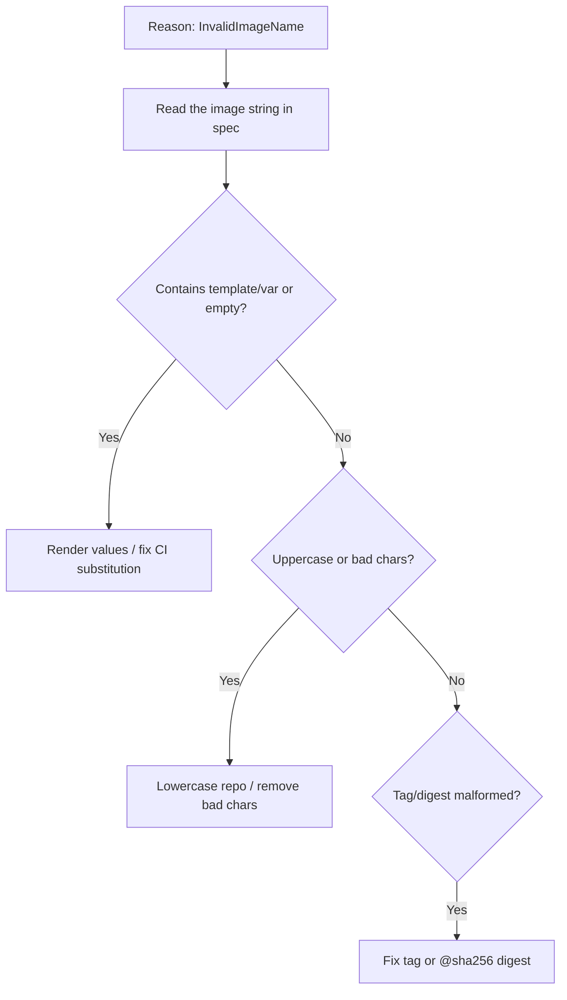

# InvalidImageName

> **Severity:** High · **Typical recovery time:** 2–15 min · **Affected versions:** 1.20+

## Error Message

```text
State:          Waiting
  Reason:       InvalidImageName
  Message:      Failed to apply default image tag "myrepo/app:::v1":
                couldn't parse image reference "myrepo/app:::v1":
                invalid reference format
Pod status: InvalidImageName
```

## Description

`InvalidImageName` is a *client-side* failure: the kubelet rejected the image
reference before any network call to a registry. The string in `image:` is
malformed and does not match the OCI reference grammar — bad characters, a double
colon, an uppercase registry host, a stray space, or an unresolved templating
placeholder. Because nothing is ever pulled, this is not a registry/credentials
problem and there is no backoff against a remote server; the pod simply waits with
this reason until the spec is corrected.

## Affected Kubernetes Versions

Version-independent (1.20+). Reference parsing is handled by the
`distribution/reference` library used across the kubelet and runtimes, so the rules
are consistent. The exact message text may vary slightly by runtime version.

## Likely Root Causes

- Malformed tag/digest: `app:::v1`, trailing space, or `:@sha256:` confusion
- Uppercase letters in the repository/registry path (must be lowercase)
- Unrendered template/variable, e.g. `image: ${IMAGE}` or `{{ .Values.image }}` left literal
- Missing image name entirely, or `image: ""`
- Illegal characters or wrong separators in the registry host:port

## Diagnostic Flow



## Verification Steps

Confirm `Reason: InvalidImageName` (parse error) versus `ErrImagePull`/`ImagePullBackOff`
(a real pull attempt that failed). Then print the exact `image:` string from the spec
and inspect it character by character.

## kubectl Commands

```bash
kubectl describe pod <pod> -n <namespace>
kubectl get pod <pod> -n <namespace> -o jsonpath='{.spec.containers[*].image}'
kubectl get pod <pod> -n <namespace> -o jsonpath='{.status.containerStatuses[*].state.waiting.message}'
kubectl get events -n <namespace> --sort-by=.lastTimestamp
kubectl get deploy <deploy> -n <namespace> -o jsonpath='{.spec.template.spec.containers[*].image}'
```

## Expected Output

```text
$ kubectl get pod web-1 -o jsonpath='{.spec.containers[*].image}'
myrepo/App:::v1

State:  Waiting
  Reason:   InvalidImageName
  Message:  couldn't parse image reference "myrepo/App:::v1": invalid reference format
```

## Common Fixes

1. Correct the reference to valid form, e.g. `myrepo/app:v1` or `myrepo/app@sha256:<digest>`
2. Lowercase the repository/registry path
3. Ensure CI/Helm/Kustomize actually substitutes image variables (no literal `${...}`)
4. Remove stray spaces, extra colons, or empty image values

## Recovery Procedures

1. Read the exact `image:` string; this is purely a spec fix, no registry involvement.
2. Patch the Deployment/StatefulSet template with the valid reference, or fix the
   CI/templating that produced it.
3. **Disruptive — roll out the corrected spec** (`kubectl set image` / `rollout
   restart`): blast radius = the workload's replicas, but those pods are already
   non-functional, so impact is low. **Deleting a single stuck pod** picks up the
   fix with blast radius of one replica.

## Validation

```bash
kubectl get pod <pod> -n <namespace>
```

Reason changes from `InvalidImageName` to a normal pull (`ContainerCreating` →
`Running`). `describe` shows a `Pulled`/`Created`/`Started` event sequence.

## Prevention

- Validate image references in CI (lint/admission) before they reach the cluster
- Use immutable digests (`@sha256:`) generated by the pipeline, not hand-typed tags
- Fail the build if templating leaves unrendered variables
- Enforce lowercase repository names in policy

## Related Errors

- [ImagePullBackOff](../pods/imagepullbackoff.md)
- [ImageInspectError](../pods/imageinspecterror.md)
- [Image Pull Rate Limited](../pods/image-pull-toomanyrequests.md)

## References

- [Images](https://kubernetes.io/docs/concepts/containers/images/)
- [Pull an Image from a Private Registry](https://kubernetes.io/docs/tasks/configure-pod-container/pull-image-private-registry/)

## Further Reading

- [Free Kubernetes config validators](https://devopsaitoolkit.com/validators/)
