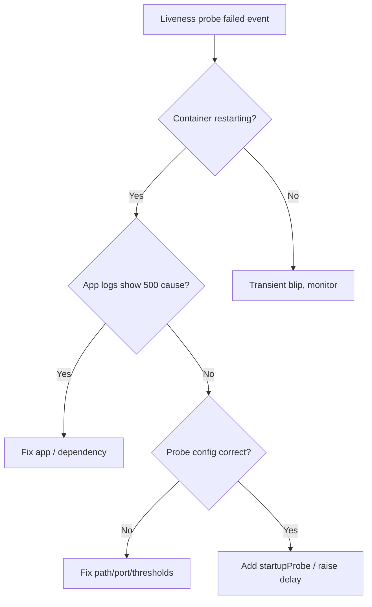

# Liveness Probe Failed

> **Severity:** High · **Typical recovery time:** 5–30 min · **Affected versions:** 1.16+

## Error Message

```text
Liveness probe failed: HTTP probe failed with statuscode: 500
Warning  Unhealthy  kubelet  Liveness probe failed: HTTP probe failed with statuscode: 500
Normal   Killing    kubelet  Container app failed liveness probe, will be restarted
```

## Description

The kubelet runs the liveness probe to decide whether a container is still
healthy. When the probe fails more than `failureThreshold` times in a row, the
kubelet kills the container and restarts it according to the pod's
`restartPolicy`. An HTTP probe returning status code 500 means the application
answered, but reported itself unhealthy (or an internal error path was hit).

During an incident this is dangerous: a misconfigured or too-aggressive probe
can put an otherwise-recoverable container into an endless kill/restart loop,
amplifying an outage instead of healing it.

## Affected Kubernetes Versions

Applies to all supported versions (1.16+). The probe schema is stable. Note
that `startupProbe` (GA in 1.20) is the recommended way to protect slow-starting
apps from premature liveness kills; before 1.20 operators leaned on
`initialDelaySeconds` instead.

## Likely Root Causes

- Application genuinely unhealthy (deadlock, exhausted thread/connection pool)
- Probe `path` returns 500 due to a dependency (DB, cache) being unreachable
- `timeoutSeconds`/`periodSeconds`/`failureThreshold` too aggressive for load
- App still warming up and no `startupProbe` configured
- Probe pointed at the wrong port or path after a code change

## Diagnostic Flow



## Verification Steps

Confirm the restart count is climbing and that the event source is the liveness
probe specifically, not readiness or an OOM kill.

## kubectl Commands

```bash
kubectl describe pod <pod> -n <namespace>
kubectl get pod <pod> -n <namespace> -o jsonpath='{.spec.containers[*].livenessProbe}'
kubectl logs <pod> -n <namespace> --previous
kubectl get events -n <namespace> --field-selector reason=Unhealthy --sort-by=.lastTimestamp
```

## Expected Output

```text
Restart Count:  7
Events:
  Warning  Unhealthy  kubelet  Liveness probe failed: HTTP probe failed with statuscode: 500
  Normal   Killing    kubelet  Container app failed liveness probe, will be restarted
Liveness:  http-get http://:8080/healthz delay=0s timeout=1s period=10s #success=1 #failure=3
```

## Common Fixes

1. Fix the underlying app fault returning 500 (check logs/dependencies)
2. Correct the probe `path`, `port`, or scheme if the endpoint moved
3. Relax `timeoutSeconds`, `periodSeconds`, and `failureThreshold` for headroom
4. Add a `startupProbe` so slow boots don't trip liveness

## Recovery Procedures

1. Inspect `--previous` logs to find why the endpoint returned 500.
2. If a downstream dependency is down, restore it; liveness should recover on
   its own once the endpoint returns 200.
3. If the probe is misconfigured, patch the deployment with corrected probe
   settings. **Disruptive — rolling update:** this triggers a rollout across all
   replicas; blast radius is the whole Deployment, so do it during a maintenance
   window or with a controlled `maxUnavailable`.
4. As a last resort, temporarily remove the liveness probe to break a restart
   loop while you diagnose. **Disruptive:** unhealthy pods will keep serving.

## Validation

Watch the restart count stabilize and confirm the event stream shows no new
`Unhealthy` warnings. Curl the health endpoint from a debug pod and expect 200.

## Prevention

- Make health endpoints cheap and dependency-light (liveness ≠ deep check)
- Use `startupProbe` for slow boots; reserve liveness for true hangs
- Set thresholds with real latency data, not defaults
- Validate probe config in CI before merge

## Related Errors

- [Readiness Probe Failed](../pods/readiness-probe-failed.md)
- [Startup Probe Failed](../pods/startup-probe-failed.md)

## References

- [Configure Liveness, Readiness and Startup Probes](https://kubernetes.io/docs/tasks/configure-pod-container/configure-liveness-readiness-startup-probes/)
- [Pod Lifecycle](https://kubernetes.io/docs/concepts/workloads/pods/pod-lifecycle/)

## Further Reading

- [Free Kubernetes config validators](https://devopsaitoolkit.com/validators/)
