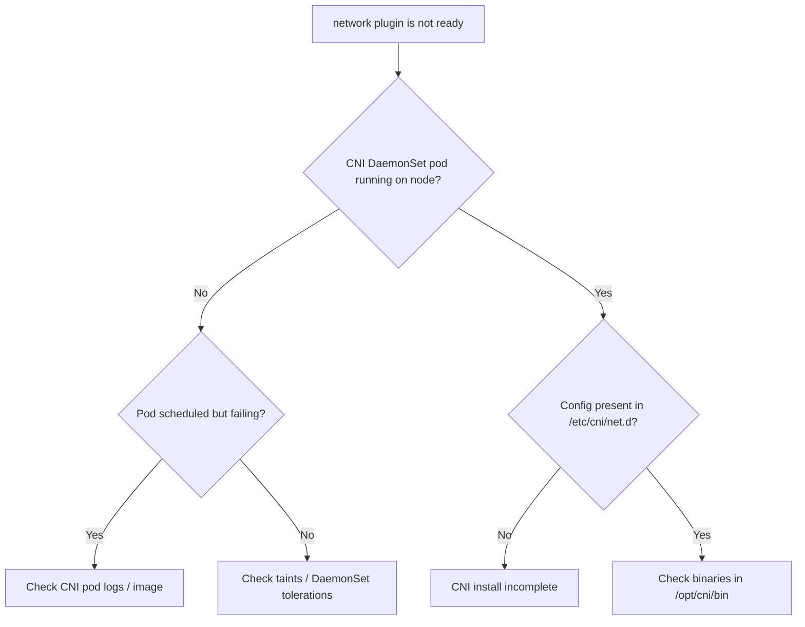

# NetworkPluginNotReady

> **Severity:** Critical · **Typical recovery time:** 10–45 min · **Affected versions:** 1.18+

## Error Message

```text
network plugin is not ready: cni config uninitialized
Warning  FailedCreatePodSandBox  kubelet  Failed to create pod sandbox: rpc error:
  code = Unknown desc = [failed to set up sandbox container network for pod:
  networkPlugin cni failed to set up pod network] network plugin is not ready:
  cni config uninitialized
```

## Description

The kubelet reports `NetworkPluginNotReady` when no valid CNI configuration has
been loaded from `/etc/cni/net.d`, so it cannot wire up pod networking. The node
typically shows `NotReady` and carries the
`node.kubernetes.io/network-unavailable` taint, which stops normal pods from
scheduling there. Any pod already assigned stalls in `ContainerCreating`.

This is Critical because it usually means the CNI DaemonSet (Calico, Cilium,
Flannel, AWS VPC CNI, etc.) hasn't installed its config — common right after a
node joins, a CNI upgrade, or a failed CNI rollout.

## Affected Kubernetes Versions

Applies to all CNI-based clusters (1.18+). After dockershim removal (1.24+),
network setup is always via CNI plugins, so this condition is universal.

## Likely Root Causes

- CNI DaemonSet pod not yet running / crashing on the node
- Missing or invalid config in `/etc/cni/net.d`
- CNI plugin binaries absent from `/opt/cni/bin`
- CNI image pull failing on the node
- RBAC/version mismatch preventing the CNI agent from starting

## Diagnostic Flow



## Verification Steps

Confirm the node is `NotReady`, the CNI DaemonSet has a pod targeting that node,
and the event chain ends in `cni config uninitialized`.

## kubectl Commands

```bash
kubectl get nodes -o wide
kubectl describe node <node>
kubectl get pods -n kube-system -o wide | grep -Ei 'calico|cilium|flannel|cni|aws-node'
kubectl logs -n kube-system <cni-pod>
```

## Expected Output

```text
NAME      STATUS     ROLES    AGE   VERSION
node-2    NotReady   <none>   3m    v1.29.4
Conditions:
  Type             Status   Reason
  NetworkUnavailable  True  NoRouteCreated
Events:
  Warning  FailedCreatePodSandBox  ... network plugin is not ready: cni config uninitialized
```

## Common Fixes

1. Ensure the CNI DaemonSet is healthy and scheduled to the node
2. Reinstall/repair CNI config and binaries on the node
3. Fix CNI image pull or registry access
4. Add the right tolerations so the CNI DaemonSet can land on tainted nodes

## Recovery Procedures

1. Check the CNI DaemonSet and its pod on the affected node.
2. If the CNI pod is crashing, read its logs and fix the root cause (config,
   RBAC, image). The node clears the taint automatically once CNI is ready.
3. If the CNI rollout itself is broken cluster-wide, roll the DaemonSet back to a
   known-good version. **Disruptive — cluster network:** affects pod networking
   on all nodes; coordinate carefully and stage by node group.
4. For a single stuck node, cordon it and let workloads run elsewhere while you
   repair. **Disruptive:** draining evicts pods from the node.

## Validation

Confirm the node turns `Ready`, the `network-unavailable` taint clears, and new
pods schedule and reach `Running` with assigned pod IPs.

## Prevention

- Gate CNI upgrades through staging and canary node pools
- Monitor CNI DaemonSet readiness and node `NetworkUnavailable` condition
- Bake CNI binaries into the node image to avoid pull-time failures
- Keep CNI tolerations broad enough to cover bootstrap taints

## Related Errors

- [FailedCreatePodSandBox](../pods/failed-to-create-pod-sandbox.md)
- [Pod Untolerated Taint](../pods/pod-untolerated-taint.md)

## References

- [Network Plugins (CNI)](https://kubernetes.io/docs/concepts/extend-kubernetes/compute-storage-net/network-plugins/)
- [Node Status & Conditions](https://kubernetes.io/docs/reference/node/node-status/)

## Further Reading

- [DevOps AI ToolKit — Kubernetes guides](https://devopsaitoolkit.com/blog/)
