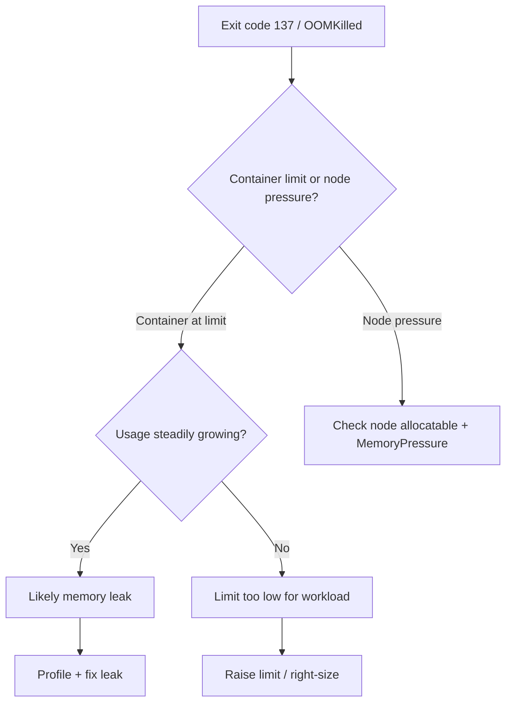

# OOMKilled

> **Severity:** High · **Typical recovery time:** 10–45 min · **Affected versions:** 1.20+

## Error Message

```text
    Last State:     Terminated
      Reason:       OOMKilled
      Exit Code:    137
```

## Description

`OOMKilled` means the Linux kernel's out-of-memory killer terminated the
container because it exceeded its memory limit (or the node ran out of memory).
Exit code 137 = 128 + 9 (SIGKILL). The container is killed abruptly — no graceful
shutdown — and then restarted per the pod's `restartPolicy`, frequently leading
to `CrashLoopBackOff` if it keeps happening.

There are two flavours: a **container-level OOM** when a container hits its
`resources.limits.memory`, and a **node-level OOM** when the node is under memory
pressure and the kubelet/kernel reclaims memory by killing pods. The fix differs:
the former needs a higher limit or a leak fix; the latter needs node-level
capacity and proper requests/limits across the cluster.

## Affected Kubernetes Versions

All supported versions (1.20+). With cgroup v2 (default on many distros and
fully supported from 1.25+), memory accounting and OOM behaviour are more
accurate, and you may see memory QoS features. The 137/SIGKILL semantics are
unchanged.

## Likely Root Causes

- Memory limit set too low for the application's real working set
- Memory leak or unbounded cache/buffer growth in the application
- Spike in load or large request payloads pushing usage past the limit
- Node memory pressure evicting/killing pods (insufficient node capacity)
- JVM/runtime heap not aligned with the container memory limit

## Diagnostic Flow



## Verification Steps

Check `Last State.Reason: OOMKilled` and `Exit Code: 137` in `describe`. Use
`kubectl top` to see live usage vs limit, and `describe node` to check for a
`MemoryPressure` condition to distinguish container vs node-level OOM.

## kubectl Commands

```bash
kubectl describe pod <pod> -n <namespace>
kubectl get pod <pod> -n <namespace> -o jsonpath='{.spec.containers[*].resources}'
kubectl top pod <pod> -n <namespace> --containers
kubectl top node
kubectl describe node <node>
kubectl get events -n <namespace> --sort-by=.lastTimestamp
```

## Expected Output

```text
    Last State:     Terminated
      Reason:       OOMKilled
      Exit Code:    137
    Restart Count:  5

# kubectl top
NAME         CPU(cores)   MEMORY(bytes)
app-xxxx     120m         512Mi          # limit was 512Mi -> killed at the ceiling
```

## Common Fixes

1. Right-size `resources.limits.memory` (and `requests.memory`) to the real
   working set plus headroom.
2. Fix the leak: profile the app, bound caches, and release buffers.
3. Align runtime heap settings with the limit (e.g. JVM
   `-XX:MaxRAMPercentage`, Node `--max-old-space-size`).
4. Add node capacity or enable autoscaling for genuine node-level pressure.

## Recovery Procedures

1. Confirm container-level vs node-level OOM before changing limits.
2. Update memory requests/limits and roll out. A rolling update replaces pods
   gradually — **blast radius: only this workload's pods; multi-replica
   Deployments stay available.**
3. Increasing capacity by adding nodes is non-disruptive; **draining a node to
   rebalance is disruptive (evicts all its pods)** — a safer alternative is to
   add a node and let the scheduler place new pods, or use a PodDisruptionBudget
   to bound impact.

## Validation

`Restart Count` stops climbing, no new `OOMKilled` in `Last State`, and
`kubectl top` shows steady usage comfortably below the limit under normal load.

## Prevention

- Always set memory requests and limits based on load testing.
- Make container runtimes limit-aware (heap/percentage flags).
- Alert on `container_memory_working_set_bytes` approaching the limit.
- Use VPA recommendations and capacity planning; enable node autoscaling.

## Related Errors

- [CrashLoopBackOff](./crashloopbackoff.md)
- [RunContainerError](./runcontainererror.md)
- [Pending Pod](./pending.md)
- [CreateContainerConfigError](./createcontainerconfigerror.md)

## References

- [Resource Management for Pods and Containers](https://kubernetes.io/docs/concepts/configuration/manage-resources-containers/)
- [Assign Memory Resources to Containers and Pods](https://kubernetes.io/docs/tasks/configure-pod-container/assign-memory-resource/)
- [Node-pressure Eviction](https://kubernetes.io/docs/concepts/scheduling-eviction/node-pressure-eviction/)

## Further Reading

- [DevOps AI ToolKit — Kubernetes guides](https://devopsaitoolkit.com/blog/)
