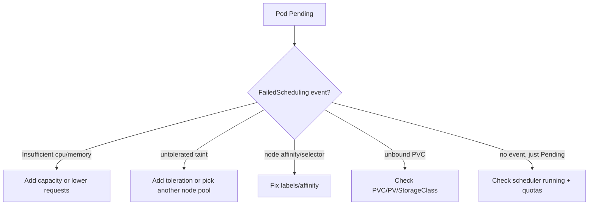

# Pending Pod

> **Severity:** High · **Typical recovery time:** 5–45 min · **Affected versions:** 1.20+

## Error Message

```text
Warning  FailedScheduling  21s (x3 over 90s)  default-scheduler  0/3 nodes are available:
3 Insufficient cpu. preemption: 0/3 nodes are available: 3 No preemption victims found
for incoming pod.
```

## Description

A pod stuck in `Pending` has been accepted by the API server but not yet
scheduled onto a node (or scheduled but not yet started). The most common reason
is the scheduler emitting a `FailedScheduling` event: no node satisfies the pod's
requirements. The message enumerates *why each node was rejected* — insufficient
CPU/memory, taints not tolerated, affinity/anti-affinity unmet, or volume
constraints.

This is a scheduling/capacity problem, not an application one. Read the
`FailedScheduling` message verbatim: it is a per-condition tally
(`3 Insufficient cpu`, `2 node(s) had untolerated taint`, etc.) that tells you
exactly which constraint to relax or which capacity to add.

## Affected Kubernetes Versions

All supported versions (1.20+). The message format ("`N/M nodes are available`")
is stable. Pod topology spread constraints (GA 1.19+) and the introduction of
`matchLabelKeys` (1.27+) can add scheduling rejection reasons. Cluster Autoscaler
/ Karpenter integration affects whether Pending resolves automatically.

## Likely Root Causes

- Insufficient allocatable CPU/memory on every node for the pod's requests
- Node taints the pod does not tolerate
- nodeSelector / nodeAffinity / pod (anti)affinity / topology spread unmet
- Unbound PersistentVolumeClaim (no matching PV / storage class provisioning)
- No nodes at all (or all cordoned), or hitting a ResourceQuota/LimitRange

## Diagnostic Flow



## Verification Steps

Confirm pod phase is `Pending` and read the `FailedScheduling` event in
`describe`. The per-reason counts must add up to the total node count; the
dominant reason is your fix target. If there is no scheduling event, check
whether the scheduler is healthy and whether a PVC is unbound.

## kubectl Commands

```bash
kubectl describe pod <pod> -n <namespace>
kubectl get events -n <namespace> --sort-by=.lastTimestamp
kubectl get nodes -o wide
kubectl describe node <node>
kubectl top node
kubectl get pvc -n <namespace>
kubectl get resourcequota -n <namespace>
```

## Expected Output

```text
NAME         READY   STATUS    RESTARTS   AGE
api-xxxx     0/1     Pending   0          90s

Events:
  Warning  FailedScheduling  21s (x3 over 90s)  default-scheduler
           0/3 nodes are available: 3 Insufficient cpu.
           preemption: 0/3 nodes are available: 3 No preemption victims found.
```

## Common Fixes

1. Reduce the pod's CPU/memory `requests` to fit existing nodes, or add nodes /
   enable Cluster Autoscaler to grow capacity.
2. Add the required `tolerations` or target a node pool without the taint.
3. Correct `nodeSelector`/affinity/topology constraints and node labels.
4. Resolve an unbound PVC (provision a PV, fix the StorageClass) or raise a
   blocking ResourceQuota/LimitRange.

## Recovery Procedures

1. Read the `FailedScheduling` reasons and pick the dominant constraint.
2. Add capacity (autoscaler or new node) — this is **non-disruptive**; the
   scheduler places the Pending pod once a fit exists.
3. Lowering requests requires updating the spec, which triggers a rolling update
   — **blast radius: only the workload's pods; replicas stay available.** Avoid
   `cordon`/`drain` of other nodes as a workaround — **draining evicts all pods
   on a node**; a safer alternative is adding capacity rather than shuffling.

## Validation

The pod transitions `Pending → ContainerCreating → Running`, a `Scheduled` event
names the node, and `kubectl get pods -o wide` shows it placed and `READY`.

## Prevention

- Set realistic resource requests and run capacity planning.
- Enable Cluster Autoscaler / Karpenter for elastic capacity.
- Keep taints/affinity/topology rules documented and validated in CI.
- Pre-provision storage classes with dynamic provisioning for PVCs.

## Related Errors

- [Stuck in ContainerCreating](./containercreating-stuck.md)
- [OOMKilled](./oomkilled.md)
- [ImagePullBackOff](./imagepullbackoff.md)
- [ErrImagePull](./errimagepull.md)

## References

- [Kubernetes Scheduler](https://kubernetes.io/docs/concepts/scheduling-eviction/kube-scheduler/)
- [Taints and Tolerations](https://kubernetes.io/docs/concepts/scheduling-eviction/taint-and-toleration/)
- [Assigning Pods to Nodes](https://kubernetes.io/docs/concepts/scheduling-eviction/assign-pod-node/)

## Further Reading

- [DevOps AI ToolKit — Kubernetes guides](https://devopsaitoolkit.com/blog/)
