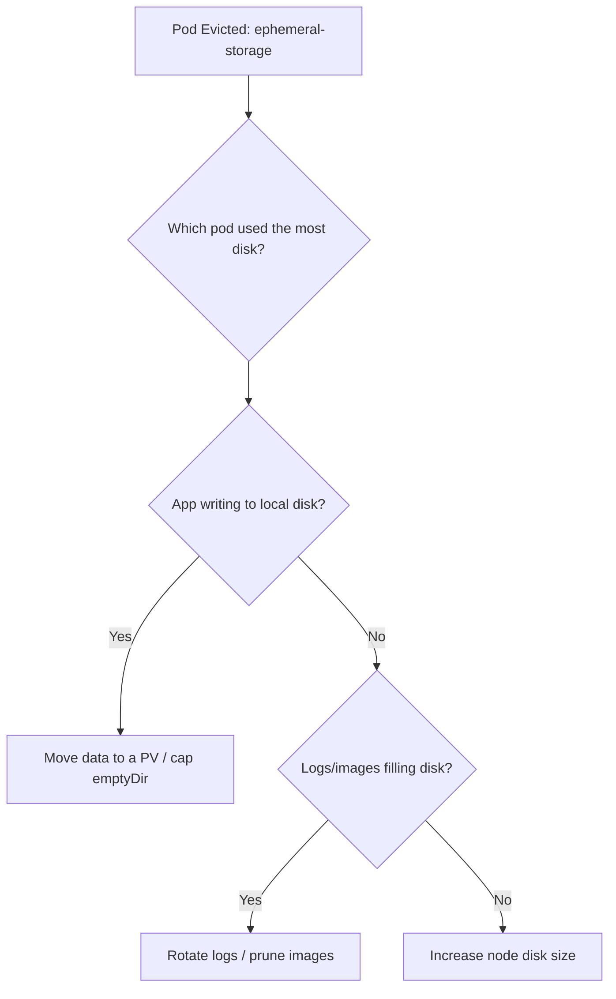

# Pod Evicted (ephemeral-storage)

> **Severity:** High · **Typical recovery time:** 10–40 min · **Affected versions:** 1.16+

## Error Message

```text
The node was low on resource: ephemeral-storage. Container app was using
2150Mi, which exceeds its request of 0.
Status:  Failed
Reason:  Evicted
Message: The node was low on resource: ephemeral-storage.
```

## Description

When a node's local disk crosses the kubelet's eviction threshold
(`nodefs`/`imagefs`), the kubelet reclaims space by evicting pods, ranked by how
far each exceeds its `ephemeral-storage` request. Evicted pods move to
`Failed/Evicted`; the controller reschedules managed pods elsewhere, but the
evicted objects linger until cleaned up. Ephemeral storage includes container
writable layers, `emptyDir` volumes, and logs.

This is High severity because disk pressure can cascade — one log-spewing pod can
fill a node and trigger eviction of innocent neighbors.

## Affected Kubernetes Versions

Applies to all supported versions (1.16+). Local ephemeral-storage requests/limits
and node-pressure eviction are stable. Default eviction thresholds (e.g.
`nodefs.available<10%`) may vary by distribution.

## Likely Root Causes

- A pod writing large data to its writable layer or `emptyDir`
- Excessive or unrotated container logs filling the node disk
- Image bloat / accumulated unused images on `imagefs`
- No `ephemeral-storage` requests/limits, so noisy pods aren't capped
- Undersized node disks for the workload mix

## Diagnostic Flow



## Verification Steps

Confirm the pod status is `Failed` with reason `Evicted` and an
`ephemeral-storage` message, and identify which pod(s) drove the node's disk
usage up.

## kubectl Commands

```bash
kubectl get pods -A --field-selector status.phase=Failed
kubectl describe pod <pod> -n <namespace>
kubectl describe node <node> | grep -A8 'Conditions\|Allocated resources'
kubectl get events -n <namespace> --field-selector reason=Evicted --sort-by=.lastTimestamp
```

## Expected Output

```text
NAME            READY   STATUS    RESTARTS   AGE
worker-5f-abcde 0/1     Evicted   0          12m
Status:   Failed
Reason:   Evicted
Message:  The node was low on resource: ephemeral-storage. Container app was using
          2150Mi, which exceeds its request of 0.
Conditions:
  DiskPressure   True
```

## Common Fixes

1. Set `ephemeral-storage` requests/limits so heavy writers are capped
2. Redirect bulk/persistent data to a PersistentVolume instead of local disk
3. Enable/verify log rotation; reduce log verbosity
4. Increase node disk size or prune unused images

## Recovery Procedures

1. Find the top disk consumer on the node from the eviction messages.
2. For the offending workload, add an `ephemeral-storage` limit and re-apply.
   **Disruptive — rolling update:** rolls the Deployment; blast radius is that
   workload.
3. Clean up evicted pod objects so they don't clutter the namespace (controllers
   already rescheduled their replacements).
4. If the node disk is chronically too small, replace it with a larger-disk node
   pool. **Disruptive — node-level:** draining the old node evicts all its pods;
   cordon and drain during a maintenance window.

## Validation

Confirm the node's `DiskPressure` condition clears, replacement pods are
`Running`, and no new `Evicted` events appear.

## Prevention

- Always set `ephemeral-storage` requests and limits on write-heavy pods
- Use PVs for durable/large data; keep `emptyDir` small and bounded
- Centralize logs and enforce rotation to stop disk creep
- Monitor node `nodefs`/`imagefs` usage and alert before thresholds

## Related Errors

- [Insufficient Memory](../pods/pod-insufficient-memory.md)
- [FailedCreatePodSandBox](../pods/failed-to-create-pod-sandbox.md)

## References

- [Node-pressure Eviction](https://kubernetes.io/docs/concepts/scheduling-eviction/node-pressure-eviction/)
- [Local Ephemeral Storage](https://kubernetes.io/docs/concepts/configuration/manage-resources-containers/#local-ephemeral-storage)

## Further Reading

- [DevOps AI ToolKit — Kubernetes guides](https://devopsaitoolkit.com/blog/)
