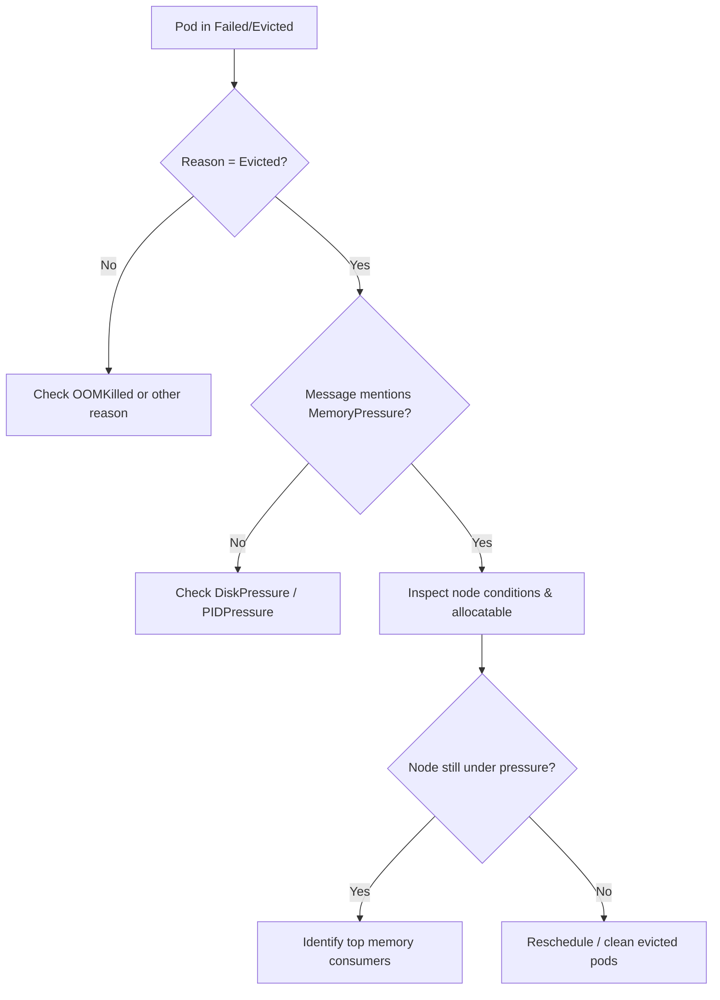

# Pod Evicted (MemoryPressure)

> **Severity:** High · **Typical recovery time:** 5–30 min · **Affected versions:** 1.20+

## Error Message

```text
Status:   Failed
Reason:   Evicted
Message:  The node had condition: [MemoryPressure].
```

## Description

The kubelet, not the OOM killer, made this decision. When available node memory
falls below the kubelet's `memory.available` eviction threshold, the node reports
the `MemoryPressure` condition and the kubelet begins evicting pods to reclaim
memory and protect node stability. Evicted pods are terminated and left in a
`Failed` phase with reason `Evicted`; they are *not* automatically rescheduled
unless owned by a controller (Deployment, ReplicaSet, StatefulSet).

This differs from `OOMKilled`: OOMKilled is the Linux cgroup killer acting on a
single container exceeding its limit, while MemoryPressure eviction is the
kubelet proactively shedding load across the whole node. During an incident this
matters because eviction often cascades — low-priority pods go first, then
higher-priority ones if pressure persists.

## Affected Kubernetes Versions

Applies to 1.20 through current releases. The eviction signal names
(`memory.available`) and the default hard threshold (`100Mi`) have been stable.
Soft vs. hard eviction thresholds and `--eviction-minimum-reclaim` behave the
same across these versions.

## Likely Root Causes

- Node oversubscribed: sum of pod memory requests/usage exceeds allocatable
- Pods without memory limits consuming far more than their requests
- A memory leak in a workload steadily climbing until the node tips over
- Too many `BestEffort`/`Burstable` pods packed onto a small node
- System daemons (logging, monitoring agents) consuming reserved headroom

## Diagnostic Flow



## Verification Steps

Confirm the pod was kubelet-evicted (reason `Evicted`) rather than OOMKilled,
and that the responsible node currently or recently reported `MemoryPressure`.

## kubectl Commands

```bash
kubectl get pods -n <namespace> --field-selector=status.phase=Failed
kubectl describe pod <pod> -n <namespace>
kubectl get node <node> -o jsonpath='{.status.conditions}'
kubectl describe node <node>
kubectl top nodes
kubectl top pods -A --sort-by=memory
```

## Expected Output

```text
$ kubectl get node ip-10-0-3-12 -o jsonpath='{.status.conditions}'
... {"type":"MemoryPressure","status":"True","reason":"KubeletHasInsufficientMemory",
     "message":"kubelet has insufficient memory available"} ...

$ kubectl describe pod web-7c9 -n app
Status:  Failed
Reason:  Evicted
Message: The node had condition: [MemoryPressure].
```

## Common Fixes

1. Set realistic memory `requests` and `limits` on all containers so the
   scheduler stops oversubscribing the node
2. Move or scale out workloads to reduce per-node memory density
3. Add nodes / use a larger instance type to increase allocatable memory
4. Fix the leaking application so usage stops climbing

## Recovery Procedures

Ordered, production-safe steps:

1. Identify the pressured node and its top memory consumers (read-only).
2. Clean up the stale evicted pod objects once a controller has rescheduled
   replacements. **Disruptive — blast radius: the deleted pods only.** Deleting
   `Failed/Evicted` pods removes finished objects; it does not restart healthy
   workloads, but confirm replacements are `Running` first.
3. If pressure persists, cordon the node and drain low-priority workloads.
   **Disruptive — blast radius: every pod on that node** is rescheduled
   elsewhere; ensure cluster capacity exists before draining.
4. Add capacity (new node / larger type) and uncordon.

## Validation

Node `MemoryPressure` condition reads `False`, `kubectl top node` shows headroom
below the eviction threshold, replacement pods are `Running` and `Ready`, and no
new `Evicted` events appear over a sustained window.

## Prevention

- Mandate memory requests/limits via a `LimitRange` and enforce with policy
- Reserve system headroom with `--system-reserved` / `--kube-reserved`
- Use `PriorityClass` so critical pods survive eviction sweeps
- Alert on node `memory.available` approaching the eviction threshold

## Related Errors

- [OOMKilled](../pods/oomkilled.md)
- [Too Many Pods (node capacity)](../pods/too-many-pods-on-node.md)

## References

- [Node-pressure Eviction](https://kubernetes.io/docs/concepts/scheduling-eviction/node-pressure-eviction/)
- [Reserve Compute Resources for System Daemons](https://kubernetes.io/docs/tasks/administer-cluster/reserve-compute-resources/)

## Further Reading

- [DevOps AI ToolKit — Kubernetes guides](https://devopsaitoolkit.com/blog/)
