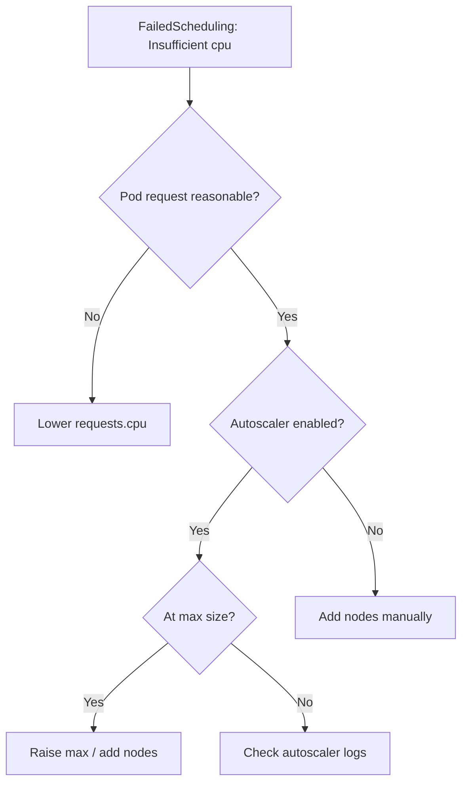

# Insufficient CPU

> **Severity:** High · **Typical recovery time:** 5–30 min · **Affected versions:** 1.16+

## Error Message

```text
0/6 nodes are available: 6 Insufficient cpu.
Warning  FailedScheduling  default-scheduler  0/6 nodes are available:
  6 Insufficient cpu. preemption: 0/6 nodes are available: 6 No preemption
  victims found for incoming pod.
```

## Description

The scheduler sums the **CPU requests** of all pods already placed on each node
and compares the remainder to the incoming pod's CPU request. If no node has
enough allocatable CPU left, the pod stays `Pending` with `Insufficient cpu`.
Note this is about *requests*, not live utilization — a node can look idle yet
be "full" because reserved requests are high.

This is a capacity/right-sizing problem and a frequent cause of stuck rollouts,
especially when a workload sets a large or accidental CPU request.

## Affected Kubernetes Versions

Applies to all supported versions (1.16+). The request-based scheduling model is
stable. Cluster Autoscaler / Karpenter behavior may resolve it automatically by
adding nodes when configured.

## Likely Root Causes

- Cluster genuinely out of allocatable CPU (needs more nodes)
- Pod requests far more CPU than necessary (mis-set `requests.cpu`)
- Node `Allocatable` reduced by system/kube reservations
- DaemonSets/system pods consuming reserved CPU on every node
- Autoscaler disabled, at max size, or unable to provision

## Diagnostic Flow



## Verification Steps

Confirm the pod is `Pending` with reason `Insufficient cpu`, then check both the
pod's CPU request and per-node allocatable/allocated CPU.

## kubectl Commands

```bash
kubectl describe pod <pod> -n <namespace>
kubectl get pod <pod> -n <namespace> -o jsonpath='{.spec.containers[*].resources.requests.cpu}'
kubectl describe node <node> | grep -A6 'Allocated resources'
kubectl top nodes
```

## Expected Output

```text
Status:  Pending
Events:
  Warning  FailedScheduling  default-scheduler  0/6 nodes are available: 6 Insufficient cpu.

Allocated resources:
  Resource  Requests      Limits
  cpu       3800m (95%)   4 (100%)
```

## Common Fixes

1. Right-size `requests.cpu` to actual measured usage
2. Add nodes (or raise Cluster Autoscaler/Karpenter limits)
3. Reduce per-node system/kube reservations if over-provisioned
4. Reschedule or consolidate low-priority workloads to free requests

## Recovery Procedures

1. Compare the pod's CPU request against per-node free allocatable CPU.
2. If the request is inflated, lower it and re-apply. **Disruptive — rolling
   update:** rolls the Deployment; blast radius is that workload.
3. If the cluster is truly full, scale the node pool up (or raise the autoscaler
   max). New nodes let the pending pod bind without further changes.
4. To free capacity fast, scale down or evict lower-priority workloads.
   **Disruptive:** evicting pods reduces capacity for those services.

## Validation

Confirm the pod schedules and reaches `Running`, and that node CPU requests sit
below 100% allocatable with headroom for spikes.

## Prevention

- Set CPU requests from real usage data (P95), not guesses
- Enable an autoscaler with sane min/max bounds
- Use ResourceQuotas/LimitRanges to catch oversized requests early
- Monitor allocatable-vs-allocated CPU and alert before saturation

## Related Errors

- [Insufficient Memory](../pods/pod-insufficient-memory.md)
- [Pod Untolerated Taint](../pods/pod-untolerated-taint.md)

## References

- [Resource Management for Pods and Containers](https://kubernetes.io/docs/concepts/configuration/manage-resources-containers/)
- [Kubernetes Scheduler](https://kubernetes.io/docs/concepts/scheduling-eviction/kube-scheduler/)

## Further Reading

- [Free Kubernetes config validators](https://devopsaitoolkit.com/validators/)
