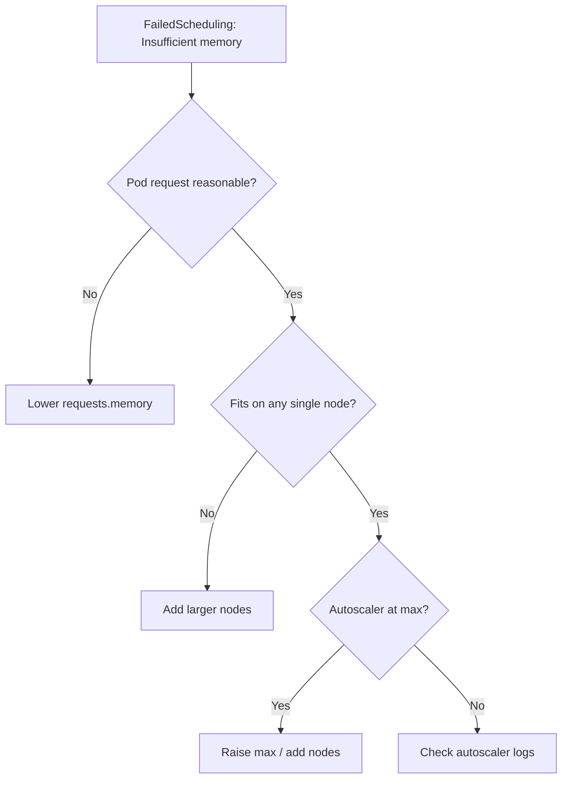

# Insufficient Memory

> **Severity:** High · **Typical recovery time:** 5–30 min · **Affected versions:** 1.16+

## Error Message

```text
0/6 nodes are available: 6 Insufficient memory.
Warning  FailedScheduling  default-scheduler  0/6 nodes are available:
  6 Insufficient memory. preemption: 0/6 nodes are available: 6 No preemption
  victims found for incoming pod.
```

## Description

The scheduler adds up the **memory requests** of pods already on each node and
checks whether the remaining allocatable memory can fit the incoming pod's
request. If no node has room, the pod is `Pending` with `Insufficient memory`.
Like CPU, this is request-based: the decision uses reserved requests, not live
RAM usage, so a node with free memory can still reject the pod.

Memory is incompressible, so this is High severity — under-provisioning leads to
stuck deployments, and oversized requests waste real capacity.

## Affected Kubernetes Versions

Applies to all supported versions (1.16+). The request-based filter is stable.
Autoscalers (Cluster Autoscaler, Karpenter) can resolve it by adding nodes when
properly configured.

## Likely Root Causes

- Cluster out of allocatable memory (needs more/larger nodes)
- Pod requests more memory than it needs (mis-set `requests.memory`)
- Node `Allocatable` reduced by kube/system reserved and eviction thresholds
- Memory fragmented across nodes — no single node fits a large request
- Autoscaler off, at max, or unable to provision a fitting instance type

## Diagnostic Flow



## Verification Steps

Confirm the pod is `Pending` with reason `Insufficient memory`, then compare the
pod's memory request to per-node allocatable and already-allocated memory.

## kubectl Commands

```bash
kubectl describe pod <pod> -n <namespace>
kubectl get pod <pod> -n <namespace> -o jsonpath='{.spec.containers[*].resources.requests.memory}'
kubectl describe node <node> | grep -A6 'Allocated resources'
kubectl top nodes
```

## Expected Output

```text
Status:  Pending
Events:
  Warning  FailedScheduling  default-scheduler  0/6 nodes are available: 6 Insufficient memory.

Allocated resources:
  Resource  Requests       Limits
  memory    15Gi (96%)     16Gi (100%)
```

## Common Fixes

1. Right-size `requests.memory` to real working-set size
2. Add nodes or larger instance types to fit big requests
3. Raise the autoscaler maximum or fix provisioning constraints
4. Consolidate/evict low-priority workloads to free memory requests

## Recovery Procedures

1. Compare the pod's memory request to free allocatable memory per node.
2. If the request is inflated, reduce it and re-apply. **Disruptive — rolling
   update:** rolls the Deployment; blast radius is that workload.
3. If the cluster is full, scale up the node pool or add a node type large enough
   for the request. The pending pod binds once a fitting node appears.
4. To free memory immediately, scale down lower-priority workloads.
   **Disruptive:** evicting pods reduces capacity and may cause restarts.

## Validation

Confirm the pod schedules to `Running`, and node memory requests have headroom
below the eviction threshold so nodes stay stable under load.

## Prevention

- Base memory requests on measured working set (P95/P99), not peaks alone
- Keep requests and limits aligned to reduce OOM and fragmentation risk
- Enforce LimitRanges/ResourceQuotas to catch oversized requests in CI
- Alert on allocatable-vs-allocated memory approaching capacity

## Related Errors

- [Insufficient CPU](../pods/pod-insufficient-cpu.md)
- [Pod Evicted (ephemeral-storage)](../pods/pod-evicted-ephemeral-storage.md)

## References

- [Resource Management for Pods and Containers](https://kubernetes.io/docs/concepts/configuration/manage-resources-containers/)
- [Node-pressure Eviction](https://kubernetes.io/docs/concepts/scheduling-eviction/node-pressure-eviction/)

## Further Reading

- [Free Kubernetes config validators](https://devopsaitoolkit.com/validators/)
