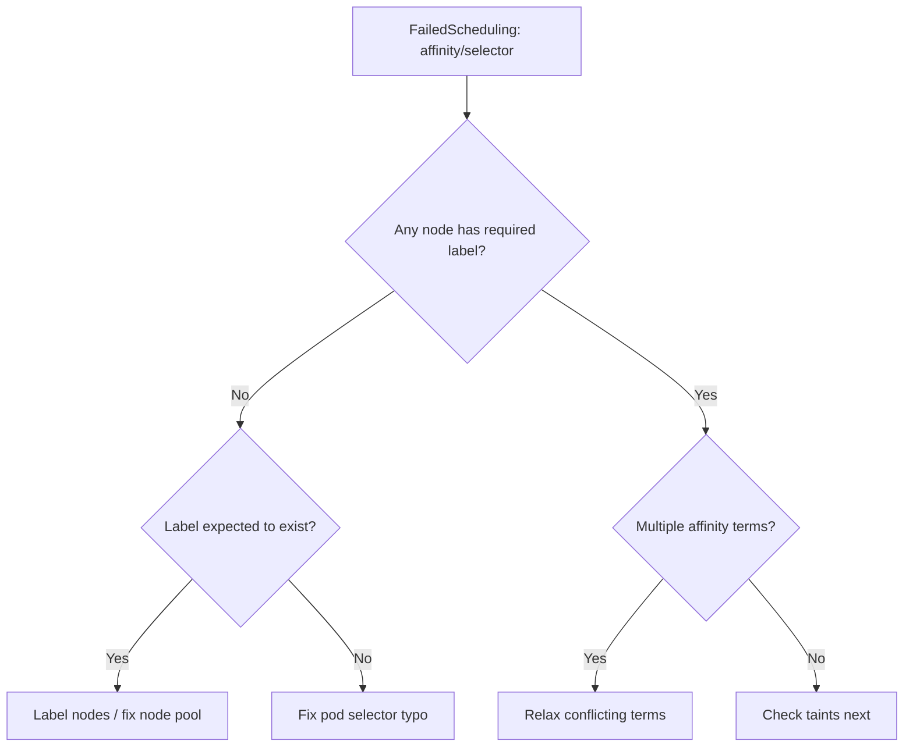

# Pod Node Affinity Conflict

> **Severity:** Medium · **Typical recovery time:** 5–20 min · **Affected versions:** 1.16+

## Error Message

```text
0/5 nodes are available: 5 node(s) didn't match Pod's node affinity/selector.
Warning  FailedScheduling  default-scheduler  0/5 nodes are available: 5 node(s)
  didn't match Pod's node affinity/selector. preemption: 0/5 nodes are available.
```

## Description

The scheduler reports this when no node satisfies the pod's `nodeSelector` or its
`requiredDuringSchedulingIgnoredDuringExecution` node affinity. The pod stays
`Pending` because the hard constraint filters out every candidate node. Unlike
resource shortages, this is a labeling/topology mismatch, not capacity.

It typically appears after a label is mistyped, a node pool is missing the
expected label, or a workload pinned to a zone/instance type that doesn't exist
in the cluster.

## Affected Kubernetes Versions

Applies to all supported versions (1.16+). Node affinity and `nodeSelector` are
stable. The scheduler message wording has stayed consistent across recent
releases.

## Likely Root Causes

- `nodeSelector` / affinity key or value typo
- Target nodes simply aren't labeled with the required key/value
- Pinned to a zone, arch, or instance type not present in the cluster
- Overly strict combined affinity terms that no node satisfies
- Node pool scaled to zero or removed

## Diagnostic Flow



## Verification Steps

Confirm the pod is `Pending`, the FailedScheduling reason cites affinity/selector
(not Insufficient resources or taints), and compare required labels against
actual node labels.

## kubectl Commands

```bash
kubectl describe pod <pod> -n <namespace>
kubectl get pod <pod> -n <namespace> -o jsonpath='{.spec.affinity}{"\n"}{.spec.nodeSelector}'
kubectl get nodes --show-labels
kubectl get nodes -l <key>=<value>
```

## Expected Output

```text
Status:  Pending
Events:
  Warning  FailedScheduling  default-scheduler  0/5 nodes are available:
  5 node(s) didn't match Pod's node affinity/selector.

# nodeSelector requires disktype=ssd, but:
kubectl get nodes -l disktype=ssd
No resources found
```

## Common Fixes

1. Correct the `nodeSelector`/affinity key/value to match real node labels
2. Add the expected label to the appropriate nodes or node pool
3. Loosen `required` affinity to `preferred` where strictness isn't essential
4. Ensure the target node pool exists and is scaled above zero

## Recovery Procedures

1. Diff the pod's required labels against `kubectl get nodes --show-labels`.
2. If pods should run on existing nodes, fix the selector and re-apply the
   workload. **Disruptive — rolling update:** editing the pod template rolls the
   Deployment; blast radius is that workload's replicas.
3. If nodes are missing the label, label them or recreate the node pool with the
   correct labels (managed node groups apply labels at creation).
4. If a node pool was scaled to zero, scale it back up so matching nodes exist.

## Validation

Confirm the pod leaves `Pending`, binds to a node carrying the required label,
and reaches `Running`.

## Prevention

- Manage node labels declaratively (IaC) to prevent drift
- Prefer `preferredDuringScheduling` unless a hard constraint is truly required
- Validate affinity rules against cluster topology in CI
- Document which labels each node pool is expected to carry

## Related Errors

- [Pod Untolerated Taint](../pods/pod-untolerated-taint.md)
- [Insufficient CPU](../pods/pod-insufficient-cpu.md)

## References

- [Assigning Pods to Nodes](https://kubernetes.io/docs/concepts/scheduling-eviction/assign-pod-node/)
- [Node Affinity](https://kubernetes.io/docs/concepts/scheduling-eviction/assign-pod-node/#node-affinity)

## Further Reading

- [Free Kubernetes config validators](https://devopsaitoolkit.com/validators/)
