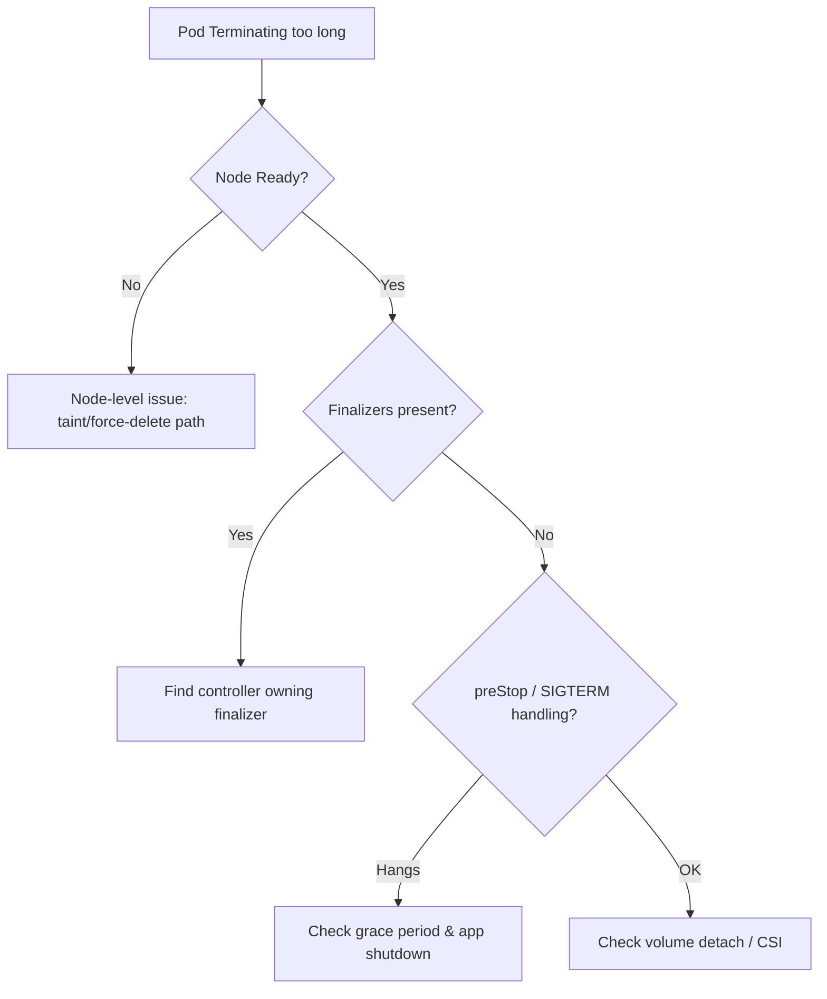

# Pod Stuck Terminating

> **Severity:** High · **Typical recovery time:** 5–20 min · **Affected versions:** 1.20+

## Error Message

```text
NAME        READY   STATUS        RESTARTS   AGE
web-7c9d    0/1     Terminating   0          47m
```

## Description

A pod enters `Terminating` the moment its `deletionTimestamp` is set, after which
the kubelet runs the preStop hook, sends `SIGTERM`, waits the grace period, then
`SIGKILL`s the container. The API object is only removed once all finalizers
clear and the kubelet confirms cleanup. A pod "stuck" Terminating means one of
those steps never completed.

During an incident this is dangerous because the old pod may still hold a lease,
a volume attachment, or a network identity that a replacement needs. For
StatefulSets in particular, the controller will not create the replacement until
the old pod fully terminates, so a single stuck pod can stall a whole rollout.

## Affected Kubernetes Versions

Applies to 1.20+. Note that unreachable-node handling improved over time: with
the `NodeOutOfServiceVolumeDetach` feature (GA 1.28) pods on a dead node are
force-deleted and volumes detached automatically once the node is tainted
`out-of-service`. On older clusters this required manual intervention.

## Likely Root Causes

- Lingering finalizers (`metadata.finalizers`) not removed by their controller
- A preStop hook or container ignoring `SIGTERM` past the grace period
- The node hosting the pod is `NotReady`/unreachable (kubelet can't confirm)
- Volume detach/unmount hung (CSI driver stuck)
- A custom controller or operator that owns the finalizer is down

## Diagnostic Flow



## Verification Steps

Confirm a `deletionTimestamp` is set and identify what is blocking: finalizers,
an unreachable node, or a hung volume/hook.

## kubectl Commands

```bash
kubectl get pod <pod> -n <namespace> -o yaml | grep -A5 deletionTimestamp
kubectl get pod <pod> -n <namespace> -o jsonpath='{.metadata.finalizers}'
kubectl describe pod <pod> -n <namespace>
kubectl get node <node>
kubectl get events -n <namespace> --sort-by=.lastTimestamp
```

## Expected Output

```text
$ kubectl get pod web-7c9d -n app -o jsonpath='{.metadata.finalizers}'
["external-attacher/ebs-csi-aws-com"]

$ kubectl get pod web-7c9d -n app -o yaml | grep deletionTimestamp
  deletionTimestamp: "2026-06-29T11:02:17Z"
  deletionGracePeriodSeconds: 30
```

## Common Fixes

1. Bring the finalizer's controller/operator back online so it completes cleanup
2. Shorten or fix the preStop hook and ensure the app handles `SIGTERM`
3. Repair the CSI driver so the volume detaches
4. Recover or remove the unreachable node so the kubelet can confirm deletion

## Recovery Procedures

Ordered, production-safe steps:

1. Diagnose the blocker first — force-deleting hides the real cause.
2. If a controller will never clear the finalizer, remove it manually with a
   patch. **Disruptive — blast radius: the single pod;** removing a finalizer
   skips that controller's cleanup (e.g. volume detach), which can corrupt data
   for RWO volumes or stateful workloads. Verify no replacement is using the
   volume.
3. As a last resort, `--force --grace-period=0` delete. **Disruptive — blast
   radius: the single pod;** for StatefulSets/RWO volumes this risks
   split-brain if the underlying container is actually still running on a live
   node. Only force-delete when the node is confirmed dead.

## Validation

The pod object disappears from `kubectl get pods`, any replacement is `Running`
and `Ready`, and volume attachments / leases previously held are released.

## Prevention

- Ensure apps trap `SIGTERM` and shut down within the grace period
- Keep finalizer-owning operators highly available
- Set the `out-of-service` taint path for dead nodes (1.28+)
- Monitor for pods Terminating longer than their grace period

## Related Errors

- [FailedPreStopHook](../pods/failed-pre-stop-hook.md)
- [Failed To Sync Secret Cache](../pods/failed-to-sync-secret-cache.md)

## References

- [Pod Lifecycle — Termination](https://kubernetes.io/docs/concepts/workloads/pods/pod-lifecycle/#pod-termination)
- [Finalizers](https://kubernetes.io/docs/concepts/overview/working-with-objects/finalizers/)

## Further Reading

- [DevOps AI ToolKit — Kubernetes guides](https://devopsaitoolkit.com/blog/)
