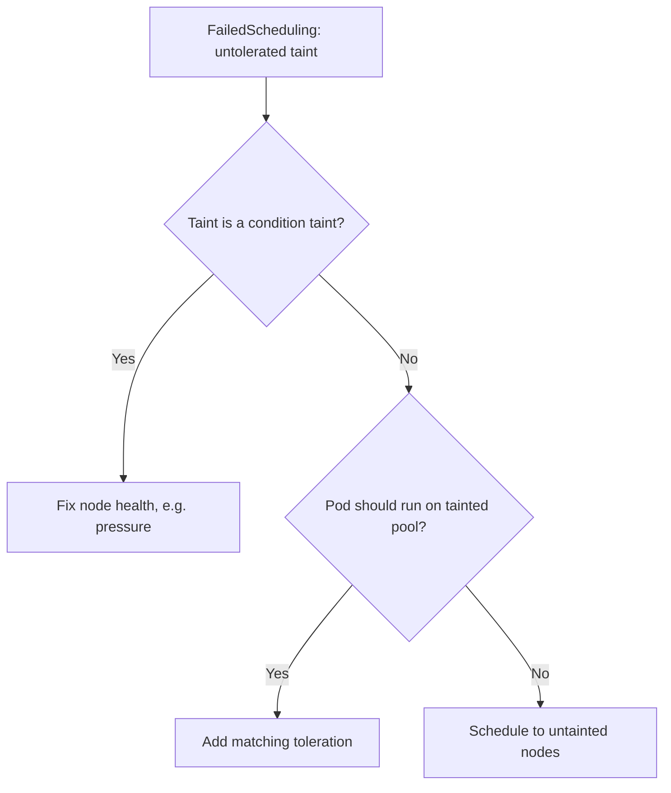

# Pod Untolerated Taint

> **Severity:** Medium · **Typical recovery time:** 5–15 min · **Affected versions:** 1.16+

## Error Message

```text
0/4 nodes are available: 4 node(s) had untolerated taint {dedicated: gpu}.
Warning  FailedScheduling  default-scheduler  0/4 nodes are available: 4 node(s)
  had untolerated taint {node-role.kubernetes.io/control-plane: }. preemption: ...
```

## Description

Taints let a node repel pods that don't carry a matching toleration. When every
candidate node has a taint the pod can't tolerate, the scheduler filters them all
out and the pod stays `Pending`. This is the inverse of affinity: nodes are
saying "stay away unless you opt in," and the pod hasn't opted in.

Common sources are control-plane taints, dedicated GPU/spot pools, and
automatically applied condition taints (disk/memory/PID pressure, not-ready)
during node trouble.

## Affected Kubernetes Versions

Applies to all supported versions (1.16+). Taints/tolerations are stable.
Built-in condition taints (e.g. `node.kubernetes.io/not-ready`) are applied
automatically and behave consistently across recent releases.

## Likely Root Causes

- Dedicated node pool taint (GPU, spot, control-plane) with no matching toleration
- Auto-applied condition taint due to node pressure or `NotReady`
- Toleration `key`/`value`/`effect` mismatch (e.g. wrong `effect: NoExecute`)
- Newly tainted nodes after a policy change
- Only control-plane nodes available and pod lacks that toleration

## Diagnostic Flow



## Verification Steps

Confirm the pod is `Pending`, the FailedScheduling message names a specific taint,
and compare that taint's key/value/effect with the pod's tolerations.

## kubectl Commands

```bash
kubectl describe pod <pod> -n <namespace>
kubectl get pod <pod> -n <namespace> -o jsonpath='{.spec.tolerations}'
kubectl describe node <node> | grep -i taint
kubectl get nodes -o custom-columns=NAME:.metadata.name,TAINTS:.spec.taints
```

## Expected Output

```text
Status:  Pending
Events:
  Warning  FailedScheduling  default-scheduler  0/4 nodes are available:
  4 node(s) had untolerated taint {dedicated: gpu}.

# Node side:
Taints:  dedicated=gpu:NoSchedule
```

## Common Fixes

1. Add a toleration matching the node taint's key/value/effect
2. Resolve the node condition that triggered an automatic taint
3. Target untainted nodes if the pod shouldn't run on the special pool
4. Correct a mismatched `effect` (NoSchedule vs NoExecute vs PreferNoSchedule)

## Recovery Procedures

1. Identify the exact taint from the event and the node spec.
2. If the pod belongs on that pool, add the matching toleration and re-apply.
   **Disruptive — rolling update:** changing the pod template rolls the
   Deployment; blast radius is that workload only.
3. If the taint is a condition taint (disk/memory pressure, not-ready), fix the
   node — don't paper over it with a toleration. **Disruptive:** repairing a node
   may require cordon/drain, evicting its pods.
4. If only control-plane nodes are free, scale up worker capacity instead of
   tolerating the control-plane taint.

## Validation

Confirm the pod schedules onto an appropriate node and reaches `Running`, and
that no condition taints remain on the targeted nodes.

## Prevention

- Define dedicated-pool tolerations alongside the workloads that need them
- Alert on condition taints (pressure/not-ready) as node-health signals
- Manage taints declaratively to avoid surprise scheduling changes
- Never blanket-tolerate condition taints in normal workloads

## Related Errors

- [Pod Node Affinity Conflict](../pods/pod-node-affinity-conflict.md)
- [NetworkPluginNotReady](../pods/networkpluginnotready.md)

## References

- [Taints and Tolerations](https://kubernetes.io/docs/concepts/scheduling-eviction/taint-and-toleration/)
- [Assigning Pods to Nodes](https://kubernetes.io/docs/concepts/scheduling-eviction/assign-pod-node/)

## Further Reading

- [Free Kubernetes config validators](https://devopsaitoolkit.com/validators/)
