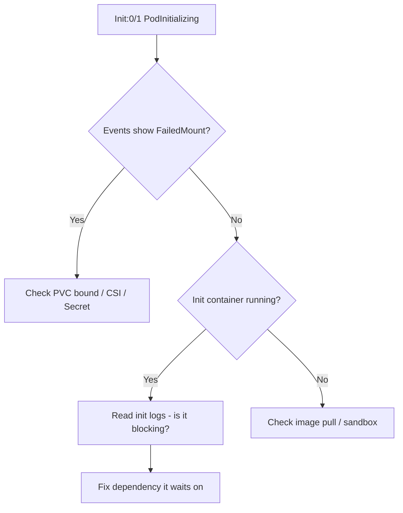

# Stuck in PodInitializing

> **Severity:** High · **Typical recovery time:** 10–30 min · **Affected versions:** 1.20+

## Error Message

```text
NAME        READY   STATUS                  RESTARTS   AGE
api-0       0/1     Init:0/1                0          6m
# describe shows:
Init Containers:
  setup:
    State:   Running
Pod status: PodInitializing
```

## Description

`Init:0/1` with status `PodInitializing` means the pod has been scheduled and the
kubelet is working through init containers, but the first one has neither completed
nor crashed — it is simply *running and not finishing*, or the kubelet cannot
finish preparing the pod sandbox/volumes. Unlike `Init:CrashLoopBackOff` there is
no restart loop; the pod just hangs. This is a soft failure that often hides a
blocking dependency or a slow/never-returning init command.

## Affected Kubernetes Versions

Behaviour is consistent across 1.20+. The displayed status string `PodInitializing`
is produced by the kubelet sandbox lifecycle and is unchanged in recent releases.
With native sidecar init containers (1.29+), a long-running sidecar that never
becomes Started can also hold the pod in this state.

## Likely Root Causes

- Init container command blocks forever (waiting on an endpoint that never comes up)
- Volume mount stalls: PVC unbound, CSI attach/mount slow, NFS/secret mount hanging
- Image still pulling for the init container (slow registry, large image)
- CNI/sandbox not ready, or node under resource pressure
- A required Secret/ConfigMap referenced as a volume does not yet exist

## Diagnostic Flow



## Verification Steps

Distinguish from `Init:CrashLoopBackOff` (no restarts here) and from
`ContainerCreating` (init containers haven't started there). Confirm the init
container `State` is `Running` or `Waiting`, and check events for mount or pull
messages.

## kubectl Commands

```bash
kubectl describe pod <pod> -n <namespace>
kubectl get events -n <namespace> --sort-by=.lastTimestamp
kubectl logs <pod> -c <init-container> -n <namespace>
kubectl get pvc -n <namespace>
kubectl top pod <pod> -n <namespace>
```

## Expected Output

```text
Events:
  Warning  FailedMount  2m  kubelet  Unable to attach or mount volumes:
           unmounted volumes=[data], unattached volumes=[data kube-api-access]:
           timed out waiting for the condition

Init Containers:
  setup:  State: Running   Started: 6m ago
```

## Common Fixes

1. Resolve the blocking dependency the init container is waiting on
2. Fix the volume: bind the PVC, repair the CSI driver, or create the missing Secret/ConfigMap
3. Wait out / speed up the image pull; pre-pull large init images to nodes
4. Add a timeout to the init command so it fails loudly instead of hanging

## Recovery Procedures

1. Inspect events and init logs to identify mount vs. dependency vs. pull.
2. For an unbound PVC, ensure a matching PV/StorageClass exists (non-disruptive).
3. Create any missing Secret/ConfigMap referenced as a volume (non-disruptive).
4. **Disruptive — delete the stuck pod** once the root cause is fixed: blast
   radius = one replica; the controller reschedules it and mounts proceed cleanly.
5. **Disruptive — cordon/drain a node** only if a node-level CSI failure affects
   many pods; blast radius = all pods on that node reschedule elsewhere.

## Validation

```bash
kubectl get pod <pod> -n <namespace> -w
```

Pod advances to `Running` and `Ready 1/1`; `kubectl describe` shows volumes mounted
and no recurring `FailedMount` events.

## Prevention

- Use bounded waits in init logic; never `while true` without a deadline
- Pre-provision PVs or use a reliable dynamic StorageClass; monitor CSI health
- Validate Secret/ConfigMap volume references in CI
- Set resource requests so pods land on nodes with capacity for fast pulls

## Related Errors

- [Init:CrashLoopBackOff](../pods/init-container-crashloopbackoff.md)
- [ImageInspectError](../pods/imageinspecterror.md)
- [InvalidImageName](../pods/invalidimagename.md)

## References

- [Init Containers](https://kubernetes.io/docs/concepts/workloads/pods/init-containers/)
- [Configure a Pod to Use a PersistentVolume](https://kubernetes.io/docs/tasks/configure-pod-container/configure-persistent-volume-storage/)

## Further Reading

- [Free Kubernetes config validators](https://devopsaitoolkit.com/validators/)
