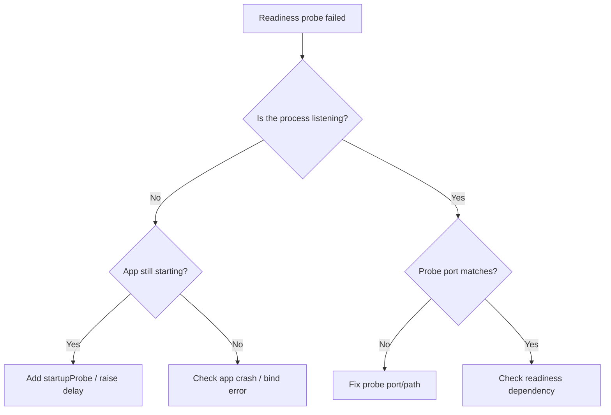

# Readiness Probe Failed

> **Severity:** High · **Typical recovery time:** 5–20 min · **Affected versions:** 1.16+

## Error Message

```text
Readiness probe failed: connection refused
Warning  Unhealthy  kubelet  Readiness probe failed: dial tcp 10.1.2.3:8080: connect: connection refused
```

## Description

The readiness probe tells Kubernetes whether a container is ready to receive
traffic. When it fails, the kubelet marks the pod `Ready=False`, and the
EndpointSlice controller removes the pod IP from the Service endpoints, so the
pod stops receiving traffic but is **not** restarted. "Connection refused"
means nothing is listening on the probed port yet — the process hasn't bound the
socket or has crashed.

In an incident this manifests as a Service with zero (or shrinking) endpoints
and 502/503s at the ingress, even though pods appear to be "running."

## Affected Kubernetes Versions

Applies to all supported versions (1.16+). Endpoint management moved from the
Endpoints controller to EndpointSlices over 1.19–1.21, but readiness semantics
are unchanged.

## Likely Root Causes

- App not yet listening on the port (still starting) and no `startupProbe`
- Wrong `containerPort`/probe port mismatch
- Application crashed or failed to bind the socket
- Dependency check in the readiness handler failing
- `periodSeconds`/`failureThreshold` too tight for startup time

## Diagnostic Flow



## Verification Steps

Confirm the pod shows `READY 0/1`, the Service lost the endpoint, and the event
reason is `Unhealthy` from a readiness probe (not liveness).

## kubectl Commands

```bash
kubectl get pod <pod> -n <namespace> -o wide
kubectl describe pod <pod> -n <namespace>
kubectl get endpointslices -n <namespace> -l kubernetes.io/service-name=<svc>
kubectl logs <pod> -n <namespace>
```

## Expected Output

```text
NAME           READY   STATUS    RESTARTS   AGE
web-7d9f-abcde 0/1     Running   0          2m
Events:
  Warning  Unhealthy  kubelet  Readiness probe failed: dial tcp 10.1.2.3:8080: connect: connection refused
Readiness:  tcp-socket :8080 delay=5s timeout=1s period=10s #success=1 #failure=3
```

## Common Fixes

1. Point the probe at the port the app actually binds
2. Add a `startupProbe` so readiness isn't evaluated before boot completes
3. Fix the app's failure to listen (config, crash, missing dependency)
4. Increase `initialDelaySeconds`/`failureThreshold` for slow starts

## Recovery Procedures

1. Check logs to confirm whether the process bound its port.
2. If a config/port mismatch, patch the deployment's probe definition.
   **Disruptive — rolling update:** affects the entire Deployment; control with
   `maxUnavailable` to keep capacity online.
3. If the app crashed on boot, fix the root cause and let the ReplicaSet recreate
   pods; readiness flips to true once the socket is accepting connections.
4. Re-add pods to the Service automatically — no manual endpoint edits needed.

## Validation

Confirm the pod reports `READY 1/1`, the EndpointSlice lists the pod IP, and a
request through the Service succeeds.

## Prevention

- Always pair slow-starting apps with a `startupProbe`
- Keep readiness checks shallow but representative of serving capability
- Pin `containerPort` and probe port to the same value via shared config
- Load-test startup time to set realistic thresholds

## Related Errors

- [Liveness Probe Failed](../pods/liveness-probe-failed.md)
- [Startup Probe Failed](../pods/startup-probe-failed.md)

## References

- [Configure Liveness, Readiness and Startup Probes](https://kubernetes.io/docs/tasks/configure-pod-container/configure-liveness-readiness-startup-probes/)
- [Service & EndpointSlices](https://kubernetes.io/docs/concepts/services-networking/endpoint-slices/)

## Further Reading

- [Free Kubernetes config validators](https://devopsaitoolkit.com/validators/)
