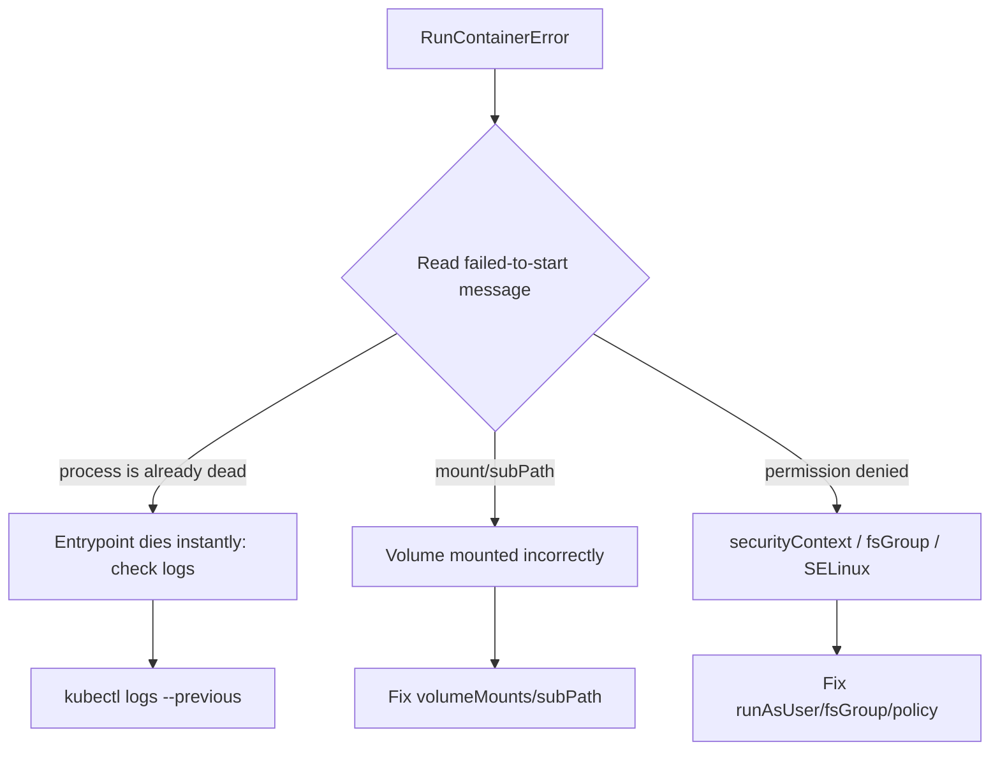

# RunContainerError

> **Severity:** High · **Typical recovery time:** 10–45 min · **Affected versions:** 1.20+

## Error Message

```text
Warning  Failed  2s (x3 over 18s)  kubelet  Error: failed to start container "app":
Error response from daemon: OCI runtime start failed: container process is already dead: unknown
```

## Description

`RunContainerError` occurs when the container was successfully *created* but
failed at the *start* step. The runtime built the container, then the attempt to
launch its process failed immediately. Common culprits are mount failures
surfacing at start, a config/secret mounted as a directory vs file, SELinux/
AppArmor denials, or an entrypoint that dies the instant it executes.

It sits one step later than `CreateContainerError` in the container lifecycle.
Because the failure happens at start, you often get useful detail from
`logs --previous` in addition to the event message. Treat the message text as
authoritative for pinpointing the cause.

## Affected Kubernetes Versions

All supported versions (1.20+). Post-dockershim (1.24+) the message originates
from containerd/runc (`OCI runtime start failed`). Older clusters using Docker
showed similar `Error response from daemon` wording; the diagnostics are the same.

## Likely Root Causes

- Volume/subPath mount issue surfacing at start (e.g. mounting a file as a dir)
- Entrypoint process exits immediately or is invalid at runtime
- SELinux/AppArmor/seccomp denial blocking the process start
- Missing shared library or interpreter in the image
- Permission/ownership problems on mounted paths with restrictive `securityContext`

## Diagnostic Flow



## Verification Steps

Confirm container `State` is `Waiting` with reason `RunContainerError`, and read
the `Error:` event. Pull `--previous` logs to see anything the process emitted
before dying. Distinguish from `CreateContainerError` (fails earlier, at create).

## kubectl Commands

```bash
kubectl describe pod <pod> -n <namespace>
kubectl logs <pod> -n <namespace> --previous
kubectl get events -n <namespace> --sort-by=.lastTimestamp
kubectl get pod <pod> -n <namespace> -o yaml
kubectl auth can-i get pods -n <namespace>
```

## Expected Output

```text
    State:          Waiting
      Reason:       RunContainerError
    Last State:     Terminated
      Reason:       ContainerCannotRun
Events:
  Normal   Created  18s              kubelet  Created container app
  Warning  Failed   2s (x3 over 18s) kubelet  Error: failed to start container "app":
           OCI runtime start failed: container process is already dead: unknown
```

## Common Fixes

1. Fix the entrypoint so the process stays alive and is valid for the image
   (correct interpreter, present libraries).
2. Correct `volumeMounts`/`subPath` so files mount as files and dirs as dirs.
3. Adjust `securityContext` (`runAsUser`, `fsGroup`) and SELinux/AppArmor/seccomp
   profiles so the process is permitted to start and access mounts.
4. Ensure required shared libraries/runtime dependencies are in the image.

## Recovery Procedures

1. Read the start error and `--previous` logs to localise the failure.
2. Rebuild the image or correct the spec, then apply. The controller performs a
   rolling update — **blast radius: only the workload's pods; replicas remain
   available throughout.**
3. To force an immediate retry you may delete the pod, but **that disrupts only
   the single replica**. A safer alternative is to fix the manifest and let the
   controller reconcile, avoiding repeated manual deletions.

## Validation

A `Started` event appears, the pod reaches `Running`/`READY`, probes pass, and
the process inside the container is the expected long-running entrypoint.

## Prevention

- Smoke-test the image's start path in CI (run it briefly, assert it stays up).
- Validate volume mount shapes (file vs directory) and `subPath` usage.
- Test under the same `securityContext` and security profiles as production.
- Keep images self-contained with all runtime dependencies.

## Related Errors

- [CreateContainerError](./createcontainererror.md)
- [CreateContainerConfigError](./createcontainerconfigerror.md)
- [CrashLoopBackOff](./crashloopbackoff.md)
- [OOMKilled](./oomkilled.md)

## References

- [Debug Running Pods](https://kubernetes.io/docs/tasks/debug/debug-application/debug-running-pod/)
- [Configure a Security Context for a Pod or Container](https://kubernetes.io/docs/tasks/configure-pod-container/security-context/)
- [Volumes](https://kubernetes.io/docs/concepts/storage/volumes/)

## Further Reading

- [DevOps AI ToolKit — Kubernetes guides](https://devopsaitoolkit.com/blog/)
