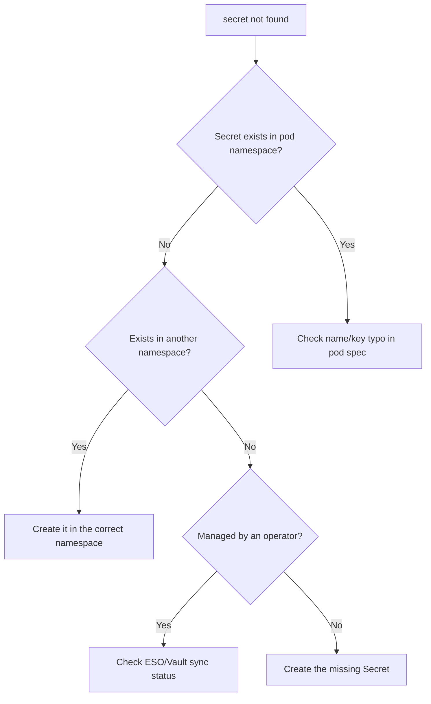

# Secret Not Found

> **Severity:** High · **Typical recovery time:** 5–15 min · **Affected versions:** 1.20+

## Error Message

```text
Events:
  Type     Reason       Age   From     Message
  ----     ------       ----  ----     -------
  Warning  FailedMount  9s    kubelet  MountVolume.SetUp failed for volume "creds" :
           secret "db-credentials" not found

# Or, for an env reference:
  Error: secret "db-credentials" not found
```

## Description

The pod references a Secret — as a volume, an `env` value, or `envFrom` — that
does not exist in the pod's namespace. The kubelet cannot create the container
until the volume/env source resolves, so the pod stays in `ContainerCreating`
(volume case) or fails to start with a `CreateContainerConfigError` (env case).
This is a hard dependency: Kubernetes will retry indefinitely, surfacing
repeated `FailedMount` events.

The single most common cause is a **namespace mismatch** — Secrets are
namespace-scoped, and a pod can only reference Secrets in its own namespace. The
second is ordering: the workload was applied before the Secret (common in
GitOps/Helm when resources race).

## Affected Kubernetes Versions

Applies to 1.20+. Behavior is consistent across versions. The `optional: true`
field on secret references (which lets a pod start despite a missing Secret) is
long-standing and unchanged.

## Likely Root Causes

- Secret lives in a different namespace than the pod
- Secret name typo or wrong key referenced
- Secret never created, or deleted/rotated out from under the workload
- Apply ordering: pod created before its Secret (GitOps/Helm race)
- An external secrets operator (ESO/Vault) hasn't synced the Secret yet

## Diagnostic Flow



## Verification Steps

Confirm the referenced Secret name exactly, the pod's namespace, and whether a
Secret by that name exists in that namespace.

## kubectl Commands

```bash
kubectl describe pod <pod> -n <namespace>
kubectl get secret -n <namespace>
kubectl get secret <name> -n <namespace>
kubectl get pod <pod> -n <namespace> -o jsonpath='{.spec.volumes}'
kubectl get pod <pod> -n <namespace> -o jsonpath='{.spec.containers[*].envFrom}'
kubectl get events -n <namespace> --field-selector reason=FailedMount
```

## Expected Output

```text
$ kubectl get secret db-credentials -n web
Error from server (NotFound): secrets "db-credentials" not found

$ kubectl get secret db-credentials -n data
NAME             TYPE     DATA   AGE
db-credentials   Opaque   2      40d
# -> exists in 'data', pod is in 'web': namespace mismatch
```

## Common Fixes

1. Create the Secret in the pod's own namespace (Secrets are not cross-namespace)
2. Fix the Secret name/key typo in the pod spec or Helm values
3. Ensure apply ordering: create Secrets before/with the workloads that need them
4. If using an external secrets operator, fix the sync source/auth so it
   materializes the Secret

## Recovery Procedures

Ordered, production-safe steps:

1. Confirm the namespace and exact name (read-only) before acting.
2. Create or copy the Secret into the correct namespace via your secret-
   management pipeline (sealed-secrets/ESO/Vault), not a raw literal in shell
   history. Non-disruptive: the waiting pod mounts it on the next kubelet retry.
3. If the pod stays stuck after the Secret exists, recreate it via a rollout.
   **Disruptive — blast radius: the affected replicas;** for a Deployment,
   roll it; avoid editing live pods by hand.

## Validation

`kubectl get secret <name> -n <namespace>` returns the Secret, `FailedMount`
events stop, the pod transitions to `Running`/`Ready`, and the application reads
the expected credential values.

## Prevention

- Manage Secrets and workloads together in the same namespace and release
- Use a secrets operator (ESO/Vault/sealed-secrets) so Secrets exist before pods
- Add CI validation that referenced Secrets/keys exist
- Mark non-critical secret references `optional: true` to avoid hard blocks

## Related Errors

- [Failed To Sync Secret Cache](../pods/failed-to-sync-secret-cache.md)
- [ConfigMap Change Not Applied](../pods/configmap-immutable-not-updating.md)

## References

- [Secrets](https://kubernetes.io/docs/concepts/configuration/secret/)
- [Distribute Credentials Securely Using Secrets](https://kubernetes.io/docs/tasks/inject-data-application/distribute-credentials-secure/)

## Further Reading

- [Free Kubernetes config validators](https://devopsaitoolkit.com/validators/)
