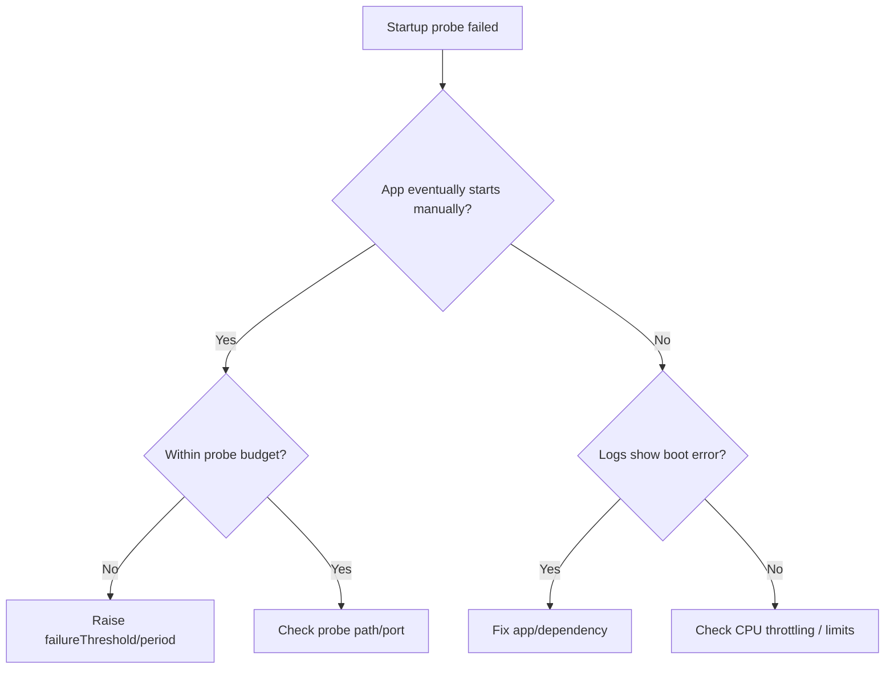

# Startup Probe Failed

> **Severity:** High · **Typical recovery time:** 5–20 min · **Affected versions:** 1.20+

## Error Message

```text
Startup probe failed: HTTP probe failed with statuscode: 503
Warning  Unhealthy  kubelet  Startup probe failed: Get "http://10.1.2.3:8080/healthz": context deadline exceeded
Normal   Killing    kubelet  Container app failed startup probe, will be restarted
```

## Description

The startup probe protects slow-starting containers. While it is running, the
kubelet disables the liveness and readiness probes so a long boot doesn't get
killed prematurely. The app gets up to `failureThreshold × periodSeconds` to
become healthy. If that budget is exhausted before the probe succeeds, the
kubelet kills the container and restarts it — often producing a
`CrashLoopBackOff` if the app simply needs more time than allotted.

During incidents this commonly appears after a deploy that increased boot time
(larger dataset to load, new migration, JIT warmup) without widening the startup
budget.

## Affected Kubernetes Versions

`startupProbe` reached GA in Kubernetes 1.20. Clusters below 1.20 must emulate
the behaviour with `initialDelaySeconds` on liveness/readiness instead.

## Likely Root Causes

- `failureThreshold × periodSeconds` shorter than real startup time
- App boot regressed (migrations, cache warmup, dependency wait)
- Probe `path`/`port` wrong so it never succeeds
- Dependency required at boot is unavailable
- Resource starvation slowing initialization (CPU throttling)

## Diagnostic Flow



## Verification Steps

Confirm the event reason is the **startup** probe, the restart count is rising,
and the container never reaches `Ready` before being killed.

## kubectl Commands

```bash
kubectl describe pod <pod> -n <namespace>
kubectl get pod <pod> -n <namespace> -o jsonpath='{.spec.containers[*].startupProbe}'
kubectl logs <pod> -n <namespace> --previous
kubectl top pod <pod> -n <namespace>
```

## Expected Output

```text
Restart Count:  4
Events:
  Warning  Unhealthy  kubelet  Startup probe failed: context deadline exceeded
  Normal   Killing    kubelet  Container app failed startup probe, will be restarted
Startup:  http-get http://:8080/healthz delay=0s timeout=1s period=10s #success=1 #failure=3
```

## Common Fixes

1. Increase `failureThreshold` (and/or `periodSeconds`) to cover real boot time
2. Correct the probe `path`/`port`/scheme
3. Fix the boot-time error or restore the required dependency
4. Raise CPU requests so initialization isn't throttled

## Recovery Procedures

1. Time the actual startup from logs; compute the needed budget.
2. Patch the startup probe with a sufficient `failureThreshold`.
   **Disruptive — rolling update:** rolls all replicas; use `maxUnavailable` to
   preserve serving capacity during the change.
3. If boot fails due to a missing dependency, restore it first; pods will pass
   the probe on the next attempt without further changes.
4. To unblock urgently, temporarily remove the startup probe.
   **Disruptive:** liveness/readiness resume immediately and may kill a still-booting pod.

## Validation

Confirm the container transitions to `Ready 1/1`, restart count stops climbing,
and the startup probe no longer appears in events.

## Prevention

- Set the startup budget from measured P99 boot time plus margin
- Keep boot-time dependency waits bounded and observable
- Use a dedicated lightweight startup endpoint
- Alert on rising restart counts to catch boot regressions early

## Related Errors

- [Liveness Probe Failed](../pods/liveness-probe-failed.md)
- [Readiness Probe Failed](../pods/readiness-probe-failed.md)

## References

- [Configure Liveness, Readiness and Startup Probes](https://kubernetes.io/docs/tasks/configure-pod-container/configure-liveness-readiness-startup-probes/)
- [Pod Lifecycle](https://kubernetes.io/docs/concepts/workloads/pods/pod-lifecycle/)

## Further Reading

- [DevOps AI ToolKit — Kubernetes guides](https://devopsaitoolkit.com/blog/)
