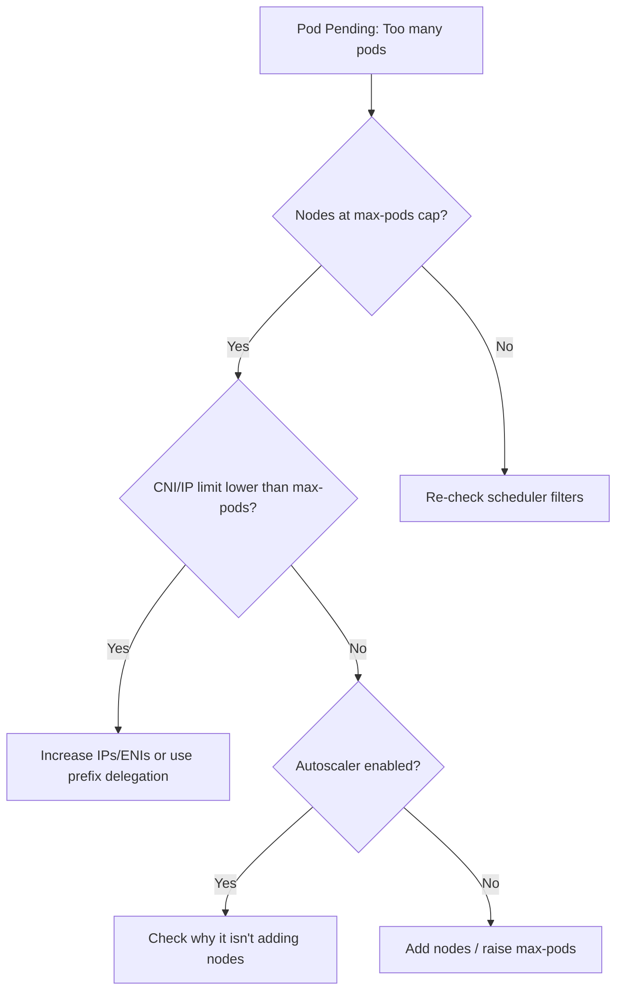

# Too Many Pods (node capacity)

> **Severity:** High · **Typical recovery time:** 10–30 min · **Affected versions:** 1.20+

## Error Message

```text
Events:
  Type     Reason            Age   From               Message
  ----     ------            ----  ----               -------
  Warning  FailedScheduling  18s   default-scheduler  0/4 nodes are available:
           4 Too many pods. preemption: 0/4 nodes are available:
           4 No preemption victims found for incoming pod.
```

## Description

The pod is `Pending` and unschedulable because every candidate node has already
hit its **maximum pods per node** limit. This is the kubelet's `--max-pods`
ceiling (default 110), not a CPU/memory shortfall. The scheduler treats pod
count as a first-class resource; once a node reaches its cap it is filtered out
regardless of how much CPU/RAM is free.

This is common on clusters with many small pods, and especially on certain CNIs
or cloud providers where the real limit is lower — for example AWS VPC CNI ties
the pod cap to ENI/IP capacity per instance type, which can be well below 110.
During an incident this blocks all new pods (rollouts, scale-ups, DaemonSets)
even though dashboards show plenty of "free" CPU and memory.

## Affected Kubernetes Versions

Applies to 1.20+. The `--max-pods` default of 110 is long-standing. Provider-
specific caps (AWS VPC CNI IP-per-ENI math; GKE/AKS per-node defaults) are set
outside core Kubernetes and vary by node/instance type and CNI configuration.

## Likely Root Causes

- Nodes at the kubelet `--max-pods` cap (default 110)
- CNI/cloud IP-address limit lower than `--max-pods` (e.g. AWS VPC CNI per ENI)
- Too few nodes for the number of pods; cluster-autoscaler not scaling/disabled
- Many tiny pods inflating pod count without using much CPU/memory
- DaemonSets/system pods consuming a large share of each node's slots

## Diagnostic Flow



## Verification Steps

Confirm the `FailedScheduling` reason is specifically "Too many pods", and
compare each node's running pod count against its capacity/allocatable pods.

## kubectl Commands

```bash
kubectl describe pod <pod> -n <namespace>
kubectl get pod <pod> -n <namespace> -o jsonpath='{.status.conditions}'
kubectl get nodes -o jsonpath='{range .items[*]}{.metadata.name}{"\t"}{.status.allocatable.pods}{"\n"}{end}'
kubectl get pods -A -o wide --field-selector spec.nodeName=<node> | wc -l
kubectl describe node <node>
```

## Expected Output

```text
$ kubectl get nodes -o jsonpath='{range .items[*]}{.metadata.name}{"\t"}{.status.allocatable.pods}{"\n"}{end}'
ip-10-0-1-10    29
ip-10-0-1-11    29        # small instance: AWS VPC CNI cap, not 110

$ kubectl describe node ip-10-0-1-10 | grep -A3 'Allocated resources'
  Resource   Requests   Limits
  pods       29         29        # at capacity
```

## Common Fixes

1. Add nodes (or let the cluster-autoscaler scale up) to add pod slots
2. Raise `--max-pods` where the underlying CNI/IP capacity allows it
3. For AWS VPC CNI, enable prefix delegation to multiply IPs (pods) per ENI
4. Reduce pod count: consolidate tiny pods, remove unneeded DaemonSets

## Recovery Procedures

Ordered, production-safe steps:

1. Confirm nodes are genuinely at the pod cap (read-only) versus a CPU/memory
   block.
2. Scale the node group up (or fix the autoscaler) to add capacity.
   Non-disruptive: new nodes simply absorb the Pending pods.
3. To raise `--max-pods`, update kubelet config and restart kubelets.
   **Disruptive — blast radius: every pod on each node** is restarted; do it
   node-by-node behind cordon/drain, and only after confirming CNI/IP capacity
   supports the higher number.
4. For AWS VPC CNI, enable prefix delegation, which may require recycling nodes.
   **Disruptive — blast radius: the recycled nodes' pods.**

## Validation

The Pending pod schedules and becomes `Running`/`Ready`, node pod counts sit
below their allocatable cap, and no new "Too many pods" `FailedScheduling`
events appear.

## Prevention

- Right-size instance types and pod caps together; account for CNI IP limits
- Keep cluster-autoscaler/Karpenter enabled with sane min/max bounds
- Alert on per-node pod-count utilization approaching the cap
- Use prefix delegation (AWS) or higher-density CNI config where appropriate

## Related Errors

- [Pod Evicted (MemoryPressure)](../pods/pod-evicted-memorypressure.md)
- [Cannot Allocate Memory](../pods/fork-cannot-allocate-memory.md)

## References

- [Scheduler — Node Capacity](https://kubernetes.io/docs/concepts/scheduling-eviction/scheduling-framework/)
- [Building Large Clusters — pods per node](https://kubernetes.io/docs/setup/best-practices/cluster-large/)

## Further Reading

- [DevOps AI ToolKit — Kubernetes guides](https://devopsaitoolkit.com/blog/)
