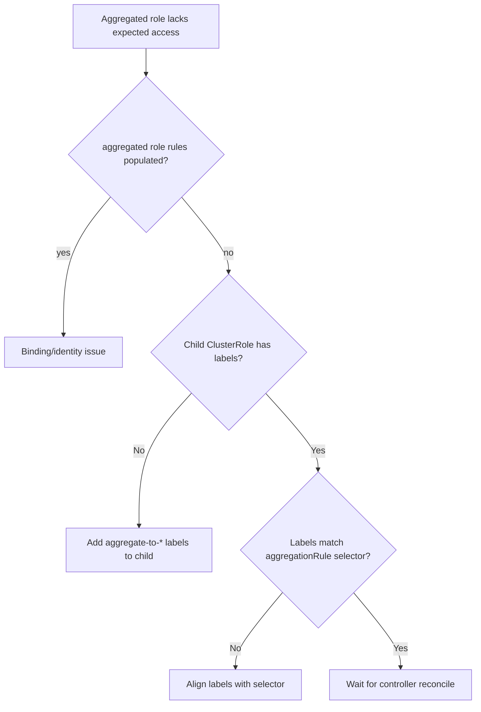

# Aggregated ClusterRole Not Applied

> **Severity:** Medium · **Typical recovery time:** 10–30 min · **Affected versions:** 1.20+

## Error Message

```text
Error from server (Forbidden): widgets.example.com is forbidden: User
"jane@example.com" cannot list resource "widgets" in API group "example.com"
at the cluster scope
# 'view' ClusterRole has an aggregationRule but rules: [] — child role not labeled
```

## Description

An aggregated ClusterRole (such as the built-in `view`, `edit`, `admin`) has an
`aggregationRule` that selects child ClusterRoles by label. The controller in
the controller-manager merges the rules of every matching ClusterRole into the
aggregated one. If a child ClusterRole lacks the expected aggregation labels, its
rules are never merged, so subjects bound to the aggregated role silently miss
those permissions. The aggregated role's own `rules` field is managed by the
controller and should not be edited directly.

## Affected Kubernetes Versions

ClusterRole aggregation is GA and present in all 1.20+ clusters. The default
aggregation labels are `rbac.authorization.k8s.io/aggregate-to-view`,
`aggregate-to-edit`, and `aggregate-to-admin`. CRD vendors are expected to ship
child ClusterRoles carrying these labels.

## Likely Root Causes

- The child ClusterRole is missing the `aggregate-to-*` label selector value
- A custom aggregationRule uses a label the child role does not carry
- The child role was created after binding and aggregation has not reconciled
- Someone edited `rules` on the aggregated role and it was overwritten

## Diagnostic Flow



## Verification Steps

Compare the aggregationRule's `clusterRoleSelectors` against the labels on the
child ClusterRoles, and check whether the aggregated role's `rules` actually
contains the expected entries.

## kubectl Commands

```bash
kubectl get clusterrole view -o yaml
kubectl get clusterrole view -o jsonpath='{.aggregationRule}{"\n"}'
kubectl get clusterroles -l rbac.authorization.k8s.io/aggregate-to-view=true
kubectl describe clusterrole widgets-viewer
kubectl auth can-i list widgets --as=jane@example.com
```

## Expected Output

```text
$ kubectl get clusterrole view -o jsonpath='{.aggregationRule}'
{"clusterRoleSelectors":[{"matchLabels":{"...aggregate-to-view":"true"}}]}

$ kubectl get clusterroles -l ...aggregate-to-view=true
NAME            CREATED AT
# (widgets-viewer absent — label missing)
```

## Common Fixes

1. Add the label `rbac.authorization.k8s.io/aggregate-to-view: "true"` (and
   `edit`/`admin` as appropriate) to the child ClusterRole.
2. Match the child role's labels to a custom aggregationRule selector.
3. Let the controller-manager reconcile; do not hand-edit the aggregated role's
   `rules`.

## Recovery Procedures

1. Patch labels onto the child ClusterRole so the selector matches — this is the
   least-privilege fix and changes only that role.
2. The aggregated role's `rules` repopulate automatically within seconds; verify
   before changing bindings.
3. **Disruptive (cluster-wide):** Do not bypass aggregation by binding subjects
   directly to broad roles like `cluster-admin`; blast radius would be the whole
   cluster.

## Validation

`kubectl get clusterrole view -o yaml` now lists the child rules, and
`kubectl auth can-i list widgets --as=jane@example.com` returns `yes`.

## Prevention

Ship CRD ClusterRoles with the standard aggregation labels, document custom
selectors, and add a CI assertion that the aggregated role contains the expected
resources.

## Related Errors

- [ClusterRole Missing Verb](./clusterrole-missing-verb.md)
- [Forbidden: User Cannot List](./forbidden-user-cannot-list.md)
- [RBAC apiGroup Mismatch](./rbac-apigroup-mismatch.md)

## References

- [Aggregated ClusterRoles](https://kubernetes.io/docs/reference/access-authn-authz/rbac/#aggregated-clusterroles)
- [Default roles and role bindings](https://kubernetes.io/docs/reference/access-authn-authz/rbac/#default-roles-and-role-bindings)

## Further Reading

- [DevOps AI ToolKit — Kubernetes guides](https://devopsaitoolkit.com/blog/)
