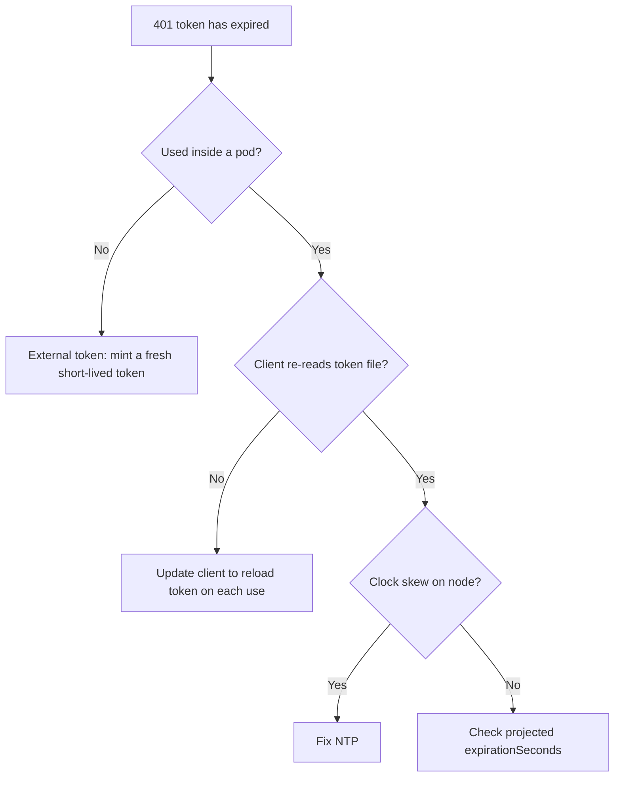

# Bound SA Token Expired

> **Severity:** High · **Typical recovery time:** 5–20 min · **Affected versions:** 1.22+

## Error Message

```text
Unauthorized
# server log:
authentication.go: "Unable to authenticate the request" err="[invalid bearer
token, service account token has expired]"
```

## Description

BoundServiceAccountTokens are time-limited, audience-bound JWTs projected into
pods. The kubelet automatically refreshes the projected token before it expires,
but a long-lived client that reads the token **once** and caches it will keep
sending a stale token after rotation, producing 401 Unauthorized. Tokens used
outside a pod (copied into a script or CI) are not refreshed at all and expire on
their own. This is an authentication failure, distinct from RBAC 403s.

## Affected Kubernetes Versions

BoundServiceAccountTokens are the default since 1.22; legacy non-expiring Secret
tokens are no longer auto-created from 1.24. Default token lifetime is one hour
(minimum 10 minutes), configurable via `--service-account-max-token-expiration`
on the API server.

## Likely Root Causes

- A client library reads the token file once and never re-reads after rotation
- A token was extracted from a pod/Secret and used externally past its TTL
- The pod was paused/clock-skewed so the cached token aged out
- A projected volume set an explicit short `expirationSeconds`

## Diagnostic Flow



## Verification Steps

Confirm the error is token expiry (server auth logs), check the token's `exp`
claim window, and determine whether the client reloads the projected file.

## kubectl Commands

```bash
kubectl get pod <pod> -n web \
  -o jsonpath='{.spec.volumes[?(@.projected)].projected.sources}{"\n"}'
kubectl describe pod <pod> -n web
kubectl get --raw='/livez?verbose'
kubectl auth can-i get pods -n web \
  --as=system:serviceaccount:web:api-runner
```

## Expected Output

```text
$ kubectl get pod app-1 -n web -o jsonpath='{.spec.volumes[?(@.projected)]...}'
[{"serviceAccountToken":{"expirationSeconds":3607,"path":"token"}}]

# server auth log
"service account token has expired"
```

## Common Fixes

1. Update the application/client to re-read
   `/var/run/secrets/kubernetes.io/serviceaccount/token` on each request (modern
   client-go does this automatically).
2. Stop using extracted long-lived tokens externally; mint a short-lived token
   on demand instead.
3. Ensure node clocks are NTP-synced so token windows are valid.

## Recovery Procedures

1. For in-pod clients, upgrade to a client library that reloads the projected
   token — least disruptive and the correct long-term fix.
2. **Disruptive (pod restart):** Restarting the workload forces a fresh token
   mount and clears the cached one; this briefly reduces capacity for that
   Deployment only.
3. For external automation, issue a new short-lived, audience-scoped token and
   keep its lifetime minimal to limit exposure.

## Validation

The workload's 401s stop, and `kubectl auth can-i get pods -n web --as=...`
returns `yes`, confirming the SA itself is authorized once a valid token is sent.

## Prevention

Use client libraries that auto-reload tokens, avoid copying tokens out of pods,
keep token TTLs short, monitor NTP, and alert on `token has expired` in API
server auth logs.

## Related Errors

- [SA Token Not Mounted](./serviceaccount-token-not-mounted.md)
- [Unauthorized (401)](./unauthorized-401.md)
- [Forbidden: ServiceAccount](./forbidden-serviceaccount.md)

## References

- [Bound Service Account Tokens](https://kubernetes.io/docs/reference/access-authn-authz/service-accounts-admin/#bound-service-account-token-volume)
- [Managing Service Accounts](https://kubernetes.io/docs/reference/access-authn-authz/service-accounts-admin/)

## Further Reading

- [DevOps AI ToolKit — Kubernetes guides](https://devopsaitoolkit.com/blog/)
