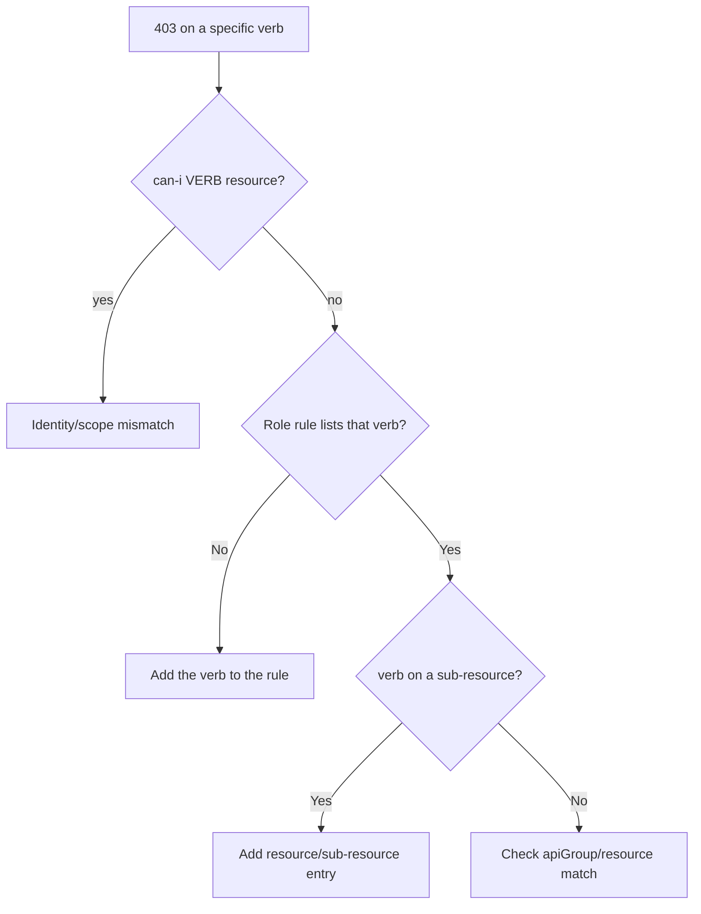

# ClusterRole Missing Verb

> **Severity:** Medium · **Typical recovery time:** 5–15 min · **Affected versions:** 1.20+

## Error Message

```text
Error from server (Forbidden): pods is forbidden: User
"system:serviceaccount:obs:collector" cannot watch resource "pods"
in API group "" in the namespace "obs"
```

## Description

A subject can perform some operations on a resource but not the specific verb
being attempted. RBAC verbs are explicit and not hierarchical: `get` does not
imply `list`, and neither implies `watch`. Controllers and informers commonly
require `get`, `list`, **and** `watch` together; clients that can `get` and
`list` still fail to establish a watch stream if `watch` is missing. The error
names the exact verb that was denied.

## Affected Kubernetes Versions

All RBAC-enabled clusters, 1.20+. The set of verbs (`get`, `list`, `watch`,
`create`, `update`, `patch`, `delete`, `deletecollection`, plus sub-resource and
special verbs like `impersonate`, `escalate`, `bind`) is stable. Wildcard `*`
matches all verbs but is discouraged.

## Likely Root Causes

- The (Cluster)Role lists `get`/`list` but omits `watch`
- An informer/controller requires the full read trio and one verb is absent
- A new code path uses `patch`/`deletecollection` not present in the Role
- Sub-resource verbs (e.g. `pods/log`) are missing from rules

## Diagnostic Flow



## Verification Steps

Read the Role's rules and confirm the exact denied verb is present for the exact
resource (including sub-resources) and apiGroup in the error.

## kubectl Commands

```bash
kubectl auth can-i watch pods -n obs \
  --as=system:serviceaccount:obs:collector
kubectl auth can-i --list -n obs \
  --as=system:serviceaccount:obs:collector
kubectl get clusterrole collector-read -o yaml
kubectl describe clusterrole collector-read
```

## Expected Output

```text
$ kubectl auth can-i watch pods -n obs --as=...:collector
no

$ kubectl get clusterrole collector-read -o yaml
rules:
- apiGroups: [""]
  resources: ["pods"]
  verbs: ["get", "list"]      # 'watch' is missing
```

## Common Fixes

1. Add the missing verb (e.g. `watch`) to the matching rule in the Role.
2. Group the read trio `["get","list","watch"]` for resources that controllers
   watch.
3. Add explicit sub-resource entries (`pods/log`, `pods/exec`) where needed.

## Recovery Procedures

1. Add only the specific missing verb to the existing rule — avoid `verbs: ["*"]`
   so the blast radius stays minimal.
2. Apply the updated Role; clients with active retries pick up access without a
   restart.
3. **Disruptive (pod restart):** restart the controller only if its client
   stopped retrying after repeated 403s; scope to that workload.

## Validation

`kubectl auth can-i watch pods -n obs --as=...` returns `yes`; the informer
establishes its watch and stops reconnecting with Forbidden.

## Prevention

Derive Role verbs from the controller's actual API calls, prefer the read trio
for watched resources, and audit Roles for `verbs: ["*"]` which hides missing
specific grants and over-permits.

## Related Errors

- [Forbidden: User Cannot List](./forbidden-user-cannot-list.md)
- [RBAC apiGroup Mismatch](./rbac-apigroup-mismatch.md)
- [Aggregated ClusterRole Not Applied](./aggregated-clusterrole-not-applied.md)

## References

- [RBAC verbs and resources](https://kubernetes.io/docs/reference/access-authn-authz/rbac/#referring-to-resources)
- [Using RBAC Authorization](https://kubernetes.io/docs/reference/access-authn-authz/rbac/)

## Further Reading

- [DevOps AI ToolKit — Kubernetes guides](https://devopsaitoolkit.com/blog/)
