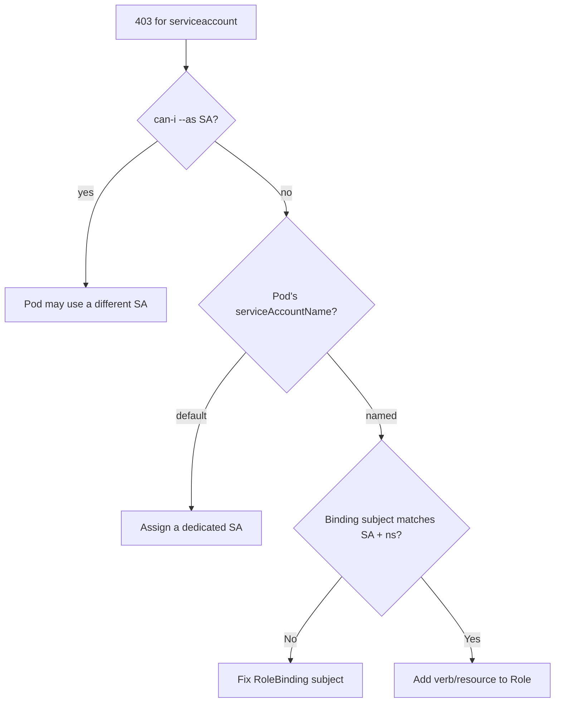

# Forbidden: ServiceAccount

> **Severity:** High · **Typical recovery time:** 5–20 min · **Affected versions:** 1.20+

## Error Message

```text
Error from server (Forbidden): configmaps "app-config" is forbidden:
User "system:serviceaccount:web:api-runner" cannot get resource "configmaps"
in API group "" in the namespace "web"
```

## Description

A pod's ServiceAccount authenticated with its bound token, but no RBAC rule
grants the requested verb on the resource. The subject is the synthetic user
`system:serviceaccount:<namespace>:<name>`. This is the most common in-cluster
RBAC failure: application code calls the API server and receives 403 because the
ServiceAccount was never bound to an appropriate Role. The default
ServiceAccount has no API permissions.

## Affected Kubernetes Versions

All RBAC-enabled clusters. Since 1.24 ServiceAccounts no longer auto-create a
long-lived Secret token; pods use projected BoundServiceAccountTokens, but the
authorization model and this error are unchanged across 1.20+.

## Likely Root Causes

- The ServiceAccount has no RoleBinding/ClusterRoleBinding for the verb/resource
- The pod uses the `default` SA, which grants nothing
- The binding subject names the wrong SA name or namespace
- The Role grants other verbs but not the one being used (e.g. `get`)

## Diagnostic Flow



## Verification Steps

Confirm which ServiceAccount the pod actually runs as, then test that exact
subject with `--as`. Mismatched namespaces are a frequent trap.

## kubectl Commands

```bash
kubectl get pod <pod> -n web -o jsonpath='{.spec.serviceAccountName}{"\n"}'
kubectl auth can-i get configmaps -n web \
  --as=system:serviceaccount:web:api-runner
kubectl get rolebindings,clusterrolebindings -A -o wide | grep api-runner
kubectl describe sa api-runner -n web
kubectl get role -n web -o yaml
```

## Expected Output

```text
$ kubectl get pod api-7c -n web -o jsonpath='{.spec.serviceAccountName}'
api-runner

$ kubectl auth can-i get configmaps -n web \
    --as=system:serviceaccount:web:api-runner
no
```

## Common Fixes

1. Bind the ServiceAccount to a Role granting the needed verb/resource in the
   pod's namespace.
2. Set `serviceAccountName` on the pod spec to a dedicated SA instead of
   `default`.
3. Correct the binding subject `kind: ServiceAccount`, `name`, and `namespace`.

## Recovery Procedures

1. Create a narrowly-scoped Role (only the verbs/resources the app calls) and a
   namespaced RoleBinding to the SA — least privilege keeps blast radius to one
   namespace.
2. Restart the workload only if it caches a failed client. **Disruptive
   (pod restart):** rolling a Deployment briefly drops capacity; scope to the
   single affected workload.
3. Avoid binding to `cluster-admin`; the blast radius would be the entire cluster.

## Validation

`kubectl auth can-i get configmaps -n web --as=system:serviceaccount:web:api-runner`
returns `yes`, and application logs stop emitting 403.

## Prevention

Give every workload a dedicated ServiceAccount with a minimal Role, set
`automountServiceAccountToken: false` where the API is unused, and lint manifests
so no app silently relies on the `default` SA.

## Related Errors

- [Forbidden: User Cannot List](./forbidden-user-cannot-list.md)
- [SA Token Not Mounted](./serviceaccount-token-not-mounted.md)
- [RoleBinding Wrong Namespace](./rolebinding-wrong-namespace.md)

## References

- [Configure Service Accounts for Pods](https://kubernetes.io/docs/tasks/configure-pod-container/configure-service-account/)
- [Using RBAC Authorization](https://kubernetes.io/docs/reference/access-authn-authz/rbac/)

## Further Reading

- [DevOps AI ToolKit — Kubernetes guides](https://devopsaitoolkit.com/blog/)
