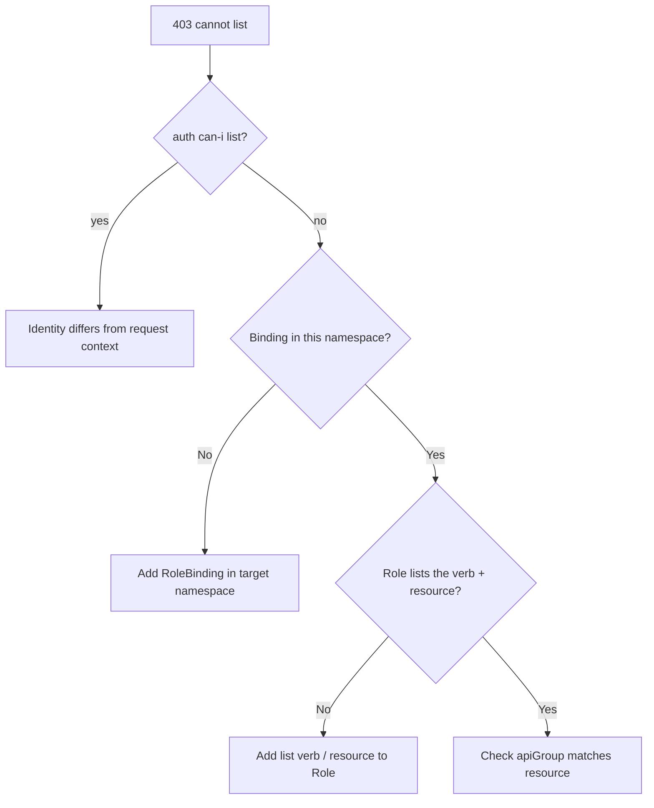

# Forbidden: User Cannot List

> **Severity:** High · **Typical recovery time:** 5–20 min · **Affected versions:** 1.20+

## Error Message

```text
Error from server (Forbidden): pods is forbidden: User "jane@example.com" cannot
list resource "pods" in API group "" in the namespace "payments"
```

## Description

The request authenticated successfully, but the RBAC authorizer found no rule
granting the `list` verb on the requested resource for this user in this scope.
Kubernetes evaluates authorization after authentication: a 403 Forbidden means
"we know who you are, you just are not allowed to do this." During an incident
this often surfaces when an engineer is added to the cluster but never bound to
a Role, or when they operate in a namespace their binding does not cover.

## Affected Kubernetes Versions

Applies to all clusters using the RBAC authorizer (default since 1.6, GA in
1.8). The message format is stable from 1.20 onward. Note that the empty API
group `""` denotes the core group (pods, services, configmaps).

## Likely Root Causes

- No (Cluster)RoleBinding maps the user to a Role granting `list` on the resource
- A binding exists but in a different namespace than the request
- The Role grants `get` but omits `list` (verbs are not implied)
- The user identity (case, domain, group) differs from what the binding names

## Diagnostic Flow



## Verification Steps

Confirm the denial is RBAC (403/Forbidden), not authentication (401), and that
you are checking the exact verb, resource, namespace, and identity in the error.

## kubectl Commands

```bash
kubectl auth whoami
kubectl auth can-i list pods -n payments
kubectl auth can-i list pods -n payments --as=jane@example.com
kubectl get rolebindings,clusterrolebindings -A -o wide | grep jane
kubectl describe rolebinding -n payments
kubectl get role -n payments -o yaml
```

## Expected Output

```text
$ kubectl auth can-i list pods -n payments --as=jane@example.com
no

$ kubectl get rolebindings -n payments -o wide
NAME            ROLE                AGE   USERS   GROUPS   SERVICEACCOUNTS
deploy-viewer   Role/pod-reader     5d    bob
```

## Common Fixes

1. Create a RoleBinding in the target namespace binding the user to a Role that
   includes `list` on the resource.
2. Add the missing verb/resource to the existing Role's rules.
3. Correct the subject name so it matches the authenticated identity exactly.

## Recovery Procedures

1. Identify the least-privilege Role that already grants the needed access
   (e.g. the built-in `view` ClusterRole) instead of creating broad rules.
2. Bind it in the specific namespace. Prefer a namespaced RoleBinding over a
   ClusterRoleBinding to limit blast radius to that namespace only.
3. **Disruptive (cluster-wide):** Only use a ClusterRoleBinding if the user
   genuinely needs all-namespace access — blast radius is every namespace and
   should be reviewed by a second engineer.

## Validation

Re-run `kubectl auth can-i list pods -n payments --as=jane@example.com`; it
should print `yes`. Have the user retry the original command.

## Prevention

Manage access through groups bound to the built-in `view`/`edit` ClusterRoles,
codify bindings in Git, and add a CI check (`kubectl auth can-i --list`) for
critical service accounts and human roles.

## Related Errors

- [Forbidden: ServiceAccount](./forbidden-serviceaccount.md)
- [ClusterRole Missing Verb](./clusterrole-missing-verb.md)
- [RBAC apiGroup Mismatch](./rbac-apigroup-mismatch.md)

## References

- [Using RBAC Authorization](https://kubernetes.io/docs/reference/access-authn-authz/rbac/)
- [Authorization Overview](https://kubernetes.io/docs/reference/access-authn-authz/authorization/)

## Further Reading

- [DevOps AI ToolKit — Kubernetes guides](https://devopsaitoolkit.com/blog/)
