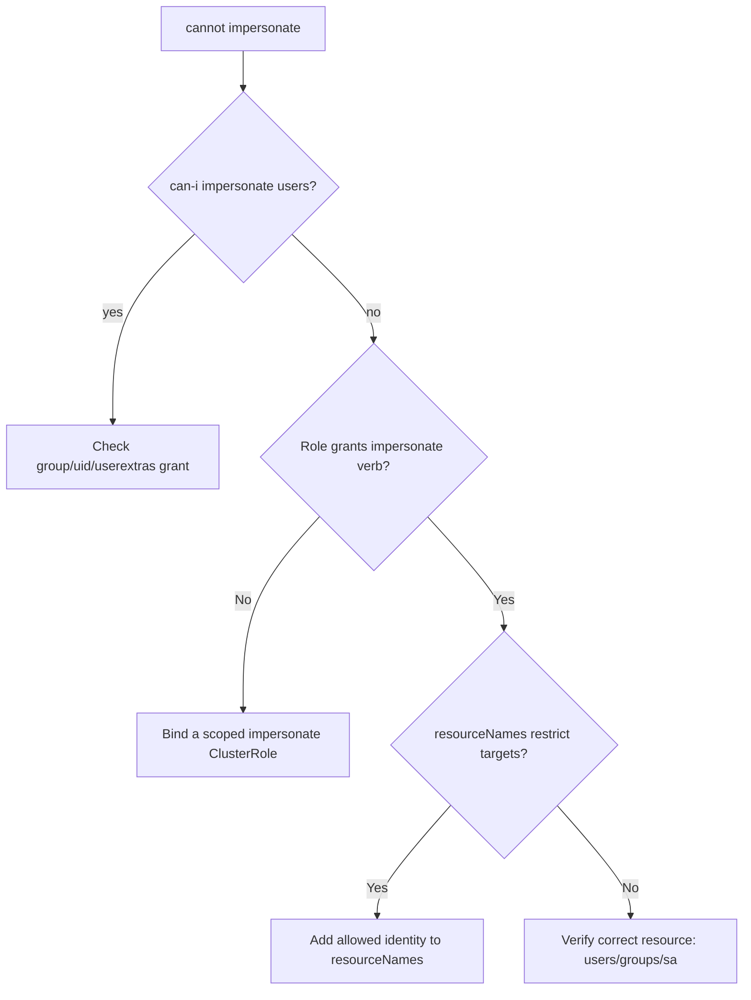

# Impersonation Denied

> **Severity:** High · **Typical recovery time:** 5–20 min · **Affected versions:** 1.20+

## Error Message

```text
Error from server (Forbidden): users.user.openshift.io "jane@example.com"
is forbidden: User "ops@example.com" cannot impersonate resource "users"
in API group "" at the cluster scope
```

## Description

Impersonation lets a user act as another user, group, or ServiceAccount via the
`--as`, `--as-group`, and `--as-uid` flags. To do so the caller must hold the
`impersonate` verb on the corresponding resource (`users`, `groups`,
`serviceaccounts`, `uids`). When that grant is missing, the API server denies the
request with a Forbidden naming the `impersonate` verb. This is common when an
operator runs `kubectl auth can-i ... --as=...` to test someone else's access but
lacks impersonation rights themselves.

## Affected Kubernetes Versions

Impersonation and its verbs are stable across 1.20+. `userExtras` impersonation
requires the `userextras` resource with the specific sub-key. Impersonation is a
powerful, audited capability and should be tightly scoped.

## Likely Root Causes

- The caller has no ClusterRole granting `impersonate` on `users`/`groups`/`serviceaccounts`
- Impersonating a group/UID but only `users` was granted (each is separate)
- The grant exists but `resourceNames` restricts it to other identities
- Impersonation flag typo targets a resource the caller cannot impersonate

## Diagnostic Flow



## Verification Steps

Confirm which impersonation resource the request targets (user vs group vs
serviceaccount) and whether the caller holds `impersonate` on that exact
resource.

## kubectl Commands

```bash
kubectl auth whoami
kubectl auth can-i impersonate users
kubectl auth can-i impersonate groups
kubectl auth can-i impersonate serviceaccounts -A
kubectl get clusterrolebindings -o wide | grep ops@example.com
kubectl describe clusterrole | grep -i impersonate -B3
```

## Expected Output

```text
$ kubectl auth can-i impersonate users
no

$ kubectl auth can-i impersonate groups
no
```

## Common Fixes

1. Bind the caller to a ClusterRole granting `impersonate` on the needed
   resource(s), ideally restricted with `resourceNames`.
2. Grant each resource separately (`users`, `groups`, `serviceaccounts`, `uids`)
   for the identities being impersonated.
3. Add `userextras/<key>` rules when impersonating extra attributes.

## Recovery Procedures

1. Prefer a tightly scoped ClusterRole with `resourceNames` limited to the exact
   identities allowed — never grant blanket `impersonate` on all users.
2. Bind it to the specific operator or break-glass group.
3. **Disruptive (cluster-wide, high risk):** Broad impersonation effectively
   grants the caller anyone's privileges, including admins — blast radius is the
   entire cluster. Require dual approval and ensure audit logging captures the
   `impersonatedUser` field.

## Validation

`kubectl auth can-i impersonate users` returns `yes`, and the original
`--as=...` command succeeds. Confirm the impersonation appears in audit logs.

## Prevention

Grant impersonation only to vetted automation/break-glass roles, scope with
`resourceNames`, alert on `impersonate` usage in audit logs, and review these
grants regularly.

## Related Errors

- [Forbidden: User Cannot List](./forbidden-user-cannot-list.md)
- [RBAC Escalation Denied](./rbac-escalation-denied.md)
- [Unauthorized (401)](./unauthorized-401.md)

## References

- [User impersonation](https://kubernetes.io/docs/reference/access-authn-authz/authentication/#user-impersonation)
- [Using RBAC Authorization](https://kubernetes.io/docs/reference/access-authn-authz/rbac/)

## Further Reading

- [DevOps AI ToolKit — Kubernetes guides](https://devopsaitoolkit.com/blog/)
