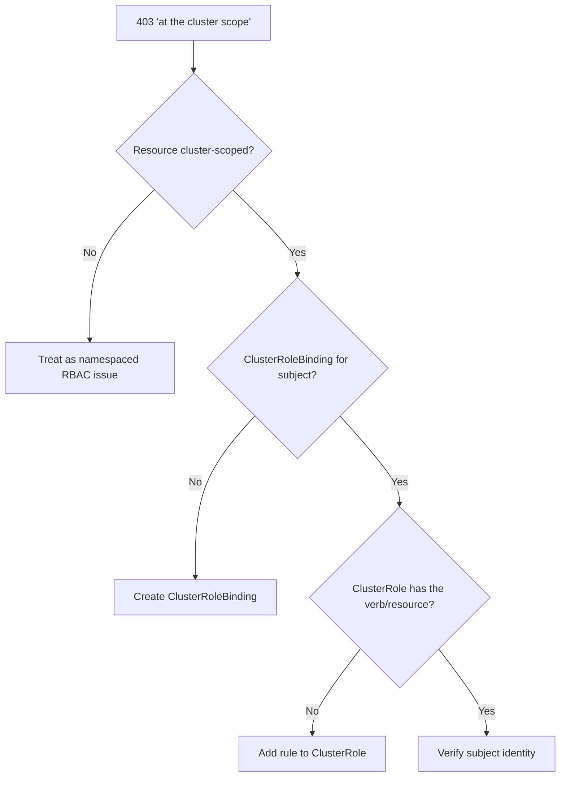

# Namespaced Binding For Cluster Resource

> **Severity:** Medium · **Typical recovery time:** 5–15 min · **Affected versions:** 1.20+

## Error Message

```text
Error from server (Forbidden): nodes is forbidden: User
"system:serviceaccount:mon:agent" cannot list resource "nodes"
in API group "" at the cluster scope
# A RoleBinding -> ClusterRole exists, but RoleBindings cannot grant cluster scope
```

## Description

Cluster-scoped resources (nodes, namespaces, persistentvolumes,
customresourcedefinitions, clusterroles) live outside any namespace. A
RoleBinding only grants access within its own namespace, so even when it
references a ClusterRole that contains node permissions, it cannot authorize a
cluster-scoped request. Granting access to cluster-scoped resources requires a
**ClusterRoleBinding**. Operators often create a RoleBinding to a ClusterRole and
are surprised that namespaced resources work while cluster-scoped ones stay
Forbidden "at the cluster scope".

## Affected Kubernetes Versions

All RBAC-enabled clusters, 1.20+. The rule is invariant: RoleBinding → namespace
scope only; ClusterRoleBinding → cluster scope and all namespaces. The "at the
cluster scope" phrase in the error is the diagnostic tell.

## Likely Root Causes

- A RoleBinding (not ClusterRoleBinding) is used for cluster-scoped resources
- The ClusterRole is correct but bound only with a namespaced RoleBinding
- Confusion that referencing a ClusterRole alone grants cluster scope
- Mixed needs (namespaced + cluster-scoped) covered by one RoleBinding

## Diagnostic Flow



## Verification Steps

Confirm the resource is cluster-scoped (`NAMESPACED=false` in api-resources) and
that the subject is bound via a ClusterRoleBinding, not just a RoleBinding.

## kubectl Commands

```bash
kubectl api-resources --namespaced=false | grep -i nodes
kubectl auth can-i list nodes \
  --as=system:serviceaccount:mon:agent
kubectl get clusterrolebindings -o wide | grep agent
kubectl get rolebindings -A -o wide | grep agent
kubectl describe clusterrole node-reader
```

## Expected Output

```text
$ kubectl api-resources --namespaced=false | grep -i nodes
nodes   no   v1   Node

$ kubectl get clusterrolebindings -o wide | grep agent
# (none — only a namespaced RoleBinding exists)
```

## Common Fixes

1. Create a ClusterRoleBinding linking the subject to the ClusterRole for
   cluster-scoped access.
2. Keep namespaced needs in RoleBindings and cluster-scoped needs in a separate
   ClusterRoleBinding.
3. Ensure the ClusterRole actually contains rules for the cluster-scoped
   resource.

## Recovery Procedures

1. Confirm the subject genuinely needs cluster-scoped access (e.g. a node
   monitor). If only specific namespaces are needed, prefer RoleBindings.
2. **Disruptive (cluster-wide):** A ClusterRoleBinding grants the bound
   permissions across the entire cluster and all namespaces — blast radius is
   cluster-wide. Scope the ClusterRole to only the needed cluster resources and
   verbs, and have it reviewed.
3. Avoid binding to `cluster-admin` to satisfy a single cluster-scoped read.

## Validation

`kubectl auth can-i list nodes --as=system:serviceaccount:mon:agent` returns
`yes`, and the agent stops logging Forbidden at the cluster scope.

## Prevention

Document which resources are cluster-scoped, template ClusterRoleBindings
separately from RoleBindings, and review ClusterRoleBindings as the highest-risk
RBAC objects.

## Related Errors

- [RoleBinding Wrong Namespace](./rolebinding-wrong-namespace.md)
- [Forbidden: User Cannot List](./forbidden-user-cannot-list.md)
- [ClusterRole Missing Verb](./clusterrole-missing-verb.md)

## References

- [RoleBinding and ClusterRoleBinding](https://kubernetes.io/docs/reference/access-authn-authz/rbac/#rolebinding-and-clusterrolebinding)
- [Role and ClusterRole](https://kubernetes.io/docs/reference/access-authn-authz/rbac/#role-and-clusterrole)

## Further Reading

- [DevOps AI ToolKit — Kubernetes guides](https://devopsaitoolkit.com/blog/)
