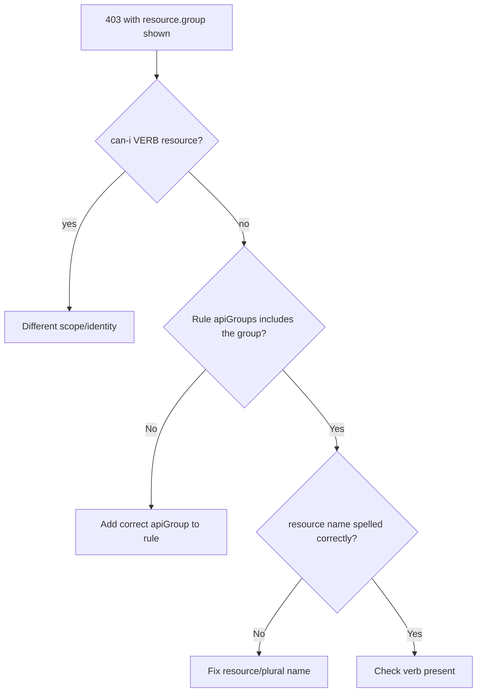

# RBAC apiGroup Mismatch

> **Severity:** Medium · **Typical recovery time:** 5–15 min · **Affected versions:** 1.20+

## Error Message

```text
Error from server (Forbidden): deployments.apps is forbidden: User
"system:serviceaccount:ci:deployer" cannot create resource "deployments"
in API group "apps" in the namespace "ci"
# Role grants deployments but with apiGroups: [""] instead of ["apps"]
```

## Description

Every RBAC rule binds verbs to resources **within a specific API group**. A rule
that lists `deployments` under `apiGroups: [""]` (the core group) does not match
`deployments` in the `apps` group, so the request is denied even though the
resource name looks right. The Forbidden message always shows the fully
qualified `<resource>.<group>`, which is the key to spotting a group mismatch.
The empty string `""` is the core group; named groups like `apps`,
`networking.k8s.io`, `rbac.authorization.k8s.io`, and `batch` must be listed
exactly.

## Affected Kubernetes Versions

All RBAC-enabled clusters, 1.20+. API group placement is stable, but resources
occasionally move groups across versions (e.g. Ingress to `networking.k8s.io`),
so rules copied from old manifests can mismatch on upgrade.

## Likely Root Causes

- Rule uses `apiGroups: [""]` for a non-core resource (deployments, ingresses)
- Wrong group name (e.g. `extensions` instead of `apps`/`networking.k8s.io`)
- A resource moved API groups across a version upgrade
- CRD rule omits the CRD's `spec.group`

## Diagnostic Flow



## Verification Steps

Read the fully qualified `resource.group` from the error and confirm the Role
rule lists that exact group string alongside the resource.

## kubectl Commands

```bash
kubectl auth can-i create deployments.apps -n ci \
  --as=system:serviceaccount:ci:deployer
kubectl api-resources | grep -i deployment
kubectl get role deployer -n ci -o yaml
kubectl describe role deployer -n ci
```

## Expected Output

```text
$ kubectl api-resources | grep -i deployment
deployments   deploy   apps/v1   true   Deployment

$ kubectl get role deployer -n ci -o yaml
rules:
- apiGroups: [""]            # wrong — deployments live in "apps"
  resources: ["deployments"]
  verbs: ["create"]
```

## Common Fixes

1. Set `apiGroups: ["apps"]` (or the correct group) on the rule for that
   resource.
2. Use `kubectl api-resources` to find the authoritative group for each resource.
3. For CRDs, set `apiGroups` to the CRD's `spec.group`.

## Recovery Procedures

1. Correct the `apiGroups` entry on the specific rule — change only that rule to
   keep blast radius minimal.
2. Apply the Role; access takes effect immediately for retrying clients.
3. **Caution:** Avoid "fixing" mismatches with `apiGroups: ["*"]` and
   `resources: ["*"]`; that grants every resource in every group and broadens
   blast radius far beyond intent.

## Validation

`kubectl auth can-i create deployments.apps -n ci --as=...` returns `yes`, and
the deployer's pipeline step succeeds.

## Prevention

Generate Roles from `api-resources` output, pin the qualified `resource.group`
in manifests, and re-validate Roles after cluster upgrades where resources may
have changed groups.

## Related Errors

- [ClusterRole Missing Verb](./clusterrole-missing-verb.md)
- [Forbidden: User Cannot List](./forbidden-user-cannot-list.md)
- [Aggregated ClusterRole Not Applied](./aggregated-clusterrole-not-applied.md)

## References

- [Referring to resources](https://kubernetes.io/docs/reference/access-authn-authz/rbac/#referring-to-resources)
- [API Groups](https://kubernetes.io/docs/reference/using-api/#api-groups)

## Further Reading

- [DevOps AI ToolKit — Kubernetes guides](https://devopsaitoolkit.com/blog/)
