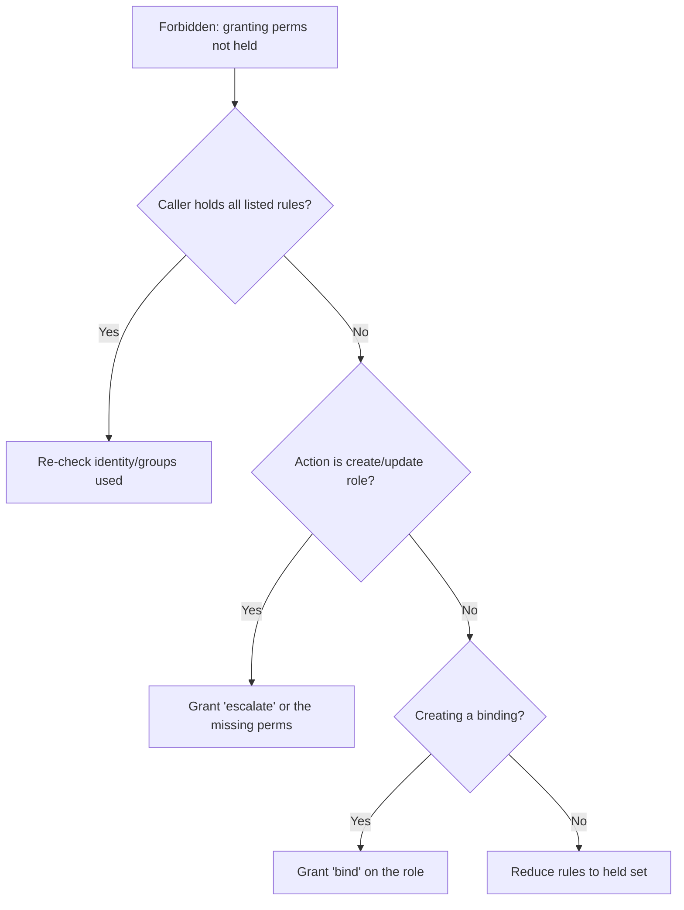

# RBAC Escalation Denied

> **Severity:** High · **Typical recovery time:** 5–20 min · **Affected versions:** 1.20+

## Error Message

```text
Error from server (Forbidden): roles.rbac.authorization.k8s.io "deployer"
is forbidden: user "jane@example.com" (groups=["dev"]) is attempting to grant
RBAC permissions not currently held:
{APIGroups:["apps"], Resources:["deployments"], Verbs:["delete"]}
```

## Description

Kubernetes enforces privilege escalation prevention: to create or update a Role
or ClusterRole, the requester must already hold (via some binding) every
permission they are trying to grant — unless they hold the special `escalate`
verb on roles. This stops a user with limited rights from authoring a Role that
hands out more than they have. The error lists exactly which rules exceed the
caller's current permissions. The same protection applies to `bind`: creating a
binding to a role you cannot fully exercise requires the `bind` verb.

## Affected Kubernetes Versions

Escalation prevention is built into the RBAC authorizer for all 1.20+ clusters.
The `escalate` and `bind` verbs on `roles`/`clusterroles` are the explicit,
audited overrides.

## Likely Root Causes

- The author lacks one or more permissions they are putting into the Role
- Creating a RoleBinding to a role granting rights the author does not hold
  (needs `bind`)
- A CD pipeline SA writes Roles broader than its own grants
- Intentional admin role authoring without the `escalate`/`bind` verb

## Diagnostic Flow



## Verification Steps

Compare the rules listed in the error against what the caller can actually do,
and confirm whether they hold `escalate`/`bind` for the operation.

## kubectl Commands

```bash
kubectl auth whoami
kubectl auth can-i --list --as=jane@example.com
kubectl auth can-i delete deployments.apps -n ci --as=jane@example.com
kubectl auth can-i escalate roles.rbac.authorization.k8s.io --as=jane@example.com
kubectl auth can-i bind roles.rbac.authorization.k8s.io --as=jane@example.com
```

## Expected Output

```text
$ kubectl auth can-i delete deployments.apps -n ci --as=jane@example.com
no

$ kubectl auth can-i escalate roles.rbac.authorization.k8s.io --as=jane@example.com
no
```

## Common Fixes

1. Grant the caller the underlying permissions they are trying to put into the
   Role (preferred — keeps escalation prevention intact).
2. Grant the `escalate` verb on `roles`/`clusterroles` only to trusted admins
   who legitimately author roles.
3. For binding to a powerful role, grant the `bind` verb on that role (optionally
   scoped with `resourceNames`).

## Recovery Procedures

1. Prefer giving the author the specific missing permissions so the safeguard
   still applies — least-privilege and lowest blast radius.
2. If a platform/admin role must author arbitrary roles, grant `escalate`/`bind`
   to that narrow group only.
3. **Disruptive (cluster-wide, high risk):** `escalate` lets a subject grant
   themselves any permission, effectively cluster-admin — blast radius is the
   entire cluster. Require dual approval, scope tightly, and audit usage.

## Validation

The Role/RoleBinding applies successfully, and
`kubectl auth can-i --list --as=jane@example.com` shows the intended (not
excessive) permissions.

## Prevention

Keep CD/automation SAs at least privilege, reserve `escalate`/`bind` for a small
audited admin group, review Role/ClusterRole changes in Git, and alert on use of
these verbs.

## Related Errors

- [Impersonation Denied](./impersonation-denied.md)
- [Forbidden: User Cannot List](./forbidden-user-cannot-list.md)
- [Aggregated ClusterRole Not Applied](./aggregated-clusterrole-not-applied.md)

## References

- [Privilege escalation prevention and bootstrapping](https://kubernetes.io/docs/reference/access-authn-authz/rbac/#privilege-escalation-prevention-and-bootstrapping)
- [Using RBAC Authorization](https://kubernetes.io/docs/reference/access-authn-authz/rbac/)

## Further Reading

- [DevOps AI ToolKit — Kubernetes guides](https://devopsaitoolkit.com/blog/)
