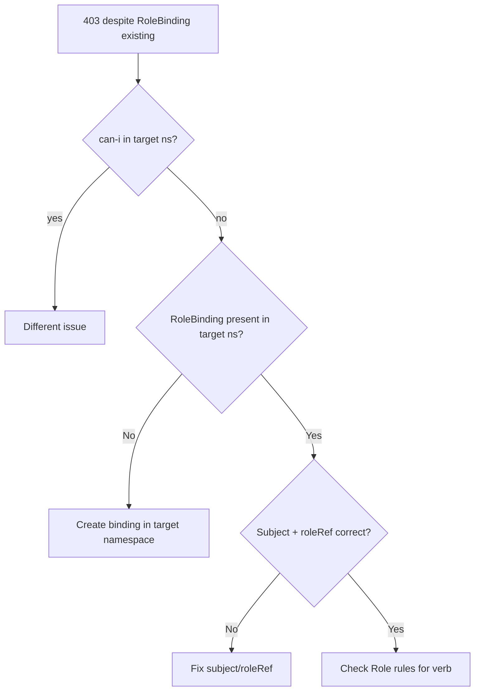

# RoleBinding Wrong Namespace

> **Severity:** Medium · **Typical recovery time:** 5–15 min · **Affected versions:** 1.20+

## Error Message

```text
Error from server (Forbidden): secrets is forbidden: User
"system:serviceaccount:team-a:reader" cannot list resource "secrets"
in API group "" in the namespace "team-b"
# A RoleBinding exists for "reader" — but only in namespace "team-a"
```

## Description

A RoleBinding is namespaced: it only grants access within the namespace it lives
in. A RoleBinding in `team-a` does nothing for requests against `team-b`, even
if the subject and Role are otherwise correct. This trips teams who copy a
working binding but forget that access does not follow the subject across
namespaces. There is no error when applying the misplaced binding — it simply
grants no access where it is needed.

## Affected Kubernetes Versions

All RBAC-enabled clusters, 1.20+. The namespaced semantics of RoleBinding are
unchanged. Note one subtlety: a RoleBinding can reference a ClusterRole, but the
granted permissions still apply only within the RoleBinding's own namespace.

## Likely Root Causes

- The RoleBinding was created in the subject's home namespace, not the target
- Manifest omits `metadata.namespace` and defaults to `default`
- A ServiceAccount needs access in multiple namespaces but has one binding
- Copy-paste reused a namespace value from another manifest

## Diagnostic Flow



## Verification Steps

List bindings per namespace and confirm a binding for the subject actually
exists in the namespace named in the Forbidden error, not elsewhere.

## kubectl Commands

```bash
kubectl auth can-i list secrets -n team-b \
  --as=system:serviceaccount:team-a:reader
kubectl get rolebindings -n team-b -o wide
kubectl get rolebindings -A -o wide | grep reader
kubectl describe rolebinding -n team-a
```

## Expected Output

```text
$ kubectl get rolebindings -A -o wide | grep reader
NAMESPACE   NAME           ROLE              SERVICEACCOUNTS
team-a      reader-bind    Role/secret-rdr   team-a/reader   # wrong ns

$ kubectl auth can-i list secrets -n team-b \
    --as=system:serviceaccount:team-a:reader
no
```

## Common Fixes

1. Create a RoleBinding in the **target** namespace (`team-b`) referencing the
   subject and Role.
2. Add `metadata.namespace` explicitly to every binding manifest.
3. For multi-namespace access, create one RoleBinding per namespace, or use a
   ClusterRole + per-namespace RoleBindings.

## Recovery Procedures

1. Determine exactly which namespace(s) the subject must reach.
2. Apply a RoleBinding in each target namespace referencing the least-privilege
   Role — blast radius stays confined to the named namespaces.
3. **Disruptive (cluster-wide):** A ClusterRoleBinding would grant the subject
   access in every namespace; use only with explicit approval as the blast
   radius is the whole cluster.

## Validation

`kubectl auth can-i list secrets -n team-b --as=...` returns `yes`, and the
original workload no longer logs Forbidden in `team-b`.

## Prevention

Always pin `metadata.namespace` in binding manifests, template per-namespace
bindings with Helm/Kustomize, and run `kubectl auth can-i --list -n <ns>` in CI
for each environment.

## Related Errors

- [Forbidden: ServiceAccount](./forbidden-serviceaccount.md)
- [Namespaced Binding For Cluster Resource](./namespaced-binding-for-cluster-resource.md)
- [Forbidden: User Cannot List](./forbidden-user-cannot-list.md)

## References

- [RoleBinding and ClusterRoleBinding](https://kubernetes.io/docs/reference/access-authn-authz/rbac/#rolebinding-and-clusterrolebinding)
- [Using RBAC Authorization](https://kubernetes.io/docs/reference/access-authn-authz/rbac/)

## Further Reading

- [DevOps AI ToolKit — Kubernetes guides](https://devopsaitoolkit.com/blog/)
