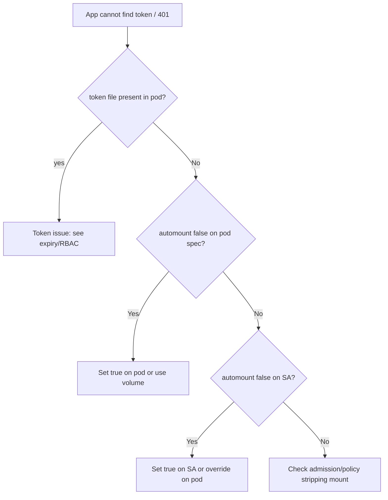

# SA Token Not Mounted

> **Severity:** High · **Typical recovery time:** 5–20 min · **Affected versions:** 1.22+

## Error Message

```text
open /var/run/secrets/kubernetes.io/serviceaccount/token: no such file or directory
# or from client libraries:
the server has asked for the client to provide credentials (Unauthorized)
# automountServiceAccountToken: false prevented the projected token mount
```

## Description

A pod that talks to the API server expects a projected ServiceAccount token at
`/var/run/secrets/kubernetes.io/serviceaccount/`. When
`automountServiceAccountToken: false` is set on the ServiceAccount or the pod
spec, that volume is not mounted, so the in-cluster client finds no credentials
and requests are anonymous — leading to Unauthorized or a missing-file error.
This is an authentication gap, not an authorization (403) one.

## Affected Kubernetes Versions

Projected BoundServiceAccountTokens became the default in 1.22 and legacy Secret
tokens were no longer auto-generated from 1.24. The `automountServiceAccountToken`
field exists on both ServiceAccount and Pod specs; the pod-level setting wins.

## Likely Root Causes

- `automountServiceAccountToken: false` on the ServiceAccount or pod spec
- A hardening policy/admission webhook strips the token mount
- The pod uses a SA configured for no automount but the app needs the API
- A custom projected-volume setup omits the `serviceAccountToken` source

## Diagnostic Flow



## Verification Steps

Confirm the token path is absent inside the pod and inspect the automount
setting on both the pod and its ServiceAccount.

## kubectl Commands

```bash
kubectl get pod <pod> -n web \
  -o jsonpath='{.spec.automountServiceAccountToken}{"\n"}'
kubectl get sa <sa> -n web \
  -o jsonpath='{.automountServiceAccountToken}{"\n"}'
kubectl describe pod <pod> -n web
kubectl get pod <pod> -n web -o jsonpath='{.spec.volumes[*].name}{"\n"}'
```

## Expected Output

```text
$ kubectl get sa app -n web -o jsonpath='{.automountServiceAccountToken}'
false

$ kubectl describe pod app-1 -n web | grep -A2 Mounts
    Mounts:
      <none for kube-api-access>
```

## Common Fixes

1. Set `automountServiceAccountToken: true` on the pod spec (overrides the SA).
2. Set it `true` on the ServiceAccount if all its pods need the API.
3. Add an explicit projected volume with a `serviceAccountToken` source for
   fine-grained control of audience and expiry.

## Recovery Procedures

1. Decide whether the workload genuinely needs API access — if not, leave
   automount disabled (least privilege; no token to leak).
2. If access is required, set automount at the **pod** level so only that
   workload gets a token, keeping blast radius to one Deployment.
3. **Disruptive (pod restart):** changing automount requires recreating pods;
   roll the Deployment, which briefly reduces capacity for that workload only.

## Validation

After the rollout, the token file exists in the pod and API calls succeed:
`kubectl exec` checks are mutating-free here — instead verify via app logs and
`kubectl auth can-i ... --as=system:serviceaccount:web:<sa>` returning `yes`.

## Prevention

Default `automountServiceAccountToken: false` cluster-wide and opt workloads in
explicitly; this minimizes token exposure and makes intentional API consumers
visible in review.

## Related Errors

- [Forbidden: ServiceAccount](./forbidden-serviceaccount.md)
- [Bound SA Token Expired](./bound-sa-token-expired.md)
- [Unauthorized (401)](./unauthorized-401.md)

## References

- [Configure automountServiceAccountToken](https://kubernetes.io/docs/tasks/configure-pod-container/configure-service-account/#opt-out-of-api-credential-automounting)
- [Managing Service Accounts](https://kubernetes.io/docs/reference/access-authn-authz/service-accounts-admin/)

## Further Reading

- [DevOps AI ToolKit — Kubernetes guides](https://devopsaitoolkit.com/blog/)
