# Unauthorized (401)

> **Severity:** Critical · **Typical recovery time:** 5–30 min · **Affected versions:** 1.20+

## Error Message

```text
error: You must be logged in to the server (Unauthorized)
```

## Description

A 401 Unauthorized means **authentication** failed — the API server could not
establish who the caller is, so it never reached RBAC authorization. This is
different from a 403 Forbidden, where identity is known but access is denied.
Common triggers are expired or invalid client certificates, expired bearer
tokens, a malformed kubeconfig, clock skew, or a rotated cluster CA. During an
incident a fleet-wide 401 (every command failing) usually points at credential
or CA rotation rather than per-user RBAC.

## Affected Kubernetes Versions

All versions, 1.20+. Client certificate expiry is version-independent. Note that
kubeadm-managed control-plane certs and the cluster CA have finite lifetimes;
exec-credential plugins (cloud IAM, OIDC) can also return expired tokens.

## Likely Root Causes

- Expired or revoked client certificate or bearer token
- kubeconfig points to the wrong cluster/context or has malformed credentials
- OIDC/exec auth plugin failed to refresh the token
- Cluster CA rotated and the client trusts the old CA, or large clock skew

## Diagnostic Flow

```mermaid
flowchart TD
    A[401 Unauthorized] --> B{Other users also 401?}
    B -- Yes --> E[Cluster-wide: CA/token issuer rotation]
    B -- No --> C{Cert/token expired?}
    C -- Yes --> D[Renew credential / re-login]
    C -- No --> F{Correct context + server?}
    F -- No --> G[Fix kubeconfig context]
    F -- Yes --> H[Check clock skew / exec plugin]
```



## Verification Steps

Confirm the failure is 401 (not 403), check which context is active, and inspect
the credential's expiry before assuming RBAC is involved.

## kubectl Commands

```bash
kubectl config current-context
kubectl config view --minify
kubectl auth whoami
kubectl get --raw='/livez?verbose'
kubectl cluster-info
```

## Expected Output

```text
$ kubectl auth whoami
error: You must be logged in to the server (Unauthorized)

$ kubectl config view --minify
# client-certificate-data present but notAfter date has passed
```

## Common Fixes

1. Renew the client credential — re-run the OIDC/cloud login, or reissue the
   client certificate via a CSR.
2. Switch to the correct context (`kubectl config use-context`) or repair a
   malformed kubeconfig.
3. Fix node/client clock skew (NTP) so token validity windows align.

## Recovery Procedures

1. Identify whether the outage is per-user (renew that credential) or
   fleet-wide (CA/issuer rotation).
2. For a single user, issue a new, short-lived credential with least privilege.
3. **Disruptive (cluster-wide):** Rotating the cluster CA or service-account
   signing keys invalidates every existing credential and requires distributing
   new kubeconfigs and restarting components — blast radius is the entire
   cluster; plan a maintenance window and follow the upgrade/cert-rotation
   runbook.

## Validation

`kubectl auth whoami` returns your identity, and routine read commands succeed
with the renewed credential.

## Prevention

Use short-lived OIDC/exec credentials, monitor certificate expiry, automate CA
and SA-key rotation with overlap windows, and keep NTP synchronized on clients
and nodes.

## Related Errors

- [Bound SA Token Expired](./bound-sa-token-expired.md)
- [SA Token Not Mounted](./serviceaccount-token-not-mounted.md)
- [Forbidden: User Cannot List](./forbidden-user-cannot-list.md)

## References

- [Authenticating](https://kubernetes.io/docs/reference/access-authn-authz/authentication/)
- [Certificate Management with kubeadm](https://kubernetes.io/docs/tasks/administer-cluster/kubeadm/kubeadm-certs/)

## Further Reading

- [DevOps AI ToolKit — Kubernetes guides](https://devopsaitoolkit.com/blog/)
