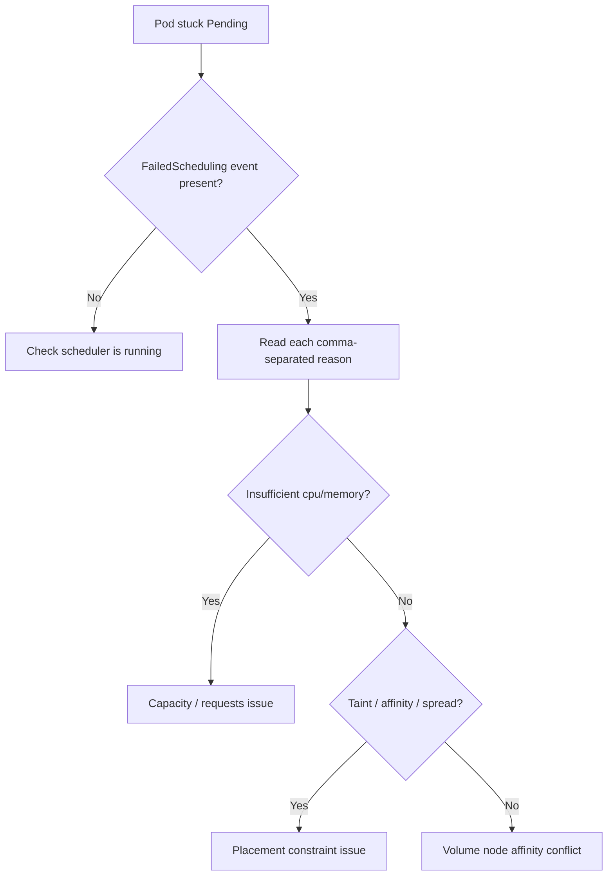

# FailedScheduling

> **Severity:** High · **Typical recovery time:** 5–30 min · **Affected versions:** 1.18+

## Error Message

```text
Warning  FailedScheduling  default-scheduler  0/5 nodes are available: 2 Insufficient cpu,
1 node(s) had untolerated taint {dedicated: gpu}, 2 node(s) didn't match Pod's node affinity/selector.
```

## Description

`FailedScheduling` is the umbrella event the `default-scheduler` records on a Pod
it cannot place. The Pod stays `Pending` and no `Node` is assigned. The single
event string is a concatenation of every per-predicate failure aggregated across
the cluster: each clause (`Insufficient cpu`, `untolerated taint`, node affinity,
volume conflicts) tells you how many nodes were rejected and why. During an
incident this is your most important diagnostic line — it summarizes the entire
scheduling cycle in one place, so read every comma-separated reason rather than
fixating on the first one.

## Affected Kubernetes Versions

Applies to all supported releases (1.18+). The message format was made more
structured around 1.19 and again refined when the scheduling framework became
the default. Pre-1.18 clusters used the older predicate/priority scheduler with
slightly different wording but the same semantics.

## Likely Root Causes

- Insufficient allocatable CPU/memory across all candidate nodes
- Taints without matching tolerations on every node
- `nodeSelector` / node affinity that no node satisfies
- Unsatisfiable pod (anti-)affinity or topology spread constraints
- Unbound or node-locked `PersistentVolume` constraints

## Diagnostic Flow



## Verification Steps

Confirm the Pod is genuinely `Pending` with a `FailedScheduling` event from
`default-scheduler`, not stuck in `ContainerCreating` (a kubelet/runtime issue)
or assigned to a node already.

## kubectl Commands

```bash
kubectl get pod <pod> -n <namespace> -o wide
kubectl describe pod <pod> -n <namespace>
kubectl get events -n <namespace> --field-selector reason=FailedScheduling --sort-by=.lastTimestamp
kubectl get nodes -o wide
kubectl describe nodes | grep -A6 "Allocated resources"
```

## Expected Output

```text
NAME        READY   STATUS    RESTARTS   AGE   NODE
web-7c9d    0/1     Pending   0          3m    <none>

Events:
  Type     Reason            From                Message
  Warning  FailedScheduling  default-scheduler   0/5 nodes are available: 2 Insufficient cpu,
  1 node(s) had untolerated taint {dedicated: gpu}, 2 node(s) didn't match Pod's node affinity/selector.
```

## Common Fixes

1. Resolve the dominant reason first — if most nodes report `Insufficient cpu`,
   lower the Pod's `requests` or add capacity.
2. Add the missing toleration or relax the `nodeSelector`/affinity.
3. Loosen overly strict topology spread or anti-affinity rules.

## Recovery Procedures

Ordered, production-safe steps:

1. Identify the predominant predicate failure from the event string.
2. Fix the underlying constraint (requests, tolerations, affinity, capacity).
3. **Disruptive:** scaling the cluster or cordoning nodes affects all workloads
   on those nodes — coordinate during a change window.
4. Recreating the Pod with corrected spec re-triggers scheduling; for a
   Deployment, `kubectl rollout restart` cycles **all** replicas (blast radius:
   the whole Deployment).

## Validation

```bash
kubectl get pod <pod> -n <namespace> -o wide
```

The Pod should transition to `Running` with a node assigned and no further
`FailedScheduling` events.

## Prevention

Set realistic resource requests, keep some headroom per node, validate affinity
and taint/toleration matrices in CI, and enable Cluster Autoscaler so capacity
pressure self-heals. Alert on Pods `Pending` longer than a few minutes.

## Related Errors

- [Insufficient Resources (Scheduling)](scheduler-insufficient-resources.md)
- [Untolerated Taint](scheduler-untolerated-taint.md)
- [Node Affinity No Match](scheduler-node-affinity-no-match.md)
- [Pending](../pods/pending.md)

## References

- [Kubernetes Scheduler](https://kubernetes.io/docs/concepts/scheduling-eviction/kube-scheduler/)
- [Assigning Pods to Nodes](https://kubernetes.io/docs/concepts/scheduling-eviction/assign-pod-node/)

## Further Reading

- [DevOps AI ToolKit — Kubernetes guides](https://devopsaitoolkit.com/blog/)
