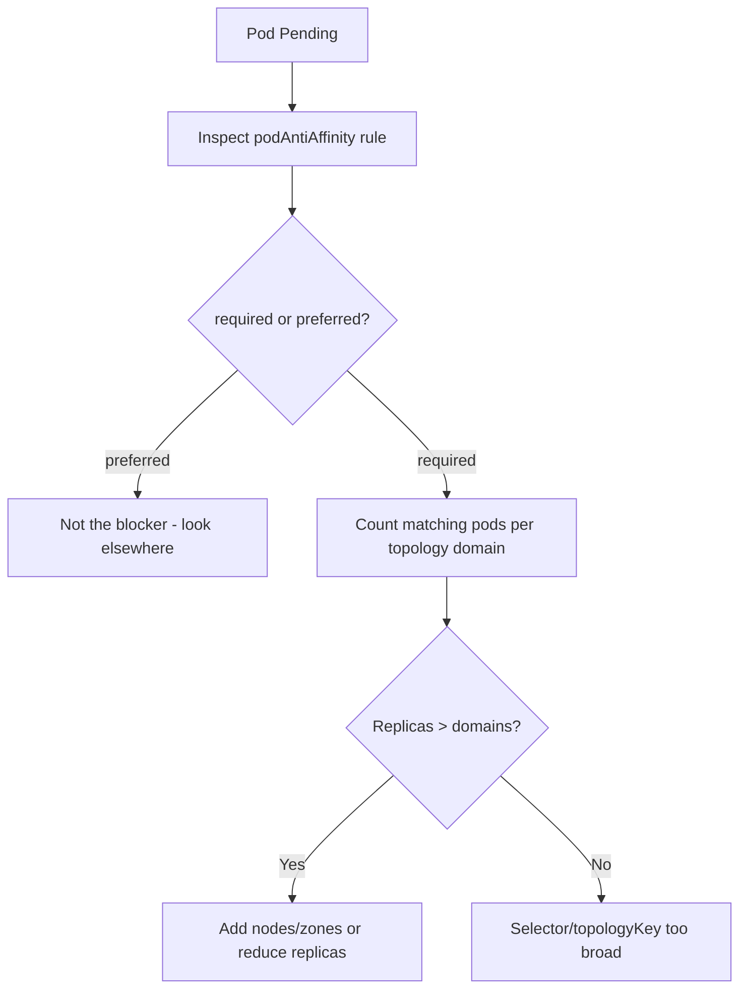

# Pod Anti-Affinity Unsatisfied

> **Severity:** Medium · **Typical recovery time:** 10–30 min · **Affected versions:** 1.18+

## Error Message

```text
0/3 nodes are available: 3 node(s) didn't satisfy existing pods anti-affinity rules.
Warning  FailedScheduling  default-scheduler  0/3 nodes are available:
3 node(s) didn't satisfy existing pods anti-affinity rules.
```

## Description

This event means a Pod declares `requiredDuringSchedulingIgnoredDuringExecution`
pod anti-affinity, and on every candidate node there is already a Pod matching
the anti-affinity label selector within the specified `topologyKey`. Because the
rule is hard, the scheduler cannot place the new Pod without violating the
"don't co-locate" guarantee, so it stays `Pending`. The classic trigger is a
replica count that exceeds the number of distinct topology domains — e.g. four
replicas with `topologyKey: kubernetes.io/hostname` on a three-node cluster: the
fourth replica has nowhere to go because each node already hosts one.

## Affected Kubernetes Versions

All releases 1.18+. Inter-pod affinity/anti-affinity has been stable since 1.6.
Performance of the calculation improved substantially in 1.21+, but the
scheduling semantics and this error string are unchanged across modern versions.

## Likely Root Causes

- Replica count exceeds available topology domains (nodes/zones)
- `topologyKey` too coarse (`hostname`) for the desired spread
- Hard `requiredDuring...` rule where `preferredDuring...` would suffice
- Label selector matches more existing Pods than intended

## Diagnostic Flow



## Verification Steps

Confirm the Pod uses *required* pod anti-affinity and that every topology domain
already hosts a Pod matching its label selector.

## kubectl Commands

```bash
kubectl describe pod <pod> -n <namespace>
kubectl get pod <pod> -n <namespace> -o jsonpath='{.spec.affinity.podAntiAffinity}{"\n"}'
kubectl get pods -n <namespace> -l <selector> -o wide
kubectl get nodes -o wide
```

## Expected Output

```text
$ kubectl get pods -n web -l app=web -o wide
NAME         READY   STATUS    NODE
web-0        1/1     Running   node-a
web-1        1/1     Running   node-b
web-2        1/1     Running   node-c
web-3        0/1     Pending   <none>

Events:
  Warning  FailedScheduling  default-scheduler  0/3 nodes are available:
  3 node(s) didn't satisfy existing pods anti-affinity rules.
```

## Common Fixes

1. Add nodes (or zones) so there are at least as many topology domains as
   replicas.
2. Reduce the replica count to fit the available domains.
3. Change `requiredDuringSchedulingIgnoredDuringExecution` to
   `preferredDuringSchedulingIgnoredDuringExecution` so spread is best-effort.

## Recovery Procedures

1. Decide between adding capacity, relaxing the rule, or lowering replicas.
2. Adding a node is non-disruptive to existing Pods and lets the Pending Pod
   schedule once the node is `Ready`.
3. **Disruptive:** changing the anti-affinity rule edits the Pod template and
   rolls **every** replica of the workload — blast radius is the whole
   Deployment/StatefulSet; plan a window.
4. Scaling down replicas removes running Pods (blast radius: reduced capacity).

## Validation

```bash
kubectl get pods -n <namespace> -l <selector> -o wide
```

All replicas should be `Running`, spread across distinct topology domains, with
no remaining `FailedScheduling` events.

## Prevention

Keep replica counts aligned with the number of fault domains, prefer soft
anti-affinity for elasticity, and consider topology spread constraints (which
offer `maxSkew` tuning) instead of strict anti-affinity for large fleets.

## Related Errors

- [Topology Spread Constraints Unsatisfied](topology-spread-unsatisfied.md)
- [FailedScheduling](failedscheduling.md)
- [Node Affinity No Match](scheduler-node-affinity-no-match.md)

## References

- [Inter-pod affinity and anti-affinity](https://kubernetes.io/docs/concepts/scheduling-eviction/assign-pod-node/#inter-pod-affinity-and-anti-affinity)
- [Assigning Pods to Nodes](https://kubernetes.io/docs/concepts/scheduling-eviction/assign-pod-node/)

## Further Reading

- [DevOps AI ToolKit — Kubernetes guides](https://devopsaitoolkit.com/blog/)
