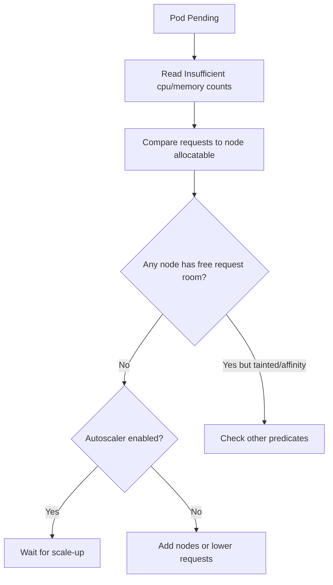

# Insufficient Resources (Scheduling)

> **Severity:** High · **Typical recovery time:** 10–40 min · **Affected versions:** 1.18+

## Error Message

```text
0/8 nodes are available: 5 Insufficient cpu, 3 Insufficient memory.
Warning  FailedScheduling  default-scheduler  0/8 nodes are available:
5 Insufficient cpu, 3 Insufficient memory.
```

## Description

The scheduler reports `Insufficient cpu` / `Insufficient memory` when no node has
enough **allocatable, unreserved** capacity to satisfy the Pod's resource
*requests*. The scheduler reserves capacity by requests, not actual usage, so a
node can look idle in `top` yet still reject a Pod whose requests exceed the
remaining requestable headroom. The count before each reason tells you how many
nodes failed on that dimension; a Pod can fail CPU on some nodes and memory on
others. This is a capacity/bin-packing problem, not a runtime OOM.

## Affected Kubernetes Versions

All releases 1.18+. The `NodeResourcesFit` plugin governs this in the scheduling
framework. Extended/scalar resources (GPUs, hugepages) produce the same family
of messages (`Insufficient nvidia.com/gpu`). Behavior is consistent across
modern versions; only the plugin name and scoring strategy options have evolved.

## Likely Root Causes

- Pod requests exceed any single node's remaining allocatable capacity
- Cluster genuinely full (high request commitment across all nodes)
- Daemon/system reservations leave less allocatable than total capacity
- Requests set far higher than real need, wasting headroom
- No autoscaling to add nodes under pressure

## Diagnostic Flow



## Verification Steps

Confirm the failing dimension (cpu vs memory), the Pod's requests, and each
node's allocatable minus already-requested totals.

## kubectl Commands

```bash
kubectl describe pod <pod> -n <namespace>
kubectl get pod <pod> -n <namespace> -o jsonpath='{.spec.containers[*].resources}{"\n"}'
kubectl describe nodes | grep -A6 "Allocated resources"
kubectl top nodes
kubectl get nodes -o custom-columns=NAME:.metadata.name,CPU:.status.allocatable.cpu,MEM:.status.allocatable.memory
```

## Expected Output

```text
Allocated resources:
  Resource           Requests       Limits
  cpu                3800m (95%)    4
  memory             7200Mi (90%)   8Gi

Events:
  Warning  FailedScheduling  default-scheduler  0/8 nodes are available:
  5 Insufficient cpu, 3 Insufficient memory.
```

## Common Fixes

1. Lower the Pod's CPU/memory `requests` to fit existing headroom (if requests
   were inflated).
2. Add nodes or enable Cluster Autoscaler to grow capacity.
3. Free capacity by removing or right-sizing over-provisioned workloads.

## Recovery Procedures

1. Quantify the gap: requested vs allocatable per node.
2. Scaling the cluster (manual or autoscaler) is the safest fix and
   non-disruptive to running Pods.
3. **Disruptive:** lowering requests in a Deployment template rolls **all**
   replicas — blast radius is the whole workload; verify the new requests still
   cover real usage to avoid throttling/OOM.
4. **Disruptive:** evicting or scaling down other workloads to free capacity
   reduces their availability — coordinate with their owners.

## Validation

```bash
kubectl get pod <pod> -n <namespace> -o wide
kubectl describe nodes | grep -A6 "Allocated resources"
```

Pod reaches `Running`; node allocation shows it accounted for with headroom
remaining.

## Prevention

Right-size requests using historical usage (VPA recommendations), keep per-node
headroom, enable Cluster Autoscaler, and enforce ResourceQuota/LimitRange so a
single namespace cannot exhaust requestable capacity.

## Related Errors

- [FailedScheduling](failedscheduling.md)
- [Preemption Found No Victims](scheduler-preemption-no-victims.md)
- [Pod Insufficient CPU](../pods/pod-insufficient-cpu.md)
- [Node Allocatable Exhausted](../nodes/node-allocatable-exhausted.md)

## References

- [Resource Management for Pods and Containers](https://kubernetes.io/docs/concepts/configuration/manage-resources-containers/)
- [Node Allocatable](https://kubernetes.io/docs/tasks/administer-cluster/reserve-compute-resources/)

## Further Reading

- [Free Kubernetes config validators](https://devopsaitoolkit.com/validators/)
