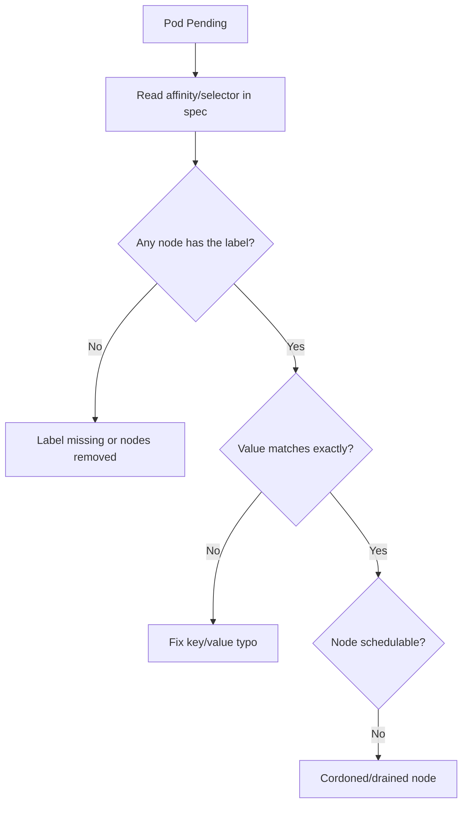

# Node Affinity No Match

> **Severity:** Medium · **Typical recovery time:** 5–20 min · **Affected versions:** 1.18+

## Error Message

```text
0/6 nodes are available: 6 node(s) didn't match Pod's node affinity/selector.
Warning  FailedScheduling  default-scheduler  0/6 nodes are available: 6 node(s)
didn't match Pod's node affinity/selector.
```

## Description

The scheduler reports this when a Pod's `nodeSelector` or
`requiredDuringSchedulingIgnoredDuringExecution` node affinity matches **no**
node in the cluster. Because the requirement is hard, the scheduler refuses to
place the Pod anywhere and it stays `Pending`. This is almost always a label
mismatch: either the label key/value the Pod asks for does not exist on any
node, or the nodes that had it were drained, relabeled, or scaled away. It is a
look-alike for untolerated taints — the difference is whether the Pod is being
*pulled* toward labels (affinity) or *pushed away* by taints.

## Affected Kubernetes Versions

All releases 1.18+. Node affinity has been stable since 1.14. The combined
`affinity/selector` wording in the event was introduced with the scheduling
framework; older clusters logged `MatchNodeSelector` separately. `nodeSelector`
itself is the oldest mechanism and behaves identically across versions.

## Likely Root Causes

- The required label is absent or misspelled on every node
- Label value mismatch (e.g. `disktype=ssd` vs `disktype=SSD`)
- Nodes carrying the label were cordoned, drained, or removed
- Affinity uses `requiredDuring...` where `preferredDuring...` was intended

## Diagnostic Flow



## Verification Steps

Read the Pod's `nodeSelector`/`affinity`, then list node labels and confirm no
node satisfies the requirement.

## kubectl Commands

```bash
kubectl describe pod <pod> -n <namespace>
kubectl get pod <pod> -n <namespace> -o jsonpath='{.spec.affinity}{"\n"}{.spec.nodeSelector}{"\n"}'
kubectl get nodes --show-labels
kubectl get nodes -l <key>=<value>
```

## Expected Output

```text
$ kubectl get nodes -l disktype=ssd
No resources found

Events:
  Warning  FailedScheduling  default-scheduler  0/6 nodes are available:
  6 node(s) didn't match Pod's node affinity/selector.
```

## Common Fixes

1. Correct the label key/value in the Pod's `nodeSelector` or node affinity.
2. Add the expected label to suitable nodes.
3. Convert a too-strict `requiredDuring...` rule to `preferredDuring...` if the
   placement is a preference, not a hard requirement.

## Recovery Procedures

1. Decide whether to fix the Pod spec or the node labels.
2. To label a node: applying a label is non-disruptive and affects only future
   scheduling decisions for that node.
3. **Disruptive:** editing the affinity in a Deployment triggers a rollout of
   **all** replicas — blast radius is the whole workload; do it deliberately.
4. Recreate the Pod (or let the controller recreate it) to re-run scheduling.

## Validation

```bash
kubectl get pod <pod> -n <namespace> -o wide
```

Pod should be `Running` on a node whose labels satisfy the affinity, with no new
`FailedScheduling` events.

## Prevention

Manage node labels declaratively (cloud node groups, MachineConfig, or GitOps),
document required labels per workload, and lint manifests so affinity keys match
real label taxonomies. Prefer `preferred` affinity unless placement is mandatory.

## Related Errors

- [FailedScheduling](failedscheduling.md)
- [Untolerated Taint](scheduler-untolerated-taint.md)
- [Topology Spread Constraints Unsatisfied](topology-spread-unsatisfied.md)
- [Pod Node Affinity Conflict](../pods/pod-node-affinity-conflict.md)

## References

- [Assigning Pods to Nodes](https://kubernetes.io/docs/concepts/scheduling-eviction/assign-pod-node/)
- [Well-Known Labels, Annotations and Taints](https://kubernetes.io/docs/reference/labels-annotations-taints/)

## Further Reading

- [Free Kubernetes config validators](https://devopsaitoolkit.com/validators/)
