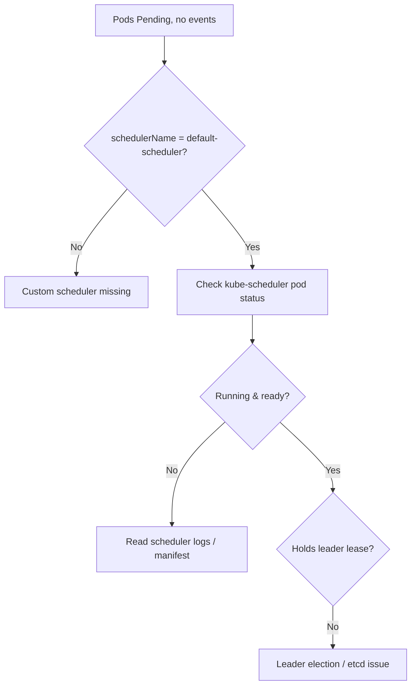

# Default Scheduler Not Running

> **Severity:** Critical · **Typical recovery time:** 10–45 min · **Affected versions:** 1.18+

## Error Message

```text
$ kubectl describe pod web -n default
...
Events:          <none>

# Pods are Pending with NO FailedScheduling event and NO node assigned —
# the default-scheduler never processed them.
```

## Description

Normally an unschedulable Pod gets a `FailedScheduling` event from
`default-scheduler` within seconds. When Pods sit `Pending` with **no scheduler
events at all** and `.spec.nodeName` empty, the scheduler itself is not
processing the queue. The kube-scheduler is a single leader-elected control-plane
component; if it is crash-looping, has lost leader election, was misconfigured, or
its static-pod manifest is missing, *nothing* gets scheduled cluster-wide. This
is a control-plane outage, not a per-Pod constraint — a distinguishing sign is
that brand-new Pods of *any* spec stay Pending without events.

## Affected Kubernetes Versions

All releases 1.18+. On kubeadm/static-pod control planes the scheduler runs as a
static Pod from `/etc/kubernetes/manifests/kube-scheduler.yaml`. Managed control
planes (EKS/GKE/AKS) hide the scheduler, so symptoms there usually trace to the
provider. KubeSchedulerConfiguration `v1beta`→`v1` API changes (1.25+) can break
a custom config and prevent startup.

## Likely Root Causes

- kube-scheduler Pod crash-looping (bad config, cert, or flag)
- Leader election lost or stuck (etcd/apiserver connectivity)
- Static-pod manifest missing/renamed or kubelet not running it
- Invalid `KubeSchedulerConfiguration` after a version upgrade
- A custom scheduler named but not deployed (`schedulerName` mismatch)

## Diagnostic Flow



## Verification Steps

Confirm Pending Pods have empty `nodeName`, no `FailedScheduling` events, and the
correct `schedulerName`; then check the kube-scheduler component health.

## kubectl Commands

```bash
kubectl get pod <pod> -n <namespace> -o jsonpath='{.spec.schedulerName}{" node="}{.spec.nodeName}{"\n"}'
kubectl get pods -n kube-system -l component=kube-scheduler -o wide
kubectl describe pod -n kube-system -l component=kube-scheduler
kubectl logs -n kube-system -l component=kube-scheduler --tail=100
kubectl get lease -n kube-system kube-scheduler -o yaml
kubectl get componentstatuses
```

## Expected Output

```text
$ kubectl get pods -n kube-system -l component=kube-scheduler
NAME                         READY   STATUS             RESTARTS   AGE
kube-scheduler-cp-1          0/1     CrashLoopBackOff   7          12m

$ kubectl logs -n kube-system kube-scheduler-cp-1 --tail=3
failed to initialize config: decoding . profile: no kind "KubeSchedulerConfiguration"
is registered for version "kubescheduler.config.k8s.io/v1beta3"
```

## Common Fixes

1. Fix the scheduler crash cause shown in its logs (config API version, bad flag,
   cert/kubeconfig path).
2. Restore the static-pod manifest at
   `/etc/kubernetes/manifests/kube-scheduler.yaml`.
3. Resolve etcd/apiserver connectivity so leader election can complete.
4. Deploy the named custom scheduler, or set `schedulerName: default-scheduler`.

## Recovery Procedures

1. Read the scheduler logs to pinpoint the failure.
2. Correct the manifest/config on the control-plane node; the kubelet restarts
   the static Pod automatically.
3. **Disruptive:** on multi-master clusters, restarting the leader scheduler
   triggers re-election — brief scheduling pause cluster-wide (blast radius:
   every new/pending Pod until a leader is re-elected). Roll one control-plane
   node at a time.
4. Do not delete Pending workload Pods en masse to "force" scheduling — the
   scheduler must be healthy first.

## Validation

```bash
kubectl get pods -n kube-system -l component=kube-scheduler
kubectl get pod <pod> -n <namespace> -o wide
```

The scheduler Pod is `Running`/`Ready`, holds the lease, and Pending Pods receive
events and get scheduled within seconds.

## Prevention

Run an HA control plane (3 schedulers, leader election), alert on scheduler Pod
restarts and lease ownership, monitor `scheduler_pending_pods` and
`scheduler_schedule_attempts_total`, and validate `KubeSchedulerConfiguration`
against the target version's API before upgrades.

## Related Errors

- [FailedScheduling](failedscheduling.md)
- [PriorityClass Not Found](scheduler-priorityclass-not-found.md)
- [Insufficient Resources (Scheduling)](scheduler-insufficient-resources.md)
- [Pending](../pods/pending.md)

## References

- [Kubernetes Scheduler](https://kubernetes.io/docs/concepts/scheduling-eviction/kube-scheduler/)
- [Scheduler Configuration](https://kubernetes.io/docs/reference/scheduling/config/)

## Further Reading

- [DevOps AI ToolKit — Kubernetes guides](https://devopsaitoolkit.com/blog/)
