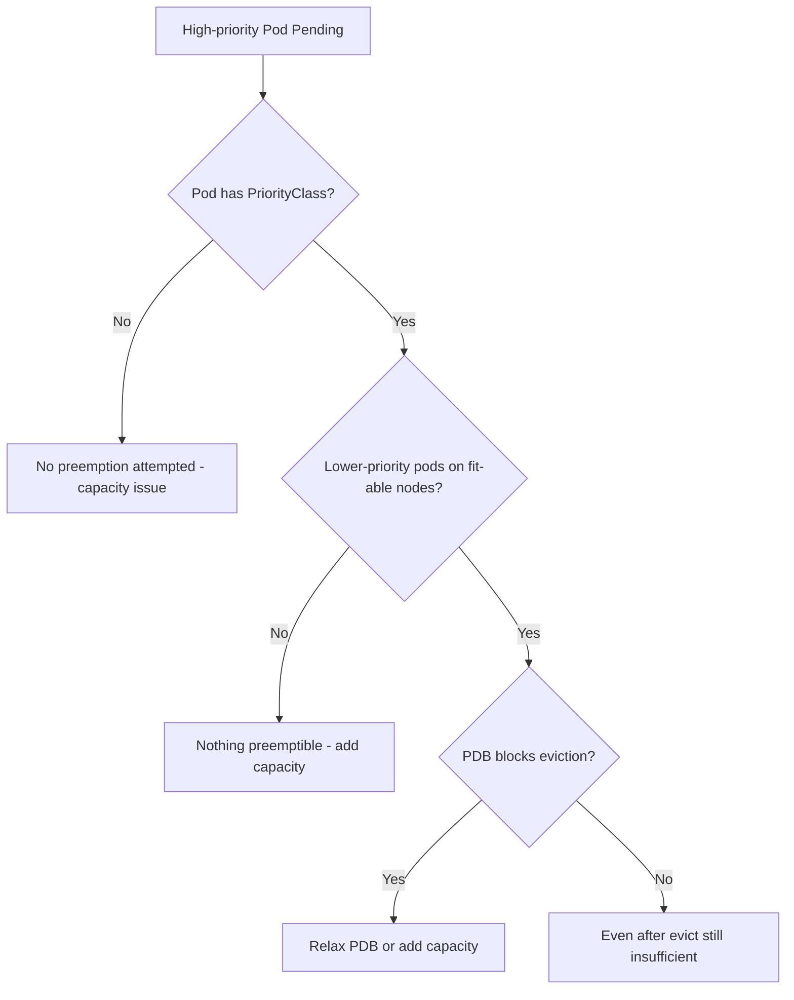

# Preemption Found No Victims

> **Severity:** High · **Typical recovery time:** 10–40 min · **Affected versions:** 1.18+

## Error Message

```text
0/5 nodes are available: 5 Insufficient cpu.
preemption: 0/5 nodes are available: 5 No preemption victims found for incoming pod.
```

## Description

When a Pod cannot schedule, the scheduler may try **preemption**: evicting
lower-priority Pods to free room. This message means the normal scheduling pass
failed *and* the preemption pass also found nowhere it could evict victims to
make the Pod fit. Typical reasons: the Pod has equal or lower priority than
everything already running (nothing is preemptible), preempting would still leave
insufficient capacity, PodDisruptionBudgets block eviction of candidate victims,
or the Pod has `preemptionPolicy: Never`. The Pod stays `Pending` despite having
a PriorityClass.

## Affected Kubernetes Versions

All releases 1.18+. Pod priority and preemption are stable since 1.14.
`preemptionPolicy` (including `Never`) is stable since 1.19. The
`PostFilter`/`DefaultPreemption` plugin produces the "No preemption victims
found" wording in the scheduling framework; semantics are consistent in modern
versions.

## Likely Root Causes

- Incoming Pod's priority ≤ priority of all Pods on candidate nodes
- Even after eviction, capacity/affinity still cannot fit the Pod
- PodDisruptionBudgets prevent evicting the would-be victims
- Pod sets `preemptionPolicy: Never`
- Lower-priority Pods exist but on nodes the Pod can't use (taint/affinity)

## Diagnostic Flow



## Verification Steps

Confirm the Pod has a non-trivial priority, then check whether lower-priority,
preemptible Pods exist on nodes that would otherwise fit, and whether PDBs guard
them.

## kubectl Commands

```bash
kubectl describe pod <pod> -n <namespace>
kubectl get pod <pod> -n <namespace> -o jsonpath='{.spec.priority}{" "}{.spec.priorityClassName}{" "}{.spec.preemptionPolicy}{"\n"}'
kubectl get pods -A -o custom-columns=NS:.metadata.namespace,NAME:.metadata.name,PRIO:.spec.priority,NODE:.spec.nodeName
kubectl get pdb -A
kubectl get priorityclasses
```

## Expected Output

```text
$ kubectl get pod web -o jsonpath='{.spec.priority}{" "}{.spec.priorityClassName}{"\n"}'
1000 high-priority

Events:
  Warning  FailedScheduling  default-scheduler  0/5 nodes are available: 5 Insufficient cpu.
  preemption: 0/5 nodes are available: 5 No preemption victims found for incoming pod.
```

## Common Fixes

1. Add cluster capacity (or enable autoscaling) so neither scheduling nor
   preemption is needed.
2. Raise the incoming Pod's PriorityClass above the workloads occupying the nodes.
3. Relax restrictive PodDisruptionBudgets that block evicting candidate victims.
4. Remove `preemptionPolicy: Never` if the Pod should be allowed to preempt.

## Recovery Procedures

1. Establish why no victims exist: priority, PDBs, capacity, or topology.
2. Adding nodes (autoscaler) is the least disruptive resolution.
3. **Disruptive:** allowing preemption (raising priority / loosening PDBs)
   causes the scheduler to **evict lower-priority running Pods** — blast radius
   is those victim workloads; confirm they tolerate disruption first.
4. **Disruptive:** manually deleting low-priority Pods frees room but reduces
   their availability — coordinate with owners.

## Validation

```bash
kubectl get pod <pod> -n <namespace> -o wide
```

The Pod schedules and reaches `Running`; if preemption ran, victim Pods reschedule
elsewhere and recover.

## Prevention

Define a clear PriorityClass hierarchy, set PDBs that permit at least some
voluntary disruption, keep headroom or autoscaling for critical priorities, and
reserve `preemptionPolicy: Never` for genuinely best-effort batch workloads.

## Related Errors

- [Insufficient Resources (Scheduling)](scheduler-insufficient-resources.md)
- [PriorityClass Not Found](scheduler-priorityclass-not-found.md)
- [FailedScheduling](failedscheduling.md)

## References

- [Pod Priority and Preemption](https://kubernetes.io/docs/concepts/scheduling-eviction/pod-priority-preemption/)
- [Pod Disruption Budgets](https://kubernetes.io/docs/concepts/workloads/pods/disruptions/)

## Further Reading

- [DevOps AI ToolKit — Kubernetes guides](https://devopsaitoolkit.com/blog/)
