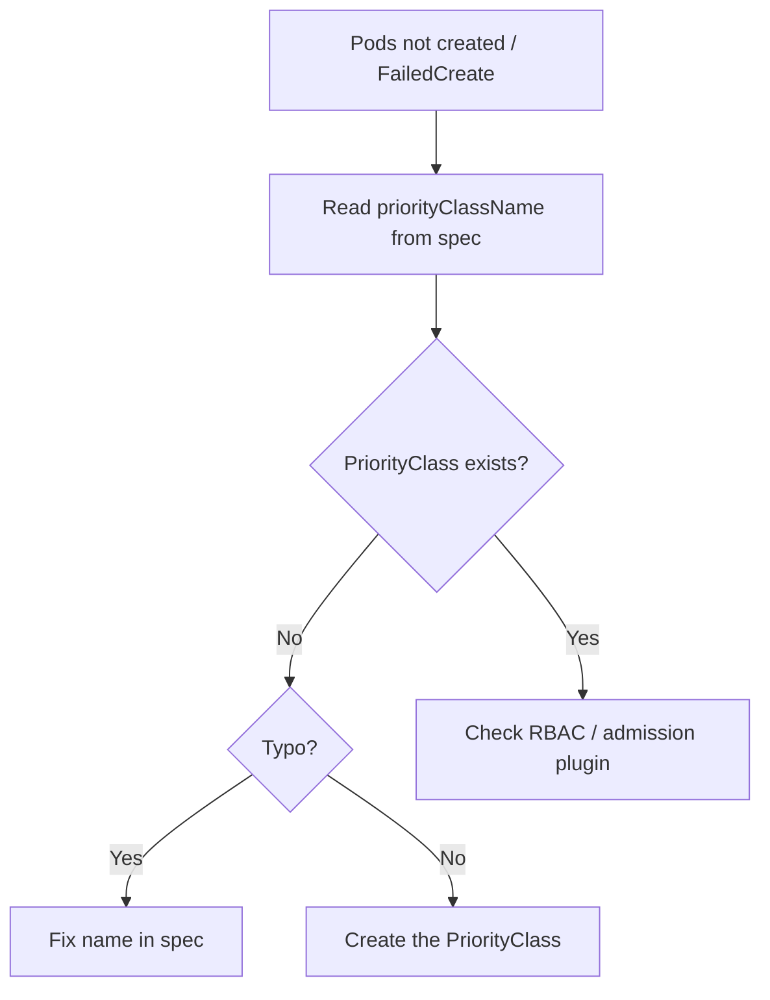

# PriorityClass Not Found

> **Severity:** High · **Typical recovery time:** 5–15 min · **Affected versions:** 1.18+

## Error Message

```text
Error creating: pods "web-7c9d-" is forbidden: no PriorityClass with name high-priority was found
Warning  FailedCreate  replicaset-controller  Error creating: pods "web-7c9d-" is forbidden:
no PriorityClass with name high-priority was found
```

## Description

`priorityClassName` on a Pod must reference an existing cluster-scoped
`PriorityClass`. The `Priority` admission plugin resolves that name to a numeric
priority **at admission time**; if the named class does not exist, the API server
rejects the Pod outright. The Pod is never created, so for controllers
(Deployments, StatefulSets) the failure surfaces as `FailedCreate` on the
ReplicaSet/controller rather than `FailedScheduling`, and the workload never
reaches `Pending`. This is a configuration/ordering problem: the workload
referenced a PriorityClass that was deleted, never applied, or misspelled.

## Affected Kubernetes Versions

All releases 1.18+. The `Priority` admission plugin is enabled by default and
PriorityClass is stable since 1.14. Two system classes,
`system-cluster-critical` and `system-node-critical`, always exist; user classes
must be created before any Pod references them. Behavior is consistent across
modern versions.

## Likely Root Causes

- The referenced PriorityClass was never created or was deleted
- Typo in `priorityClassName`
- Manifests applied out of order (workload before its PriorityClass)
- PriorityClass lives in a different cluster/context than expected

## Diagnostic Flow



## Verification Steps

Find the `priorityClassName` the workload requests and confirm whether a
matching PriorityClass object exists in the cluster.

## kubectl Commands

```bash
kubectl describe rs <replicaset> -n <namespace>
kubectl get deploy <name> -n <namespace> -o jsonpath='{.spec.template.spec.priorityClassName}{"\n"}'
kubectl get priorityclasses
kubectl get priorityclass <name> -o yaml
kubectl get events -n <namespace> --field-selector reason=FailedCreate --sort-by=.lastTimestamp
```

## Expected Output

```text
$ kubectl get priorityclasses
NAME                      VALUE        GLOBAL-DEFAULT   AGE
system-cluster-critical   2000000000   false            40d
system-node-critical      2000001000   false            40d

Events:
  Warning  FailedCreate  replicaset-controller  Error creating: pods "web-7c9d-" is
  forbidden: no PriorityClass with name high-priority was found
```

## Common Fixes

1. Create the missing PriorityClass with the expected name and value.
2. Correct the typo in `priorityClassName`.
3. Apply manifests in dependency order (PriorityClass first, then workloads), or
   remove `priorityClassName` if priority is not actually needed.

## Recovery Procedures

1. Confirm the exact missing name from the `FailedCreate` event.
2. Creating the PriorityClass is cluster-scoped and non-disruptive; the
   controller then creates the previously rejected Pods automatically.
3. **Disruptive:** if you instead edit `priorityClassName` in a Deployment, it
   rolls the template and recreates **all** replicas — blast radius is the whole
   workload.
4. Removing a no-longer-needed `priorityClassName` similarly triggers a rollout.

## Validation

```bash
kubectl get priorityclass <name>
kubectl get pods -n <namespace> -l <selector>
```

The PriorityClass exists and the workload's Pods are now created and progressing
to `Running`.

## Prevention

Manage PriorityClasses in GitOps alongside the workloads that use them, order
sync waves so classes apply first, validate `priorityClassName` references in CI,
and avoid deleting PriorityClasses still referenced by live workloads.

## Related Errors

- [Preemption Found No Victims](scheduler-preemption-no-victims.md)
- [FailedScheduling](failedscheduling.md)
- [Insufficient Resources (Scheduling)](scheduler-insufficient-resources.md)
- [ReplicaFailure FailedCreate](../deployments/replicafailure-failedcreate.md)

## References

- [Pod Priority and Preemption](https://kubernetes.io/docs/concepts/scheduling-eviction/pod-priority-preemption/)
- [PriorityClass API reference](https://kubernetes.io/docs/concepts/scheduling-eviction/pod-priority-preemption/)

## Further Reading

- [Free Kubernetes config validators](https://devopsaitoolkit.com/validators/)
