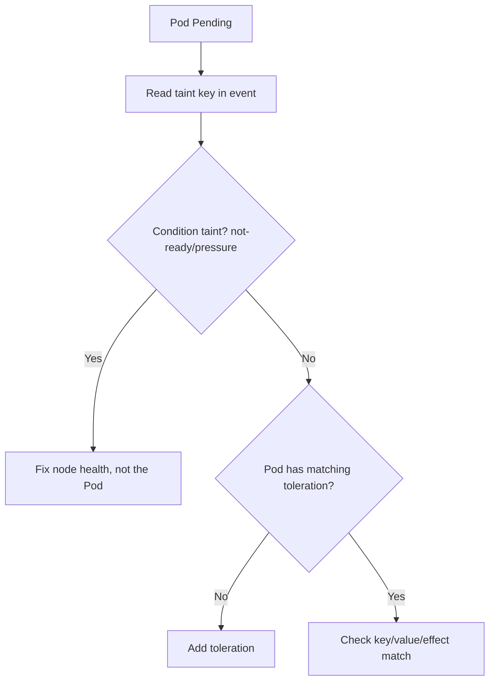

# Untolerated Taint

> **Severity:** Medium · **Typical recovery time:** 5–20 min · **Affected versions:** 1.18+

## Error Message

```text
0/5 nodes are available: 5 node(s) had untolerated taint {dedicated: gpu}.
Warning  FailedScheduling  default-scheduler  0/5 nodes are available:
5 node(s) had untolerated taint {node-role.kubernetes.io/control-plane: }.
```

## Description

Taints repel Pods from nodes unless the Pod carries a matching toleration. When
every candidate node carries a taint the Pod does not tolerate — with effect
`NoSchedule` or `NoExecute` — the scheduler rejects all of them and the Pod stays
`Pending`. This is intentional isolation: control-plane nodes, GPU nodes,
dedicated tenants, and nodes under pressure (e.g. `node.kubernetes.io/disk-pressure`)
are commonly tainted. The error names the specific taint key (and value, if any)
so you know exactly which barrier to cross.

## Affected Kubernetes Versions

All releases 1.18+. Taints and tolerations have been stable since 1.6.
Node lifecycle taints like `node.kubernetes.io/not-ready` and `unreachable` are
applied automatically. The `node-role.kubernetes.io/control-plane` taint
replaced `master` during 1.20–1.25; older clusters may show the `master` key.

## Likely Root Causes

- Node intentionally tainted (control-plane, GPU, dedicated pool) and Pod lacks
  the toleration
- Automatic condition taint applied (disk/memory/PID pressure, not-ready)
- Toleration key, value, operator, or effect mismatched with the taint
- Toleration omitted entirely from the Pod spec

## Diagnostic Flow



## Verification Steps

Read the taint key from the event, list node taints, and compare with the Pod's
tolerations to find the mismatch.

## kubectl Commands

```bash
kubectl describe pod <pod> -n <namespace>
kubectl get nodes -o custom-columns=NAME:.metadata.name,TAINTS:.spec.taints
kubectl describe node <node> | grep -i taint
kubectl get pod <pod> -n <namespace> -o jsonpath='{.spec.tolerations}{"\n"}'
```

## Expected Output

```text
$ kubectl get nodes -o custom-columns=NAME:.metadata.name,TAINTS:.spec.taints
NAME      TAINTS
node-a    [map[effect:NoSchedule key:dedicated value:gpu]]

Events:
  Warning  FailedScheduling  default-scheduler  0/5 nodes are available:
  5 node(s) had untolerated taint {dedicated: gpu}.
```

## Common Fixes

1. Add a toleration matching the taint key/value/effect to the Pod spec.
2. Remove or correct the taint if it was applied in error.
3. For condition taints (pressure, not-ready), fix the underlying node health
   rather than tolerating the symptom.

## Recovery Procedures

1. Determine whether the taint is intentional isolation or a node-health signal.
2. Adding a toleration to the Pod template is the safe path for intentional
   taints. **Disruptive:** for a Deployment this rolls **all** replicas — blast
   radius is the whole workload.
3. **Disruptive:** removing a taint from a node (`kubectl taint ... -`) allows
   *all* untolerating Pods to land there — blast radius is every workload that
   could now target that node; do it deliberately.
4. For condition taints, restoring node health auto-clears the taint.

## Validation

```bash
kubectl get pod <pod> -n <namespace> -o wide
```

Pod should schedule onto a tolerated node and reach `Running` with no further
`FailedScheduling` events.

## Prevention

Keep a documented taint/toleration matrix, apply dedicated-node tolerations via
admission policies or pod presets, and alert on automatic condition taints
(disk/memory/PID pressure) so node health is fixed before it blocks scheduling.

## Related Errors

- [Node Affinity No Match](scheduler-node-affinity-no-match.md)
- [FailedScheduling](failedscheduling.md)
- [Pod Untolerated Taint](../pods/pod-untolerated-taint.md)
- [NoExecute Taint Evicting](../nodes/node-noexecute-taint-evicting.md)

## References

- [Taints and Tolerations](https://kubernetes.io/docs/concepts/scheduling-eviction/taint-and-toleration/)
- [Well-Known Labels, Annotations and Taints](https://kubernetes.io/docs/reference/labels-annotations-taints/)

## Further Reading

- [DevOps AI ToolKit — Kubernetes guides](https://devopsaitoolkit.com/blog/)
