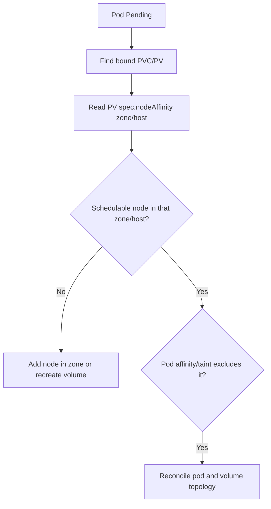

# Volume Node Affinity Conflict (Scheduling)

> **Severity:** High · **Typical recovery time:** 10–30 min · **Affected versions:** 1.18+

## Error Message

```text
0/6 nodes are available: 6 node(s) had volume node affinity conflict.
Warning  FailedScheduling  default-scheduler  0/6 nodes are available:
6 node(s) had volume node affinity conflict.
```

## Description

A `PersistentVolume` can pin itself to specific nodes or zones via
`spec.nodeAffinity` — local disks declare a single node, and zonal block storage
(EBS, PD, Azure Disk) declares a zone. The scheduler must place the Pod on a node
that satisfies **both** the Pod's own constraints and every bound volume's node
affinity. This event means no node satisfies the intersection: the Pod's
nodeSelector/affinity, taints, or capacity push it toward nodes the volume cannot
reach, or the volume's node/zone no longer has a schedulable node. The Pod stays
`Pending` because moving zonal/local storage across nodes is not possible.

## Affected Kubernetes Versions

All releases 1.18+. PV `nodeAffinity` and `VolumeBindingMode: WaitForFirstConsumer`
have been stable since 1.14. Topology-aware dynamic provisioning is standard in
CSI drivers. The error string and semantics are unchanged across modern versions.

## Likely Root Causes

- Bound PV is zonal/local and the only schedulable nodes are in another zone/node
- Pod affinity/taints force it away from the volume's zone
- The node hosting a local PV was drained, cordoned, or removed
- `WaitForFirstConsumer` not used, so the PV provisioned in the wrong zone

## Diagnostic Flow



## Verification Steps

Identify the Pod's bound PV, read its `nodeAffinity`, and confirm whether any
schedulable node satisfies both the volume and the Pod constraints.

## kubectl Commands

```bash
kubectl describe pod <pod> -n <namespace>
kubectl get pvc -n <namespace>
kubectl get pv <pv-name> -o jsonpath='{.spec.nodeAffinity}{"\n"}'
kubectl get nodes -L topology.kubernetes.io/zone
kubectl describe pv <pv-name>
```

## Expected Output

```text
$ kubectl get pv pvc-abc -o jsonpath='{.spec.nodeAffinity}{"\n"}'
{"required":{"nodeSelectorTerms":[{"matchExpressions":[
{"key":"topology.kubernetes.io/zone","operator":"In","values":["us-east-1a"]}]}]}}

Events:
  Warning  FailedScheduling  default-scheduler  0/6 nodes are available:
  6 node(s) had volume node affinity conflict.
```

## Common Fixes

1. Ensure a schedulable node exists in the volume's zone/node (add or uncordon
   one in that zone).
2. Remove Pod affinity/taint constraints that conflict with the volume's zone.
3. For new workloads, use a StorageClass with `WaitForFirstConsumer` so the
   volume provisions in a zone where the Pod can actually run.

## Recovery Procedures

1. Map the Pod → PVC → PV → required zone/node.
2. Adding or uncordoning a node in the correct zone is non-disruptive and lets
   the Pod schedule.
3. **Disruptive:** for stranded local PVs whose node is gone, the data is
   unrecoverable from the cluster's view; deleting the PVC/PV and reprovisioning
   loses that volume's data — blast radius is data loss for that Pod. Restore
   from backup.
4. **Disruptive:** editing Pod affinity rolls **all** replicas of the workload.

## Validation

```bash
kubectl get pod <pod> -n <namespace> -o wide
```

Pod schedules onto a node in the volume's zone/host, mounts the volume, and
reaches `Running` with no `FailedScheduling` events.

## Prevention

Default to `WaitForFirstConsumer` StorageClasses, keep at least one schedulable
node per zone for zonal storage, avoid mixing strict Pod affinity with zonal
PVs, and prefer replicated/regional storage for HA where the platform supports it.

## Related Errors

- [FailedScheduling](failedscheduling.md)
- [Node Affinity No Match](scheduler-node-affinity-no-match.md)
- [Volume Node Affinity Conflict](../storage/volume-node-affinity-conflict.md)
- [PV Node Affinity Prevents Scheduling](../persistent-volumes/pv-node-affinity-prevents-scheduling.md)

## References

- [Persistent Volumes — Node Affinity](https://kubernetes.io/docs/concepts/storage/persistent-volumes/#node-affinity)
- [Storage Classes — Volume Binding Mode](https://kubernetes.io/docs/concepts/storage/storage-classes/#volume-binding-mode)

## Further Reading

- [DevOps AI ToolKit — Kubernetes guides](https://devopsaitoolkit.com/blog/)
