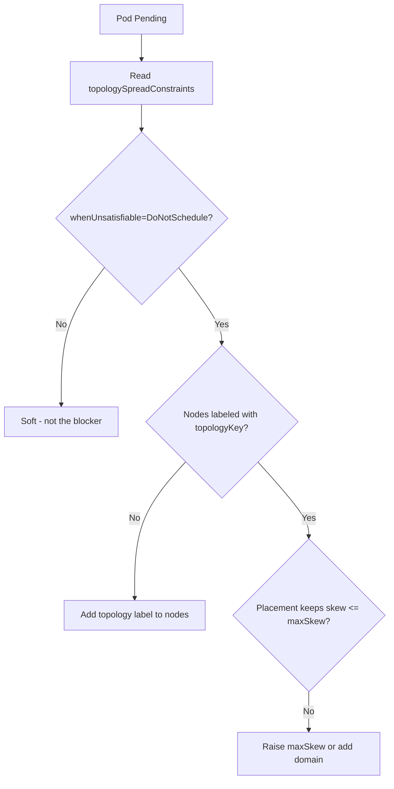

# Topology Spread Constraints Unsatisfied

> **Severity:** Medium · **Typical recovery time:** 10–30 min · **Affected versions:** 1.19+

## Error Message

```text
0/4 nodes are available: 4 node(s) didn't match pod topology spread constraints.
Warning  FailedScheduling  default-scheduler  0/4 nodes are available:
4 node(s) didn't match pod topology spread constraints.
```

## Description

The scheduler emits this when a Pod's `topologySpreadConstraints` with
`whenUnsatisfiable: DoNotSchedule` cannot be honored on any node. Topology
spread evens Pods across domains (zones, nodes, racks) within an allowed
`maxSkew`. When placing the Pod on every remaining node would push the skew
beyond `maxSkew`, the scheduler refuses and the Pod stays `Pending`. The usual
causes are a `maxSkew` that is too tight, domains that are full or missing the
topology label, or `minDomains` requiring more domains than exist.

## Affected Kubernetes Versions

Topology spread constraints went beta and on-by-default in 1.19, and graduated
to stable (`PodTopologySpread`) in 1.19–1.25. `minDomains` was added (beta 1.25,
stable 1.27). `matchLabelKeys` and `nodeAffinityPolicy`/`nodeTaintsPolicy` were
added in 1.25–1.27. Behavior of the core `maxSkew` rule is consistent from 1.19+.

## Likely Root Causes

- `maxSkew` too small for the number of replicas and domains
- Nodes missing the `topologyKey` label (e.g. `topology.kubernetes.io/zone`)
- `minDomains` set higher than the number of available domains
- Existing skew already maxed out by Pods matching the same selector

## Diagnostic Flow



## Verification Steps

Inspect the constraints, confirm `DoNotSchedule`, and verify that nodes carry
the `topologyKey` label and that current Pod distribution already sits at the
skew limit.

## kubectl Commands

```bash
kubectl describe pod <pod> -n <namespace>
kubectl get pod <pod> -n <namespace> -o jsonpath='{.spec.topologySpreadConstraints}{"\n"}'
kubectl get nodes -L topology.kubernetes.io/zone
kubectl get pods -n <namespace> -l <selector> -o wide
```

## Expected Output

```text
$ kubectl get pods -n web -l app=web -o wide --sort-by=.spec.nodeName
NAME      NODE     ZONE-equivalent
web-0     node-a   zone-a
web-1     node-b   zone-b
web-2     node-c   zone-a
web-3     Pending  <none>

Events:
  Warning  FailedScheduling  default-scheduler  0/4 nodes are available:
  4 node(s) didn't match pod topology spread constraints.
```

## Common Fixes

1. Increase `maxSkew` so the new Pod fits the allowed imbalance.
2. Add capacity in the under-represented domain (zone/node).
3. Ensure all nodes carry the `topologyKey` label; unlabeled nodes are excluded.
4. Lower `minDomains` or switch `whenUnsatisfiable` to `ScheduleAnyway` if spread
   is best-effort.

## Recovery Procedures

1. Confirm the failing constraint and target domain.
2. Labeling nodes or adding a node in the sparse domain is non-disruptive and
   lets the Pending Pod schedule.
3. **Disruptive:** editing `topologySpreadConstraints` in a workload template
   rolls **all** replicas — blast radius is the entire Deployment/StatefulSet;
   schedule a window.
4. Recreate the Pod to re-run scheduling after the change.

## Validation

```bash
kubectl get pods -n <namespace> -l <selector> -o wide
```

Replicas should be balanced across domains within `maxSkew`, all `Running`, with
no further `FailedScheduling` events.

## Prevention

Choose `maxSkew` relative to replica count and domain count, keep topology
labels consistent across all nodes, and prefer `ScheduleAnyway` for workloads
where availability outweighs perfect distribution. Validate constraints in CI.

## Related Errors

- [Pod Anti-Affinity Unsatisfied](pod-anti-affinity-unsatisfied.md)
- [FailedScheduling](failedscheduling.md)
- [Node Affinity No Match](scheduler-node-affinity-no-match.md)

## References

- [Pod Topology Spread Constraints](https://kubernetes.io/docs/concepts/scheduling-eviction/topology-spread-constraints/)
- [Well-Known Labels, Annotations and Taints](https://kubernetes.io/docs/reference/labels-annotations-taints/)

## Further Reading

- [Free Kubernetes config validators](https://devopsaitoolkit.com/validators/)
