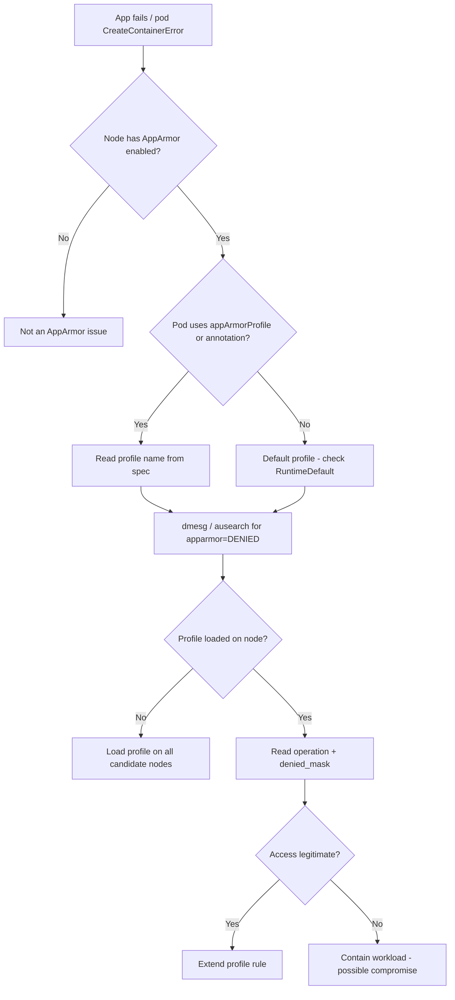

# AppArmor Denied Operation

> **Severity:** High · **Typical recovery time:** 15–40 min · **Affected versions:** 1.30+

## Error Message

```text
audit: type=1400 audit(1718900000.456:789): apparmor="DENIED" operation="open"
  profile="k8s-restricted" name="/etc/shadow" pid=5120 comm="app"
  requested_mask="r" denied_mask="r" fsuid=0 ouid=0
```

## Description

AppArmor is a Linux Security Module (LSM) that confines a process to a per-profile allow-list of file, capability, and network operations. When a container runs under an AppArmor profile and attempts something the profile does not permit, the kernel denies the syscall and emits an `apparmor="DENIED"` audit line on the node. As with SELinux, the container itself usually surfaces only a generic `Permission denied`; the authoritative detail (`operation`, `profile`, `name`, `denied_mask`) lives in the node's kernel/audit log, so you must inspect the node, not just `kubectl`.

In Kubernetes the profile is selected through the pod or container `securityContext`. AppArmor became **GA in Kubernetes 1.31** via the `securityContext.appArmorProfile` field (with `type: RuntimeDefault | Localhost | Unconfined` and `localhostProfile`). The older `container.apparmor.security.beta.kubernetes.io/<container>` annotation is **deprecated** and should be migrated to the field. A denial is correct behavior when the profile is too narrow for a legitimate need — the fix is to extend the loaded profile on the node, or pin the workload to a profile that matches its real access pattern, rather than dropping to `Unconfined`.

## Affected Kubernetes Versions

- **< 1.30** — AppArmor configured via the beta annotation only; profile must be pre-loaded on the node.
- **1.30** — `appArmorProfile` field available in beta alongside the annotation.
- **1.31+ (GA)** — use `securityContext.appArmorProfile`; the beta annotation is deprecated and ignored when the field is set.
- Only applies on nodes with AppArmor enabled (Debian/Ubuntu and derivatives); has no effect on SELinux-only nodes.

## Likely Root Causes

- The workload is bound to a `Localhost` profile that lacks a rule for a path/capability it legitimately uses.
- `RuntimeDefault` profile blocks an operation the app expects (raw sockets, mount, ptrace).
- The named `localhostProfile` is not loaded on every node the pod can schedule to.
- A migration left both the deprecated annotation and the new field set, causing confusion.
- The container genuinely attempts a disallowed action (potential compromise indicator).

## Diagnostic Flow



## Verification Steps

1. Confirm the node supports AppArmor and the runtime can apply profiles.
2. Read the profile reference from the pod spec (field preferred, annotation if legacy).
3. Find the `apparmor="DENIED"` record and read `operation`, `name`, and `denied_mask`.
4. Verify the named profile is actually loaded on the scheduling node.
5. Judge whether the denied operation is expected for the application.

## kubectl Commands

```bash
# Find the pod, node, and any CreateContainerError
kubectl get pod app -n prod -o wide
kubectl describe pod app -n prod

# Show the AppArmor profile reference (GA field, then legacy annotation)
kubectl get pod app -n prod -o jsonpath='{.spec.securityContext.appArmorProfile}'
kubectl get pod app -n prod -o jsonpath='{.metadata.annotations}' | tr ',' '\n' | grep apparmor

# Application symptom and recent events
kubectl logs app -n prod --previous
kubectl get events -n prod --sort-by=.lastTimestamp

# Confirm investigative access
kubectl auth can-i get pods -n prod
```

```bash
# NODE-level (read-only, via your existing node access):
# dmesg | grep -i 'apparmor="DENIED"'
# ausearch -m avc -ts recent | grep apparmor
# aa-status   # lists loaded profiles
```

## Expected Output

```text
$ kubectl get pod app -n prod -o jsonpath='{.spec.securityContext.appArmorProfile}'
{"type":"Localhost","localhostProfile":"k8s-restricted"}

# node kernel log
audit: apparmor="DENIED" operation="open" profile="k8s-restricted"
  name="/etc/shadow" requested_mask="r" denied_mask="r" comm="app"

$ aa-status | grep k8s-restricted
   k8s-restricted (enforce)
```

## Common Fixes

1. **Migrate to the GA field** `securityContext.appArmorProfile` and remove the deprecated annotation.
2. **Extend the Localhost profile** with a rule for the legitimate operation, then reload it on nodes.
3. **Pin to `RuntimeDefault`** when a bespoke profile is not actually required.
4. **Pre-load named profiles** on all nodes (DaemonSet/node bootstrap) so scheduling never lands on a node missing the profile.
5. If the denial reflects a real intrusion attempt, **do not loosen** — isolate and investigate.

## Recovery Procedures

1. Decide from the audit record whether the operation is legitimate or a compromise signal.
2. For a legitimate gap, edit the AppArmor profile on the node to allow the specific path/capability and reload it. **Disruptive — blast radius: all pods using that profile on the node.** Stage on one node and validate before fleet-wide rollout.
3. Re-deploy the workload using the GA `appArmorProfile` field if it still relies on the deprecated annotation. **Disruptive — blast radius: single workload** (pods restart).
4. Ensure the profile is loaded on every candidate node, otherwise pods will intermittently fail to start.
5. Avoid `appArmorProfile.type: Unconfined` as a shortcut. **Disruptive — blast radius: the workload's confinement.** The trade-off: Unconfined removes the LSM boundary for that container entirely; prefer a narrowly extended profile so you keep confinement while permitting the one needed operation.

## Validation

- No new `apparmor="DENIED"` lines after the change (`dmesg`, `ausearch`).
- `aa-status` shows the intended profile in `enforce` mode on all nodes.
- Pods start cleanly and the application performs the previously blocked operation.
- Spec uses `securityContext.appArmorProfile`, not the deprecated annotation.

## Prevention

- Standardize on the GA `appArmorProfile` field across templates; lint out the legacy annotation.
- Distribute custom profiles via a node-bootstrap DaemonSet so every node has them loaded.
- Test profiles in `complain` mode in staging before switching to `enforce`.
- Alert on `apparmor="DENIED"` audit events to catch both misconfigurations and intrusions.

## Related Errors

- [SELinux AVC Denied](../security/selinux-avc-denied.md)
- [Seccomp Blocked Syscall](../security/seccomp-blocked-syscall.md)
- [Read-only Root Filesystem Write Failure](../security/readonly-rootfs-write.md)

## References

- [Restrict a Container's Access to Resources with AppArmor](https://kubernetes.io/docs/tutorials/security/apparmor/)
- [Configure a Security Context for a Pod or Container](https://kubernetes.io/docs/tasks/configure-pod-container/security-context/)
- [Pod Security Standards](https://kubernetes.io/docs/concepts/security/pod-security-standards/)

## Further Reading

- [DevOps AI ToolKit — Kubernetes guides](https://devopsaitoolkit.com/blog/)
