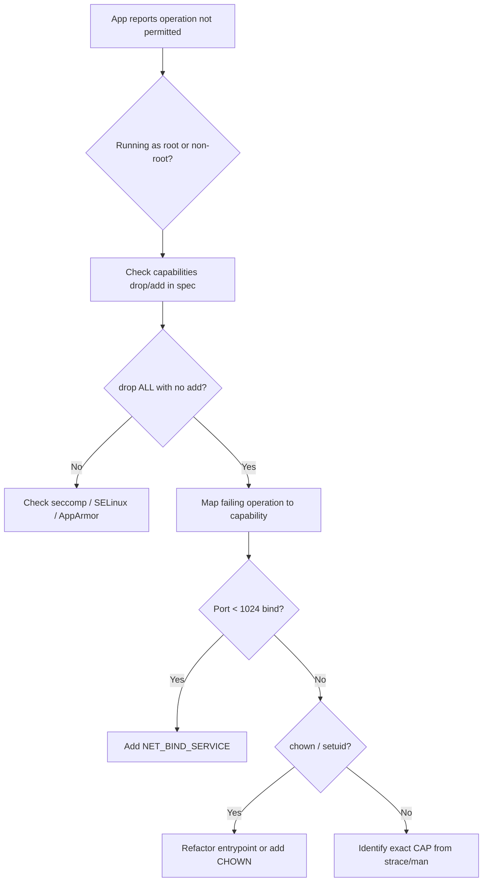

# Dropped Capability Not Permitted

> **Severity:** High · **Typical recovery time:** 10–30 min · **Affected versions:** 1.20+

## Error Message

```text
operation not permitted
bind: permission denied
setcap: Operation not permitted (missing capability CAP_NET_BIND_SERVICE)
```

## Description

Linux capabilities split the historically all-or-nothing root privilege into discrete units such as `CAP_NET_BIND_SERVICE` (bind ports below 1024), `CAP_CHOWN`, `CAP_SYS_TIME`, and `CAP_NET_ADMIN`. A hardened `securityContext` typically drops every capability (`capabilities.drop: ["ALL"]`) and adds back only what is strictly required. When an application performs a privileged kernel operation whose backing capability has been dropped, the syscall fails with `EPERM` — surfaced to operators as a vague `operation not permitted`, even though the container is otherwise healthy and running as the right user.

This is one of the most confusing security failures in production because the error rarely names the missing capability — the application just reports a permission error on an action it could perform when run as plain root. The remediation is precise rather than blunt: identify the exact operation, map it to the capability, and add only that capability back with `capabilities.add`. Restoring `ALL` or going privileged to "make it work" defeats the entire control.

## Affected Kubernetes Versions

- All supported versions (1.20+). `capabilities` is a stable field of the container `SecurityContext`.
- The `restricted` Pod Security Standard requires `drop: ["ALL"]` and only permits adding `NET_BIND_SERVICE` (1.25+).

## Likely Root Causes

- `capabilities.drop: ["ALL"]` with no matching `add` for a capability the app needs.
- Service binds to a privileged port (<1024) without `CAP_NET_BIND_SERVICE`.
- Process attempts `chown`/`setuid` on files without `CAP_CHOWN`/`CAP_SETUID` (common in entrypoint scripts).
- Networking tooling needs `CAP_NET_ADMIN` or `CAP_NET_RAW` (e.g. ping, iptables, sidecars).
- A base image entrypoint expects root-equivalent capabilities that the restricted policy strips.

## Diagnostic Flow



## Verification Steps

1. Confirm the error is `EPERM` from a syscall, not an application-level auth failure.
2. Read the container's `capabilities.drop` and `capabilities.add` lists.
3. Map the failing operation (port bind, chown, raw socket) to its Linux capability.
4. Confirm whether the namespace's Pod Security level even permits adding that capability.
5. Check that the capability is not also being blocked by seccomp.

## kubectl Commands

```bash
# Find and inspect the failing pod
kubectl get pods -n prod -l app=gateway
kubectl describe pod -n prod gateway-5d6c7-fghij

# Read the EPERM from logs
kubectl logs -n prod gateway-5d6c7-fghij --previous

# Inspect dropped/added capabilities
kubectl get pod -n prod gateway-5d6c7-fghij -o jsonpath='{.spec.containers[*].securityContext.capabilities}'

# Check the namespace Pod Security level (what add is allowed)
kubectl get ns prod -o jsonpath='{.metadata.labels}'

# Confirm you have rights to view policy and events
kubectl auth can-i get pods -n prod
kubectl get events -n prod --field-selector reason=FailedCreate
```

## Expected Output

```text
NAME                  READY   STATUS             RESTARTS   AGE
gateway-5d6c7-fghij   0/1     CrashLoopBackOff   4          3m

# logs --previous
listen tcp :443: bind: permission denied

# capabilities jsonpath
{"drop":["ALL"]}
```

## Common Fixes

1. Add only the required capability, e.g. `capabilities: { drop: ["ALL"], add: ["NET_BIND_SERVICE"] }`.
2. For privileged-port binds, prefer changing the container to listen on a high port (e.g. 8443) and map the Service port instead — no capability needed.
3. Remove `chown`/`setuid` from entrypoints by setting correct file ownership in the image build.
4. For sidecars needing raw sockets, add `NET_RAW` explicitly and document why.
5. If the namespace blocks the needed `add`, move the workload to a namespace with an appropriate (baseline) Pod Security level rather than disabling enforcement.

## Recovery Procedures

1. Confirm the precise capability from logs (`strace` in a dev replica if needed; do not run it ad hoc in prod).
2. Edit the Deployment to add the single required capability under `securityContext.capabilities.add`.
3. **Disruptive — blast radius: all pods of this Deployment.** The spec change rolls pods; ensure a PodDisruptionBudget protects quorum-sensitive services.
4. Prefer the high-port refactor where possible — it restores service with zero added privilege. **Trade-off:** requires a Service/port change and possibly upstream config, so it is slower than adding the capability.
5. Never substitute `privileged: true` or `add: ["ALL"]` to bypass this — that grants the full capability set and is a major regression. If you must do it to restore a P1, log it as an incident and revert in the same window.

## Validation

- Pod reaches `Running`/`Ready` and the previously failing operation succeeds.
- `capabilities.drop` still contains `ALL`; only the minimal `add` list is present.
- The workload still passes the namespace's Pod Security admission.

## Prevention

- Default every container to `drop: ["ALL"]` and add capabilities individually with comments.
- Avoid privileged ports inside containers; bind high and remap at the Service.
- Bake correct file ownership into images so entrypoints never need `CHOWN`/`SETUID`.
- Enforce capability restrictions with the `restricted` Pod Security Standard or Kyverno.

## Related Errors

- [Privileged Containers Not Allowed](../security/privileged-containers-not-allowed.md)
- [Privilege escalation blocked under restricted PSA](../security/psa-restricted-privilege-escalation.md)
- [Seccomp Blocked Syscall](../security/seccomp-blocked-syscall.md)

## References

- [Set capabilities for a Container](https://kubernetes.io/docs/tasks/configure-pod-container/security-context/#set-capabilities-for-a-container)
- [Pod Security Standards](https://kubernetes.io/docs/concepts/security/pod-security-standards/)
- [Security Context concepts](https://kubernetes.io/docs/concepts/security/pod-security-admission/)

## Further Reading

- [DevOps AI ToolKit — Kubernetes guides](https://devopsaitoolkit.com/blog/)
