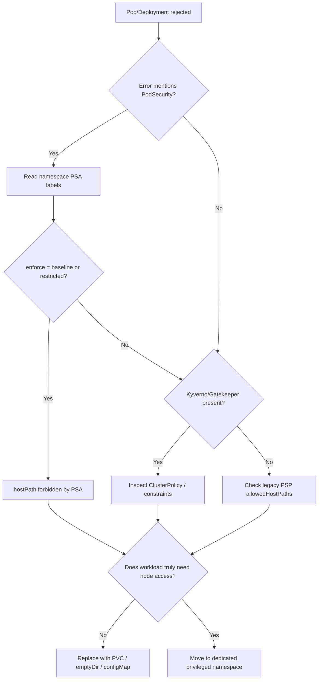

# hostPath Volumes Not Allowed

> **Severity:** High · **Typical recovery time:** 10–30 min · **Affected versions:** 1.20+

## Error Message

```text
Error creating: pods "web-7d9f" is forbidden: violates PodSecurity "baseline:latest": hostPath volumes (volume "data" uses hostPath)
hostPath volumes are not allowed to be used
```

## Description

A workload requested a `hostPath` volume and the admission layer rejected it. `hostPath` mounts a file or directory from the underlying node's filesystem straight into the container, which collapses the node-to-pod isolation boundary. A pod with a writable `hostPath` over a sensitive path (`/`, `/var/run/docker.sock`, `/etc`, kubelet credentials) can read other tenants' data, tamper with the container runtime, or pivot to full node compromise. For this reason both the Pod Security Standards **baseline** and **restricted** profiles forbid `hostPath` entirely.

In production this rejection almost always comes from Pod Security Admission (PSA) enforcing a `baseline` or `restricted` label on the namespace, or from a policy engine such as Kyverno or Gatekeeper. The fix is rarely "allow hostPath" — it is to replace the host mount with a first-class Kubernetes volume (PVC, `emptyDir`, `configMap`, `secret`, or the CSI driver the host path was standing in for). Genuine node-agent DaemonSets that legitimately need host access should be quarantined in a dedicated, more-permissive namespace rather than relaxing a shared one.

## Affected Kubernetes Versions

- **1.20–1.24** — PodSecurityPolicy (PSP) `allowedHostPaths`/blocked hostPath; PSP deprecated in 1.21.
- **1.25+** — PSP removed; built-in Pod Security Admission enforces baseline/restricted, both of which deny hostPath.
- **All versions** — Kyverno, Gatekeeper/OPA, or admission webhooks can enforce equivalent rules independently of PSA.

## Likely Root Causes

- Namespace carries `pod-security.kubernetes.io/enforce: baseline` (or `restricted`), which disallows all `hostPath` volumes.
- A Kyverno/Gatekeeper `disallow-host-path` ClusterPolicy is active.
- A Helm chart or manifest copied from a node-agent example still mounts `/var/log`, `/proc`, or `/var/lib/docker`.
- Workload was moved from a permissive namespace to a hardened one without refactoring volumes.
- Legacy PSP (pre-1.25) without the path in `allowedHostPaths`.

## Diagnostic Flow



## Verification Steps

1. Capture the exact admission message from the failing controller event.
2. Read the enforcing namespace's Pod Security labels.
3. Confirm which volume in the spec is of type `hostPath` and what path it targets.
4. Decide whether the host path is essential or an artifact of a copied manifest.
5. Identify a portable replacement volume type for the data being accessed.

## kubectl Commands

```bash
# See the rejection on the owning controller
kubectl describe deployment web -n app
kubectl get events -n app --sort-by=.lastTimestamp | grep -i hostpath

# Inspect namespace Pod Security configuration
kubectl get ns app -o jsonpath='{.metadata.labels}'

# Find every hostPath volume in the namespace
kubectl get pods -n app -o json | \
  jq -r '.items[] | select(.spec.volumes[]?.hostPath) | .metadata.name'

# Check for policy-engine rules
kubectl get clusterpolicies.kyverno.io 2>/dev/null
kubectl get constraints 2>/dev/null

# Confirm you can read the workload spec
kubectl auth can-i get deployments -n app
```

## Expected Output

```text
NAME      VOLUME   TYPE       PATH
web       data     hostPath   /var/data

Labels: pod-security.kubernetes.io/enforce=baseline
        pod-security.kubernetes.io/enforce-version=latest

Warning  FailedCreate  replicaset/web-7d9f
  pods "web-7d9f" is forbidden: violates PodSecurity "baseline:latest":
  hostPath volumes (volume "data")
```

## Common Fixes

1. **Replace with a PersistentVolumeClaim** backed by a CSI driver for durable data.
2. **Use `emptyDir`** for scratch/cache data that does not need to survive the pod.
3. **Use `configMap`/`secret` volumes** when the host path was only delivering config files.
4. **Switch to the local PV** or local-path-provisioner pattern instead of raw `hostPath`.
5. For true node agents, **deploy to a dedicated namespace** labeled `privileged` and keep RBAC tight.

## Recovery Procedures

1. Confirm the data the hostPath served and choose the correct replacement volume.
2. Update the manifest/Helm values to the portable volume and re-deploy through GitOps.
3. **Disruptive — blast radius: single workload.** Rolling out the new volume restarts the pods; data on the old host path is not migrated automatically — copy it to the PVC first if it must persist.
4. If a legitimate node agent is blocked: create a dedicated namespace with `pod-security.kubernetes.io/enforce: privileged` and move only that DaemonSet there. **Disruptive — blast radius: namespace.** Never relax PSA on a shared application namespace, because that re-enables hostPath for every tenant in it; the trade-off is isolating risk to one purpose-built namespace.
5. Re-apply tight RBAC and NetworkPolicy in the privileged namespace to compensate for the weaker pod security.

## Validation

- Pods reach `Running` with the new volume type and no admission warning.
- `kubectl get pods -n app -o json | jq '.items[].spec.volumes'` shows no `hostPath`.
- The privileged namespace (if used) contains only the intended node agent.

## Prevention

- Default every application namespace to `enforce: restricted`.
- Add a CI policy (Kyverno in audit mode, conftest) that fails manifests containing `hostPath`.
- Review third-party Helm charts for stray host mounts before install.
- Reserve `privileged` namespaces for vetted infrastructure DaemonSets only.

## Related Errors

- [Privileged Containers Not Allowed](../security/privileged-containers-not-allowed.md)
- [Privilege Escalation Blocked by Restricted PSA](../security/psa-restricted-privilege-escalation.md)
- [Read-only Root Filesystem Write Failure](../security/readonly-rootfs-write.md)

## References

- [Pod Security Standards](https://kubernetes.io/docs/concepts/security/pod-security-standards/)
- [Pod Security Admission](https://kubernetes.io/docs/concepts/security/pod-security-admission/)
- [hostPath volumes](https://kubernetes.io/docs/concepts/storage/volumes/#hostpath)

## Further Reading

- [DevOps AI ToolKit — Kubernetes guides](https://devopsaitoolkit.com/blog/)
