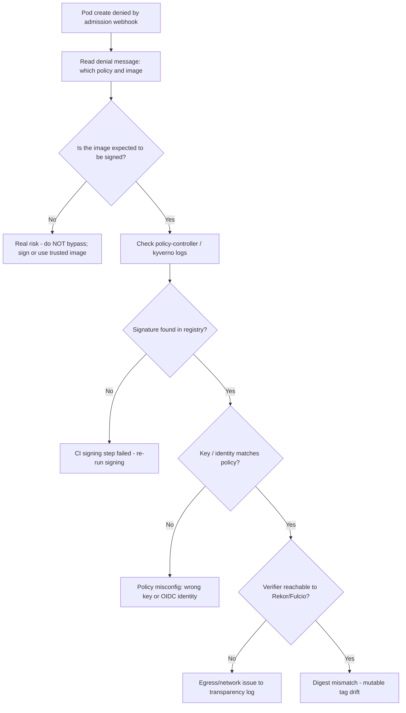

# Image Signature Verification Failed

> **Severity:** Critical · **Typical recovery time:** 10–45 min · **Affected versions:** 1.21+

## Error Message

```text
admission webhook "policy.sigstore.dev" denied the request:
validation failed: failed policy: image-must-be-signed:
no matching signatures: image registry.example.com/api@sha256:ab12...:
no signatures found for image
```

## Description

Kubernetes core does **not** verify container image signatures. Signature enforcement is layered on top via an admission controller or policy engine — Sigstore's policy-controller (cosign), Kyverno `verifyImages`, Connaisseur, or Ratify with Gatekeeper. When a Pod is created or updated, the admission webhook resolves each image to its digest, looks up the corresponding signature (and optionally attestations/SBOMs) in the registry or a transparency log, and verifies it against the configured public key, KMS key, or keyless OIDC identity. If no signature exists, the signature was made with a different key, or the issuer/subject does not match policy, the webhook denies admission and the workload never schedules.

This is Critical because it blocks deployments outright — a failing rollout, a stuck Deployment with zero available replicas, or a CrashLoop of the controller itself. But it is also a *security control working as intended*: the most dangerous mistake an SRE can make here is to disable verification to "unblock" a release. The correct path is to determine whether the image is genuinely unsigned/untrusted (real supply-chain risk) or whether the policy is misconfigured (wrong key, wrong identity, registry the verifier cannot reach).

## Affected Kubernetes Versions

- Any version running a signature-verifying admission webhook (commonly 1.21+ where Sigstore policy-controller and Kyverno are widely deployed).
- The denial mechanism (ValidatingAdmissionWebhook) is stable across all supported releases; behavior depends on the policy engine version, not the cluster version.

## Likely Root Causes

- Image was pushed but never signed (CI signing step missing or failed).
- Policy configured with the wrong public key, KMS key reference, or keyless identity (issuer/subject regexp mismatch).
- Image referenced by mutable tag; verifier resolved a different digest than what was signed.
- Verifier cannot reach the registry, Rekor transparency log, or Fulcio (network/proxy/egress block).
- Signature stored in a different registry/repository than where the verifier looks.
- Clock skew or expired certificate in keyless (Fulcio) verification.

## Diagnostic Flow



## Verification Steps

1. Read the exact admission denial to identify the failing policy name and the offending image digest.
2. Inspect the policy engine's controller logs for the underlying reason (no signature vs. key mismatch vs. network).
3. Confirm whether the image is supposed to be signed under your supply-chain policy.
4. Check the verifier can reach the registry and transparency log (DNS, egress, proxy).
5. Compare the public key / OIDC identity in the policy against what CI actually signs with.

## kubectl Commands

```bash
# See why the workload has no pods - the ReplicaSet records the admission denial
kubectl describe replicaset -l app=api -n prod

# Events surface the webhook denial text
kubectl get events -n prod --sort-by=.lastTimestamp

# Inspect the Sigstore policy-controller logs (adjust namespace/name)
kubectl logs -n cosign-system deploy/policy-controller-webhook --tail=100

# Or Kyverno admission controller logs
kubectl logs -n kyverno deploy/kyverno-admission-controller --tail=100

# Review the active image-verification policy
kubectl get clusterimagepolicy -o yaml
kubectl get clusterpolicy verify-image-signatures -o yaml

# Confirm which webhooks are intercepting pods
kubectl get validatingwebhookconfigurations
kubectl describe deployment api -n prod
```

## Expected Output

```text
$ kubectl describe replicaset -l app=api -n prod
...
Events:
  Type     Reason        Age   From                   Message
  ----     ------        ----  ----                   -------
  Warning  FailedCreate  12s   replicaset-controller  Error creating: admission webhook
  "policy.sigstore.dev" denied the request: validation failed: failed policy:
  image-must-be-signed: no matching signatures: image
  registry.example.com/api@sha256:ab12cd...: no signatures found for image
```

The ReplicaSet repeatedly fails to create pods; the message names the policy (`image-must-be-signed`) and the digest, telling you exactly which image lacks a valid signature.

## Common Fixes

1. **Sign the image** — run `cosign sign` in CI against the pushed digest, then redeploy. Fixes the legitimate "unsigned image" case.
2. **Correct the policy key/identity** — point the policy at the actual cosign public key, KMS key, or the correct keyless issuer/subject regexp used by your CI.
3. **Pin images by digest**, not mutable tags, so the verified artifact is exactly what runs.
4. **Restore egress** to the registry, Rekor, and Fulcio so the verifier can complete lookups.
5. **Ensure the signature lives where the verifier looks** — same registry/repo as the image, or configure the alternate signature repository.

## Recovery Procedures

1. Triage first: determine from the controller logs whether this is "no signature" (real risk) or "policy misconfig" (key/identity/network). Never disable verification to unblock a deploy.
2. If the image is genuinely unsigned, **re-run the CI signing stage** against the exact digest and re-trigger the rollout — no cluster change needed.
3. If the policy points at the wrong key/identity, **Disruptive — blast radius: every workload subject to this ClusterImagePolicy/ClusterPolicy.** Update the policy to the correct key/OIDC identity carefully; a wrong edit can either admit untrusted images or block all deploys cluster-wide. Stage the change in audit/warn mode before enforcing.
4. For an urgent break-glass, **Disruptive — blast radius: the namespace you scope it to.** Prefer a tightly scoped, time-boxed policy exception for a single trusted digest over disabling the webhook globally — and document/approve it. Disabling the webhook removes supply-chain protection for the whole cluster and must be avoided.
5. After remediation, restore full enforcement and verify the exception is removed.

## Validation

- Re-create the workload and confirm pods schedule with no `FailedCreate` admission denial.
- Verify the running image digest matches the signed, attested digest from CI.
- Confirm the policy is back in enforce mode (not audit/warn) and any break-glass exception is removed.
- Check controller logs show a successful verification entry for the image.

## Prevention

- Make signing a required, non-skippable CI stage; fail the pipeline if `cosign sign` fails.
- Enforce digest-pinned image references via admission policy.
- Roll out new image policies in audit/warn mode first, then enforce.
- Monitor verifier egress to Rekor/Fulcio and alert on lookup failures.
- Keep public keys / trusted OIDC identities in version control with review.

## Related Errors

- [Privileged Containers Not Allowed](../security/privileged-containers-not-allowed.md)
- [PSA runAsNonRoot Image Runs as Root](../security/psa-runasnonroot-image-root.md)
- [Secret Double Base64 Encoded](../security/secret-double-base64.md)

## References

- [Admission Controllers Reference](https://kubernetes.io/docs/reference/access-authn-authz/admission-controllers/)
- [Dynamic Admission Control](https://kubernetes.io/docs/reference/access-authn-authz/extensible-admission-controllers/)
- [Images](https://kubernetes.io/docs/concepts/containers/images/)

## Further Reading

- [DevOps AI ToolKit — Kubernetes guides](https://devopsaitoolkit.com/blog/)
