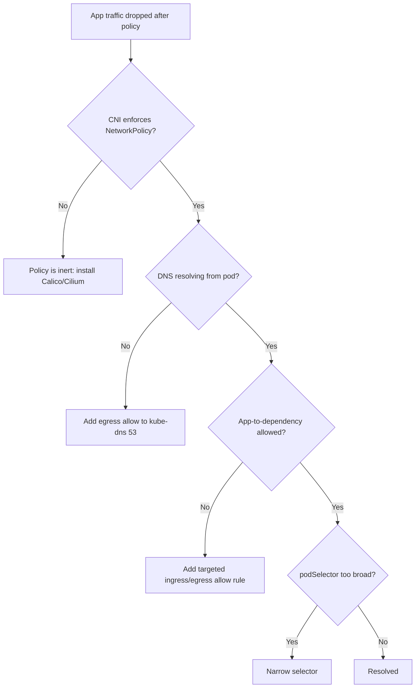

# Default-Deny NetworkPolicy Lockout

> **Severity:** High · **Typical recovery time:** 5–30 min · **Affected versions:** 1.20+

## Error Message

```text
application traffic dropped after default-deny policy
```

## Description

Adopting a zero-trust network posture usually starts by applying a default-deny NetworkPolicy that selects all pods in a namespace and permits nothing. The intent is sound, but a default-deny with no companion allow rules drops *every* connection — including the one almost everyone forgets: DNS to CoreDNS/kube-dns in `kube-system`. The symptom is rarely a clean "connection refused"; instead you see DNS timeouts, `i/o timeout` on outbound calls, readiness probes failing, and services that worked five minutes ago going dark. Because the policy is doing exactly what it was told, nothing logs an error on the control plane — the packets simply never arrive.

A second, more dangerous failure mode is the inverse: the policy appears applied but enforces nothing. NetworkPolicy objects are inert API records; enforcement is the CNI's job. If your cluster runs a CNI that does not implement NetworkPolicy (for example, default flannel), `kubectl apply` succeeds, the object exists, and traffic flows freely — giving a false sense of isolation. You must run a policy-enforcing CNI such as Calico or Cilium for these rules to mean anything.

## Affected Kubernetes Versions

- **1.20+** — NetworkPolicy API (`networking.k8s.io/v1`) stable; behavior is consistent, but enforcement depends entirely on the CNI.
- All versions — DNS-egress lockout occurs identically; the fix (allow egress to kube-dns) is version-independent.

## Likely Root Causes

- A default-deny `Ingress`/`Egress` policy applied with no allow rule for DNS (UDP/TCP 53 to kube-dns).
- No egress allow rule for required app-to-app or external dependencies.
- The CNI in use does not enforce NetworkPolicy (e.g. flannel) — policy looks applied but is ignored, or partially supported.
- `podSelector: {}` selecting more pods than intended, including system-adjacent workloads.
- Mixing namespaced and cluster-scoped selectors so the kube-dns namespace isn't matched.

## Diagnostic Flow



## Verification Steps

1. Confirm which CNI is installed and that it enforces NetworkPolicy.
2. Identify which policies select the affected pods.
3. Test DNS resolution from inside the namespace.
4. Determine which destinations the app needs (DNS, other services, external endpoints).
5. Confirm whether the default-deny is ingress-only, egress-only, or both.

## kubectl Commands

```bash
# Which CNI is running? (look for calico/cilium/flannel pods)
kubectl get pods -n kube-system -o wide
kubectl get daemonset -n kube-system

# Inspect the policies selecting your pods
kubectl get networkpolicy -A
kubectl describe networkpolicy <name> -n <ns>
kubectl get networkpolicy <name> -n <ns> -o yaml

# Confirm which pods a policy selects via its labels
kubectl get pods -n <ns> --show-labels

# Check kube-dns service and endpoints (egress target)
kubectl get svc kube-dns -n kube-system
kubectl get endpointslices -n kube-system -l k8s-app=kube-dns

# Look for probe/DNS failures in the affected pods
kubectl describe pod <pod> -n <ns>
kubectl logs <pod> -n <ns> --tail=50
kubectl get events -n <ns> --sort-by=.lastTimestamp
```

## Expected Output

```text
$ kubectl describe networkpolicy default-deny -n shop
Name:         default-deny
Spec:
  PodSelector:     <none> (Allowing the specific traffic to all pods in this namespace)
  Allowing ingress traffic:
    <none> (Selected pods are isolated for ingress connectivity)
  Allowing egress traffic:
    <none> (Selected pods are isolated for egress connectivity)
  Policy Types: Ingress, Egress

$ kubectl logs web-7d9c -n shop --tail=3
Error: getaddrinfo EAI_AGAIN db.shop.svc.cluster.local
dial tcp: lookup db.shop.svc.cluster.local: i/o timeout
```

`Egress: <none>` plus DNS `i/o timeout` confirms the lockout: the deny-all blocks port 53 to CoreDNS.

## Common Fixes

1. Add an egress allow rule permitting UDP and TCP port 53 to the kube-dns pods (match the `kube-system` namespace and `k8s-app=kube-dns` selector).
2. Add targeted ingress/egress allow rules for each legitimate dependency (other services, the API server, external endpoints).
3. If the CNI does not enforce NetworkPolicy, install Calico or Cilium — policy without enforcement is not security.
4. Narrow an over-broad `podSelector` so the default-deny only covers intended workloads.
5. Stage policies per namespace and validate before rolling cluster-wide.

## Recovery Procedures

1. **Triage (non-disruptive):** Confirm the CNI enforces policy and identify which policy and selector caused the drop.
2. **Restore DNS first.** Add an egress allow to kube-dns on port 53. This is the single most common missing rule and unblocks most workloads. **Disruptive — blast radius: namespace-wide; applying the corrected policy re-evaluates all selected pods' connections.**
3. **Add dependency allows incrementally.** For each failing call, add a scoped allow rule rather than widening to allow-all. Re-test after each change.
4. **Emergency rollback only if outage is severe. Disruptive — blast radius: removing the default-deny re-exposes the entire namespace to lateral traffic.** Prefer fixing forward by adding allow rules; only delete the deny policy if the business impact outweighs the temporary loss of isolation, and re-apply a corrected policy promptly.
5. **If the CNI was the problem, plan a CNI migration in a maintenance window. Disruptive — blast radius: cluster-wide pod networking restart.** Do not leave a non-enforcing CNI in place believing policies protect you.

## Validation

- DNS resolves from an affected pod (lookups succeed, no `i/o timeout`).
- Readiness/liveness probes pass and Services route traffic again.
- A deliberately disallowed connection still fails — proving enforcement is real, not the inert-CNI false positive.
- `kubectl describe networkpolicy` shows explicit allow rules alongside the deny.

## Prevention

- Always pair a default-deny with an explicit DNS-egress allow in the same change.
- Standardize a baseline policy bundle (deny-all + allow-DNS) applied to every new namespace.
- Verify CNI enforcement during cluster bootstrap and in CI with a connectivity smoke test.
- Roll out policies to one namespace, validate, then promote.

## Related Errors

- [ServiceAccount Token Automount Exposure](../security/sa-token-automount-exposure.md)
- [TLS Secret Wrong Type](../security/tls-secret-wrong-type.md)
- [Restricted PSA Privilege Escalation](../security/psa-restricted-privilege-escalation.md)

## References

- [Network Policies](https://kubernetes.io/docs/concepts/services-networking/network-policies/)
- [Declare Network Policy (walkthrough)](https://kubernetes.io/docs/tasks/administer-cluster/declare-network-policy/)
- [DNS for Services and Pods](https://kubernetes.io/docs/concepts/services-networking/dns-pod-service/)

## Further Reading

- [DevOps AI ToolKit — Kubernetes guides](https://devopsaitoolkit.com/blog/)
