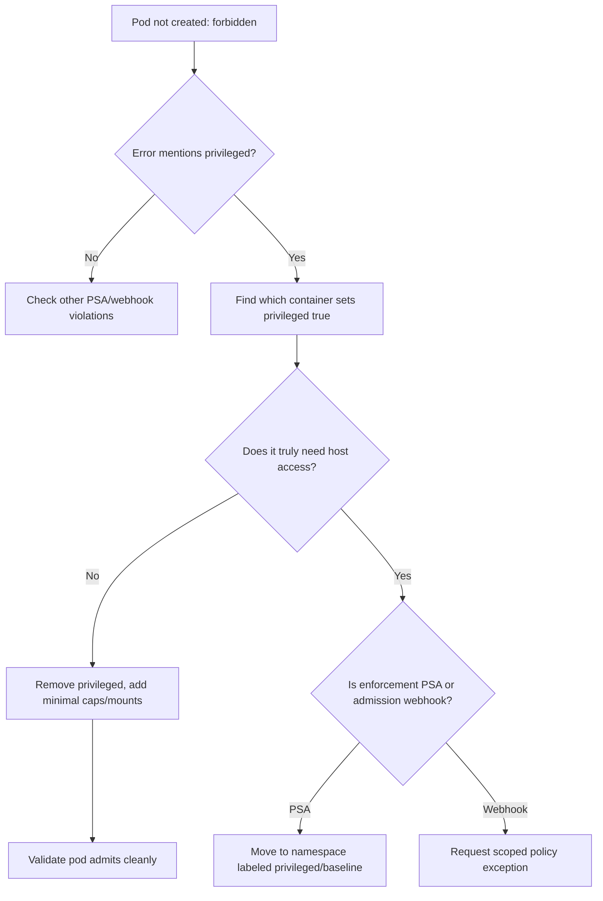

# Privileged Containers Not Allowed

> **Severity:** Critical · **Typical recovery time:** 15–45 min · **Affected versions:** 1.20+

## Error Message

```text
Error creating: pods "node-agent" is forbidden: violates PodSecurity "restricted:latest":
privileged (container "agent" must not set securityContext.privileged=true)
admission webhook "validation.kyverno.svc" denied the request: privileged: true is forbidden
```

## Description

A privileged container (`securityContext.privileged: true`) effectively disables container isolation: it runs with all Linux capabilities, write access to host devices, and the ability to manipulate the host kernel. It is the single largest blast-radius setting in a pod spec — a compromise of one privileged container is a compromise of the node. For that reason Pod Security Admission's `baseline` and `restricted` levels, and most OPA/Gatekeeper and Kyverno policies, reject it outright, so the pod is never even created.

In production this error blocks deployment, not runtime — the workload sits with no pods and a `FailedCreate` event. It typically appears when a node-level agent (CNI, CSI driver, monitoring, security tooling) that genuinely needs host access lands in a namespace enforcing `restricted`, or when a developer copied `privileged: true` to silence an unrelated permission error. The correct response is to determine whether host privilege is truly required: if yes, place the workload in a correctly labeled namespace under controlled exception; if no, replace the blunt flag with the specific, minimal capabilities or mounts the app actually needs.

## Affected Kubernetes Versions

- All supported versions (1.20+). `privileged` is a stable field of the container `SecurityContext`.
- Pod Security Admission is GA and enforced by label since 1.25; `baseline`/`restricted` both forbid privileged.

## Likely Root Causes

- `privileged: true` set on a container in a namespace labeled `baseline` or `restricted`.
- A node agent (CNI/CSI/eBPF tooling) deployed into a hardened namespace instead of a dedicated one.
- `privileged: true` used as a shotgun fix for a capability, device, or hostPath permission error.
- A Gatekeeper/Kyverno cluster policy that denies privileged regardless of namespace labels.
- A Helm chart default that enables privileged for an optional feature you do not use.

## Diagnostic Flow



## Verification Steps

1. Confirm the failure is at admission (`FailedCreate`), not a runtime crash.
2. Identify exactly which container and which field triggered the denial.
3. Determine whether the enforcer is Pod Security Admission or an admission webhook (Kyverno/Gatekeeper).
4. Assess whether the workload genuinely requires host-level privilege.
5. Check the target namespace's Pod Security labels.

## kubectl Commands

```bash
# See why the pods are missing
kubectl get deploy,rs,pods -n monitoring -l app=node-agent
kubectl describe rs -n monitoring node-agent-6b7c8

# The denial is on the controller's events
kubectl get events -n monitoring --field-selector reason=FailedCreate

# Find which container requests privileged
kubectl get deploy -n monitoring node-agent -o jsonpath='{.spec.template.spec.containers[*].securityContext}'

# Identify the enforcing policy
kubectl get ns monitoring -o jsonpath='{.metadata.labels}'
kubectl get clusterpolicies.kyverno.io 2>/dev/null
kubectl get constraints 2>/dev/null

# Confirm your view permissions
kubectl auth can-i get pods -n monitoring
```

## Expected Output

```text
# events
LAST SEEN   TYPE      REASON         OBJECT                     MESSAGE
12s         Warning   FailedCreate   replicaset/node-agent-6b7c8   Error creating: pods "node-agent-x" is forbidden: violates PodSecurity "restricted:latest": privileged

# securityContext jsonpath
{"privileged":true}

# namespace labels
{"pod-security.kubernetes.io/enforce":"restricted"}
```

## Common Fixes

1. Remove `privileged: true` and add only the specific capabilities the app needs (e.g. `NET_ADMIN`).
2. Replace host-device access with a narrowly scoped device mount or `hostPath` where permitted.
3. For genuine node agents, deploy into a dedicated namespace labeled `pod-security.kubernetes.io/enforce: privileged`.
4. Disable the unused Helm chart feature that defaults `privileged: true`.
5. For webhook denials, request a scoped policy exception that matches only the agent's ServiceAccount and namespace.

## Recovery Procedures

1. Decide whether privilege is real or accidental — never grant it just to unblock a rollout.
2. If accidental: remove the flag and substitute minimal capabilities/mounts, then redeploy.
3. If legitimate (CNI/CSI/security agent): **Disruptive — blast radius: cluster-wide if the agent is a DaemonSet on every node.** Move it to a dedicated, clearly labeled `privileged` namespace and restrict who can deploy there via RBAC.
4. For webhook exceptions, scope the rule to the exact ServiceAccount/namespace — **Trade-off:** a broad exception silently re-opens privileged across the cluster, which is worse than the original problem.
5. Do not relabel a shared application namespace to `privileged` to make one workload pass — that weakens every other pod in it. Isolate instead.

## Validation

- The Deployment's pods reach `Running`/`Ready` with no privileged container, or run only in an isolated privileged namespace.
- `kubectl get events` shows no further `FailedCreate` privileged denials.
- RBAC limits who can create pods in any namespace that permits privilege.

## Prevention

- Enforce `baseline` or `restricted` Pod Security on all general-purpose namespaces.
- Reserve a single, tightly RBAC-controlled namespace for legitimate privileged agents.
- Audit Helm values for privileged defaults before installing third-party charts.
- Add a Kyverno/Gatekeeper policy that denies privileged outside an allow-listed namespace.

## Related Errors

- [Dropped Capability Not Permitted](../security/dropped-capability-not-permitted.md)
- [hostPath Volumes Not Allowed](../security/hostpath-not-allowed.md)
- [Privilege escalation blocked under restricted PSA](../security/psa-restricted-privilege-escalation.md)

## References

- [Pod Security Standards](https://kubernetes.io/docs/concepts/security/pod-security-standards/)
- [Pod Security Admission](https://kubernetes.io/docs/concepts/security/pod-security-admission/)
- [Configure a Security Context for a Pod or Container](https://kubernetes.io/docs/tasks/configure-pod-container/security-context/)

## Further Reading

- [DevOps AI ToolKit — Kubernetes guides](https://devopsaitoolkit.com/blog/)
